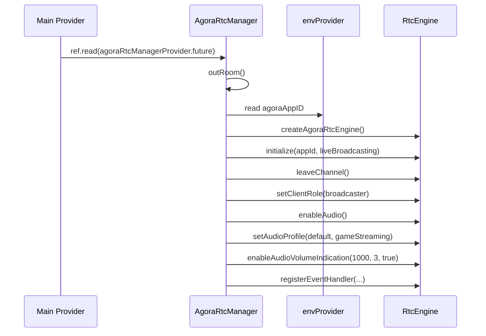
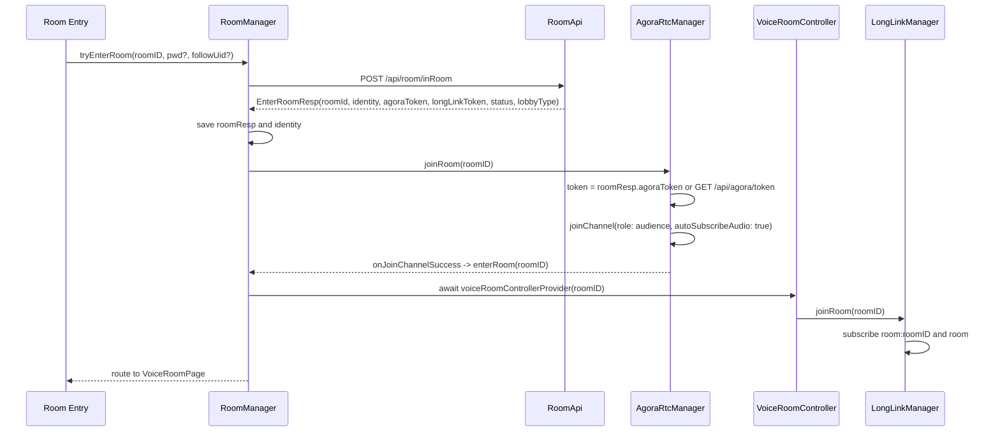
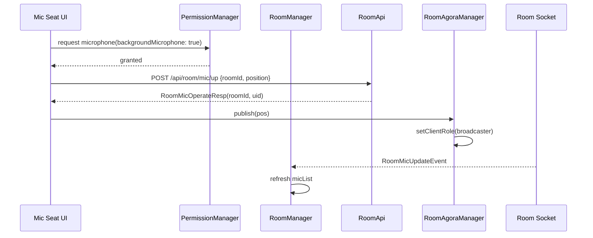
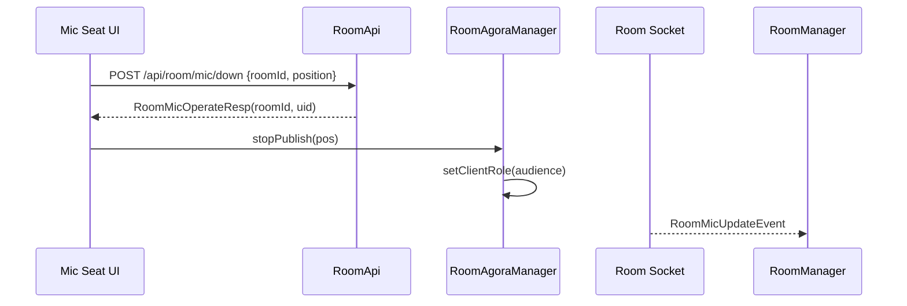
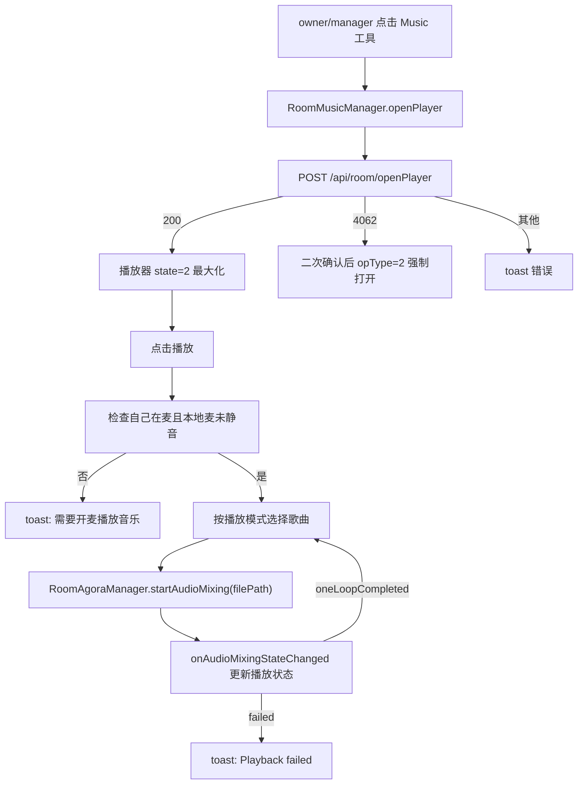
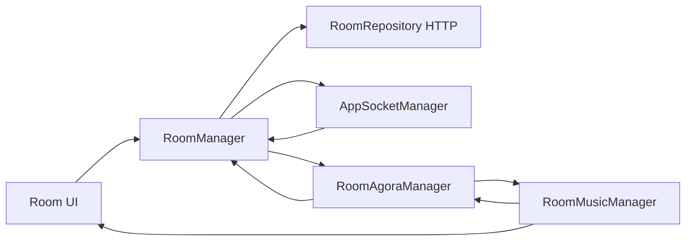

# nady Agora RTC 与房间音乐迁移清单

静态分析时间：2026-08-21  
来源项目：`/Users/huili/nady`  
目标用途：给 `/Users/huili/project/iSnow` 迁移房间语音、上下麦、声浪、静音、音乐播放器和 Agora audio mixing 能力时使用。  
分析方式：仅基于 nady 代码静态分析，不依赖接口文档或运行时抓包。  

## 结论

nady 里的 Agora 能力建议在 iSnow 中单独提取为 `RoomAgoraManager`，不要继续混在 `RoomManager` 或 `AppSocketManager` 里。

原因：

| 维度 | 结论 |
| --- | --- |
| 生命周期 | Agora 引擎初始化、频道 join/leave、dispose/release 都是 RTC 生命周期，和 HTTP 进房、socket 订阅不是同一层 |
| 状态来源 | 房间业务状态来自 HTTP/socket，音频角色和音量来自 Agora 回调，必须分开维护 |
| 失败处理 | Agora 角色切换失败会反向调用房间下麦接口，属于跨状态源补偿逻辑，需要集中管理 |
| 音乐播放 | nady 使用 Agora `audio mixing` 实现房间音乐外放，建议再独立出 `RoomMusicManager` 管理曲库和播放策略 |

iSnow 建议拆分为四个同级单例：

| 目标单例 | 负责内容 | 不负责内容 |
| --- | --- | --- |
| `AppSocketManager` | 全 App 长连接、频道订阅、事件分发、心跳、重连 | 不持有 Agora engine，不保存房间 UI 状态 |
| `RoomManager` | 当前一个房间的业务状态、HTTP 进退房、麦位状态、socket 事件落状态 | 不直接操作 Agora SDK |
| `RoomAgoraManager` | Agora engine、join/leave channel、角色切换、静音、声浪、音频混流、token 续期 | 不做房间 API model 解析，不保存曲库 |
| `RoomMusicManager` | 本地曲库、当前播放曲目、播放模式、播放器状态、调用 `RoomAgoraManager` 播放/暂停/恢复 | 不直接持有 Agora engine |

## 核心源码地图

| 类型 | 文件 |
| --- | --- |
| Agora 管理核心 | `/Users/huili/nady/lib/services/room_manager/rtc/agora_rtc_manager.dart` |
| App 启动时初始化 Agora provider | `/Users/huili/nady/lib/pages/main/main_provider.dart` |
| 进房/退房协调 | `/Users/huili/nady/lib/services/room_manager/room_manager.dart` |
| 房间生命周期聚合 | `/Users/huili/nady/lib/services/room_manager/voice_room_controller.dart` |
| 麦位点击、上下麦 | `/Users/huili/nady/lib/pages/room/voice_room/widgets/mic_area/room_mic_seat_controller.dart` |
| 麦位列表、owner 自动上麦、邀请上麦 | `/Users/huili/nady/lib/services/room_manager/room_mic_data_list_provider.dart` |
| 声浪状态 | `/Users/huili/nady/lib/services/room_manager/room_captured_audio_provider.dart` |
| 本地麦克风静音状态 | `/Users/huili/nady/lib/services/room_manager/self_setting_room_mic_mute_status_provider.dart` |
| 扬声器静音状态 | `/Users/huili/nady/lib/services/room_manager/self_setting_room_speaker_mute_status_provider.dart` |
| 音乐列表和播放控制 | `/Users/huili/nady/lib/pages/room/widgets/music/nady_my_music.dart` |
| 当前播放曲目 | `/Users/huili/nady/lib/pages/room/widgets/music/nady_playing_music.dart` |
| 播放状态 | `/Users/huili/nady/lib/pages/room/widgets/music/nady_room_play_status.dart` |
| 播放模式 | `/Users/huili/nady/lib/pages/room/widgets/music/nady_room_play_mode.dart` |
| 播放器展开/收起状态 | `/Users/huili/nady/lib/pages/room/widgets/music/widgets/nady_room_music_state_controller.dart` |
| 房间播放器 UI | `/Users/huili/nady/lib/pages/room/widgets/music/widgets/nady_room_music_player_widget.dart` |
| 本地音乐扫描 | `/Users/huili/nady/lib/pages/room/widgets/music/nady_local_music.dart`、`/Users/huili/nady/lib/pages/room/widgets/music/data/nady_audio_scan_handle.dart` |
| 音乐数据模型 | `/Users/huili/nady/lib/pages/room/widgets/music/data/nady_music_item.dart` |
| Android 权限工具 | `/Users/huili/nady/lib/utils/nady_permission_manager.dart` |
| Android 前台服务 | `/Users/huili/nady/lib/utils/foreground_service_manager.dart` |
| Android Manifest | `/Users/huili/nady/android/app/src/main/AndroidManifest.xml` |
| API wrapper | `/Users/huili/nady/lib/services/api/room_api.dart`、`/Users/huili/nady/lib/services/api/token_api.dart`、`/Users/huili/nady/lib/services/api/common_api.dart` |
| Retrofit API | `/Users/huili/nady/lib/services/http/api_client.dart` |
| API 路径常量 | `/Users/huili/nady/lib/services/api/api_urls.dart` |

## 依赖与环境变量

| 名称 | 类型 | 来源 | 是否必需 | 用途 |
| --- | --- | --- | --- | --- |
| `agora_rtc_engine` | package | `pubspec.yaml` | 是 | Agora Flutter SDK，nady 使用 `^6.5.3` |
| `agora_debug_panel` | package | `pubspec.yaml` | 否 | 调试面板，未在核心 RTC 流程中直接使用 |
| `permission_handler` | package | `pubspec.yaml` | 是 | 麦克风权限、通知权限、本地音频权限 |
| `flutter_local_notifications` | package | `pubspec.yaml` | Android 后台语音需要 | nady 用它启动 Android foreground service |
| `volume_controller` | package | 音乐 UI | 音乐功能需要 | 调整系统音量 |
| `scan_music` | local package | `lib/widgets/scan_music/` | 本地音乐扫描需要 | 扫描设备本地音频文件 |
| `agoraAppID` | `String` | `envProvider.agoraAppID`，环境变量名 `AGORA_APPID` | 是 | `RtcEngineContext.appId` |
| `roomID` | `String?` | `AgoraRtcManager.roomID` / 入参 | 是 | Agora channelId、房间业务 id |
| `uid` | `int` | `authenticationUIDProvider.value!` | 是 | Agora `joinChannel.uid`，也用于声浪映射 |
| `agoraToken` | `String?` | `RoomManager.roomResp?.agoraToken`，兜底 `/api/agora/token` | 是 | Agora `joinChannel.token` |

注意：不要把 nady 的 AppID 明文值复制到 iSnow 文档或代码仓库，保留变量名并由环境配置注入。

## nady 当前 Agora 初始化流程

`AgoraRtcManager` 是 Riverpod `AutoDisposeAsyncNotifier<void>`。nady 在 `Main.build()` 中监听并等待 `agoraRtcManagerProvider.future`，因此 Agora engine 在 App 主流程初始化阶段就创建。



初始化参数：

| 字段/方法 | nady 值 | 类型 | 说明 |
| --- | --- | --- | --- |
| `RtcEngineContext.appId` | `envProvider.agoraAppID` | `String` | 声网 AppID |
| `RtcEngineContext.channelProfile` | `ChannelProfileType.channelProfileLiveBroadcasting` | enum | 直播场景 |
| `setClientRole` 初始化 | `ClientRoleType.clientRoleBroadcaster` | enum | 初始化后先设为主播，但 `joinChannel` 又以 audience 加入 |
| `enableAudio` | 调用 | method | 启用音频模块 |
| `setAudioProfile.profile` | `AudioProfileType.audioProfileDefault` | enum | 默认音频配置 |
| `setAudioProfile.scenario` | `AudioScenarioType.audioScenarioGameStreaming` | enum | 游戏开黑/娱乐房语音场景 |
| `enableAudioVolumeIndication.interval` | `1000` | `int` | 每 1 秒回调声浪 |
| `enableAudioVolumeIndication.smooth` | `3` | `int` | 声浪平滑系数 |
| `enableAudioVolumeIndication.reportVad` | `true` | `bool` | 上报人声检测 |

iSnow 建议：`RoomAgoraManager` 可以 App 启动初始化，也可以首次进房前 lazy init。若房间是高频核心能力，建议 App 登录后初始化 engine，进房时只执行 token 和 channel join，减少首进房耗时。

## `AgoraRtcManager` 字段清单

| 字段 | 类型 | 来源/赋值 | 是否必需 | 含义 |
| --- | --- | --- | --- | --- |
| `engine` | `RtcEngine` | `createAgoraRtcEngine()` | 是 | Agora SDK 核心实例 |
| `_mediaPlayer` | `MediaEngine?` | 声明但未使用 | 否 | 历史遗留，当前可不迁移 |
| `upstreamQuality` | `QualityType?` | `onNetworkQuality.txQuality` | 建议保留 | 上行网络质量 |
| `downstreamQuality` | `QualityType?` | `onNetworkQuality.rxQuality` | 建议保留 | 下行网络质量 |
| `roomID` | `String?` | `joinRoom(roomID)` | 是 | 当前 Agora channelId |
| `currentDoActionPos` | `int?` | `publish/stopPublish(pos)` | 是 | 当前执行上下麦的麦位，用于失败补偿和日志 |
| `retryCount` | `int` | 固定 `3` | 建议保留 | 角色切换失败重试次数上限 |
| `currentRetryIndex` | `int` | 初始 `0` | 建议保留但需补 reset | 当前重试次数；nady 未在成功后显式清零 |

## `AgoraRtcManager` 方法清单

| 方法 | 入参 | 返回 | 当前行为 | iSnow 迁移建议 |
| --- | --- | --- | --- | --- |
| `build()` | 无 | `FutureOr<void>` | 初始化 engine、注册回调、dispose 时 leave/release | 拆成 `init()` 和 `dispose()` 更清晰 |
| `outRoom()` | 无 | `Future<void>` | 读取 `SpKeys.perRoomID`，非空则调用 `RoomApi.of.exitRoom` | 可放到 `RoomManager.recoverPreviousRoom()`，不要放 Agora 层 |
| `_getRoomID()` | 无 | `String` | 从 `RoomManager.currentRoomID` 读取 | iSnow 用显式状态注入，减少隐藏依赖 |
| `_getUid()` | 无 | `int` | 读取 `authenticationUIDProvider.value!` | `RoomAgoraManager` 初始化时注入当前登录 uid |
| `_getSelfStreamID()` | 无 | `String` | 返回 `${roomId}_${uid}`，当前未使用 | 不迁移，除非后续用自定义 streamId |
| `downMicWhenSetRoleFailed()` | 无 | `Future<void>` | 角色切换失败时调用 `/api/room/mic/down` 补偿业务麦位 | 保留为 `RoomManager.forceDownMicAfterRtcFailure(pos)` |
| `joinRoom(String roomID)` | `roomID` | `Future<void>` | 获取 token，以 audience 身份 join channel | iSnow 命名 `joinChannel(roomId, token?)` |
| `publish({int? pos})` | `pos` | `Future<void>` | 记录麦位，切换为 broadcaster | 上麦 HTTP 成功后调用 |
| `stopPublish({int? pos})` | `pos` | `Future<void>` | 记录麦位，切换为 audience | 下麦 HTTP 成功后调用 |
| `leaveRoom(String roomID)` | `roomID` | `Future<void>` | 切 audience 后 leaveChannel | 退房/切房/dispose 都要调用 |
| `startPlayingStream(String streamID)` | `streamID` | `Future<void>` | 空实现，只有注释 | 不迁移 |
| `stopPlayingStream(String streamID)` | `streamID` | `Future<void>` | 空实现，只有注释 | 不迁移 |
| `muteMicrophone(bool mute)` | `mute` | `Future<void>` | `muteLocalAudioStream`；静音时如果音乐播放中则暂停音乐 | 保留，但音乐暂停建议交给 `RoomMusicManager` 监听 mic 状态 |
| `muteSpeaker(bool mute)` | `mute` | `Future<void>` | `muteAllRemoteAudioStreams` | 保留 |
| `setMicVolume(int volume)` | `volume` | `Future<void>` | `adjustRecordingSignalVolume(volume)`，注释范围 `[0,400]` | 保留；nady UI 中麦克风音量 slider 当前注释 |
| `startPlayMusic({required String filePath})` | `filePath` | `Future<void>` | `startAudioMixing(filePath, loopback:false, cycle:-1)` | 由 `RoomMusicManager` 调用 |
| `stopPlayMusic()` | 无 | `Future<void>` | 实际调用 `pauseAudioMixing()`，不是 `stopAudioMixing()` | iSnow 需确认“停止”是否应真正 stop |
| `pauseMusic()` | 无 | `Future<void>` | `pauseAudioMixing()` | 保留 |
| `resumeMusic()` | 无 | `Future<void>` | `resumeAudioMixing()` | 保留 |
| `muteAllRemoteAudioStreams(bool mute)` | `mute` | `Future<void>` | 静音所有远端音频 | 与 `muteSpeaker` 能力重复，可合并 |
| `setPlayMusicOutVolume(int volume)` | `volume` | `Future<void>` | 同时调 `adjustAudioMixingVolume` 和 `adjustAudioMixingPublishVolume` | 保留，注意 volume 范围按 Agora SDK 通常为 `0..100` |

## Agora 回调全量清单

以下为 nady 当前 `RtcEngineEventHandler` 中已经注册的全部回调。

| 回调 | 参数 | nady 当前处理 | 状态影响 | iSnow 建议 |
| --- | --- | --- | --- | --- |
| `onJoinChannelSuccess` | `RtcConnection connection`, `int elapsed` | 打日志，调用 `RoomManager.enterRoom(roomID ?? '')` | 从 RTC 已加入推进到房间 UI 初始化和路由跳转 | 作为 `RoomAgoraState.joined` 事件回传给 `RoomManager`，不要在 Agora 层直接跳路由 |
| `onConnectionStateChanged` | `RtcConnection connection`, `ConnectionStateType state`, `ConnectionChangedReasonType reason` | 打印 state/reason；`connectionChangedTokenExpired` 分支为空 | 可表示连接中、已连接、重连、失败、token 过期 | 补齐 token 过期续期与重连状态 |
| `onUserJoined` | `RtcConnection connection`, `int remoteUid`, `int elapsed` | 仅日志 | 当前不改 UI | 可用于调试或远端用户入 RTC 状态 |
| `onUserOffline` | `RtcConnection connection`, `int remoteUid`, `UserOfflineReasonType reason` | 仅日志 | 当前不改 UI | 可用于清理远端音频状态 |
| `onLocalAudioStateChanged` | `RtcConnection connection`, `LocalAudioStreamState state`, `LocalAudioStreamReason reason` | 仅日志 | 当前不改 UI | 建议更新本地推流状态/错误提示 |
| `onRemoteAudioStateChanged` | `RtcConnection connection`, `int remoteUid`, `RemoteAudioState state`, `RemoteAudioStateReason reason`, `int elapsed` | 仅日志 | 当前不改 UI | 可用于远端音频异常诊断 |
| `onNetworkQuality` | `RtcConnection connection`, `int remoteUid`, `QualityType txQuality`, `QualityType rxQuality` | 写入 `upstreamQuality/downstreamQuality` | 保存上下行质量 | 建议暴露到 UI 或日志上报 |
| `onAudioPublishStateChanged` | `String channel`, `StreamPublishState oldState`, `StreamPublishState newState`, `int elapseSinceLastState` | 仅日志 | 当前不改 UI | 建议作为 `publishing` 状态源 |
| `onRequestToken` | `RtcConnection connection` | 仅日志，`renewToken` 代码被注释 | token 续期未实现 | 必须补：请求 `/api/agora/token?roomId=...` 后 `engine.renewToken(token)` |
| `onClientRoleChanged` | `RtcConnection connection`, `ClientRoleType oldRole`, `ClientRoleType newRole`, `ClientRoleOptions newRoleOptions` | 仅日志 | 当前不改 UI | 成功后重置 `currentRetryIndex`，同步角色状态 |
| `onClientRoleChangeFailed` | `RtcConnection connection`, `ClientRoleChangeFailedReason reason`, `ClientRoleType currentRole` | 上报 `/api/shenwang/callback`，调用 `downMicWhenSetRoleFailed()`；若当前角色还是 broadcaster，最多重试 3 次 `stopPublish` | RTC 角色切换失败，触发 HTTP 下麦补偿 | 保留补偿，但由 `RoomManager` 统一协调并刷新麦位 |
| `onTokenPrivilegeWillExpire` | `RtcConnection connection`, `String token` | 仅日志 | token 即将过期但未续期 | 必须补续期，和 `onRequestToken` 共用逻辑 |
| `onAudioVolumeIndication` | `RtcConnection connection`, `List<AudioVolumeInfo> speakers`, `int speakerNumber`, `int totalVolume` | 过滤 `volume > 0`，uid 为 0 映射成本地 uid，写入 `roomCapturedAudioProvider` | 驱动麦位声浪动画 | 保留映射逻辑，建议状态类型为 `Map<int, double>` |
| `onAudioMixingStateChanged` | `AudioMixingStateType state`, `AudioMixingReasonType reason` | 更新 `nadyRoomPlayStatusProvider`；单次播放完成时调用 `nadyMyMusicProvider.goPlay()`；失败 toast | 驱动音乐播放按钮、自动下一首 | 交给 `RoomMusicManager.onMixingStateChanged` |
| `onAudioMixingPositionChanged` | `int position` | 注释日志，无状态更新 | 当前不显示播放进度 | 如 iSnow 要进度条，可接入当前曲目 progress |
| `onError` | `ErrorCodeType err`, `String msg` | 打错误日志 | 当前不改 UI | 建议进入统一错误流，上报日志 |

## 三条状态源必须分开

### 1. HTTP 房间状态

HTTP 房间状态决定“用户是否被服务端认定在房间/在麦位/有权限”。

| 状态/字段 | 类型 | 来源 | 说明 |
| --- | --- | --- | --- |
| `RoomManager.state` | `RoomControllerInterface?` | `VoiceRoomController(roomID).future` | 当前是否已有房间 controller |
| `RoomManager.currentRoomID` | `String` | `state?.roomID ?? ""` | 当前房间 id |
| `RoomManager.roomResp` | `EnterRoomResp?` | `/api/room/inRoom` | 进房响应，含 `agoraToken`、身份、房间状态 |
| `roomIdentifyProvider(roomID)` | `UserRoomIdentity` | `EnterRoomResp.identity` / socket 身份更新 | 自己在房间里的身份 |
| `roomMicDataListProvider(roomID)` | `List<RoomMicModel>` | `/api/room/mic/list/info` / `RoomMicUpdateEvent` | 服务端麦位列表 |
| `selfSettingRoomMicMuteStatusProvider(roomID)` | `bool` | 本地 `SpUtil` + 麦位刷新同步 | 自己的麦克风静音设置 |
| `selfSettingRoomSpeakerMuteStatusProvider(roomID)` | `bool` | 本地 `SpUtil` | 扬声器静音设置 |

关键规则：

| 场景 | nady 当前逻辑 |
| --- | --- |
| 进入房间 | `RoomApi.of.enterRoom` 成功后调用 `AgoraRtcManager.joinRoom` |
| 切换房间 | 如果已有旧房间，先 `AgoraRtcManager.leaveRoom(oldRoomID)`，再 `RoomManager.leaveRoom()` 清状态 |
| 正式渲染房间 | `Agora onJoinChannelSuccess` 后调用 `RoomManager.enterRoom`，再初始化 `VoiceRoomController` 和跳转页面 |
| 退房 | `VoiceRoomController.onDispose` 里同时执行 socket 退订、Agora leave、前台服务停止、`/api/room/outRoom` |

### 2. Agora 推流/订阅状态

Agora 状态决定“用户是否已经加入音频频道、当前是否推流、远端音频是否静音”。

| 状态/字段 | 类型 | 来源 | 说明 |
| --- | --- | --- | --- |
| `joined` | `bool` | `onJoinChannelSuccess` / `leaveRoom` | nady 没有显式字段，iSnow 建议补 |
| `clientRole` | `ClientRoleType` | `joinChannel.options.clientRoleType` / `setClientRole` | 进房默认 audience，上麦后 broadcaster |
| `publishing` | `bool` | `onAudioPublishStateChanged` 或角色状态 | nady 没有显式字段，iSnow 建议补 |
| `mutedMicrophone` | `bool` | `muteMicrophone` | 本地采集音频静音 |
| `mutedSpeaker` | `bool` | `muteSpeaker/muteAllRemoteAudioStreams` | 远端播放静音 |
| `volumeLevels` | `Map<String, double>` | `onAudioVolumeIndication` | uid -> 声浪 |
| `upstreamQuality` | `QualityType?` | `onNetworkQuality` | 上行网络质量 |
| `downstreamQuality` | `QualityType?` | `onNetworkQuality` | 下行网络质量 |

关键规则：

| 场景 | nady 当前逻辑 |
| --- | --- |
| 加入频道 | `joinChannel(token, channelId: roomID, uid, clientRoleType: audience, autoSubscribeAudio: true)` |
| 上麦 | 先 HTTP `/api/room/mic/up` 成功，再 `setClientRole(broadcaster)` |
| 下麦 | 先 HTTP `/api/room/mic/down` 成功，再 `setClientRole(audience)` |
| 角色切换失败 | 调 `/api/shenwang/callback` 上报，再调 `/api/room/mic/down` 做服务端麦位补偿 |
| 麦克风静音 | `muteLocalAudioStream(mute)`；如果静音且音乐播放中，暂停音乐 |
| 扬声器静音 | `muteAllRemoteAudioStreams(mute)` |

### 3. 音乐播放状态

音乐播放状态决定“是否展示播放器、播放哪首歌、播放模式、是否正在混音”。

| 状态/字段 | 类型 | 来源 | 说明 |
| --- | --- | --- | --- |
| `NadyMyMusic._allItems` | `List<NadyMusicItem>` | `StorageUtil.getValue("my_music_key_$uid")` / 本地扫描添加 | 我的歌单 |
| `NadyMyMusic.selectedIndex` | `int` | 播放/删除/恢复时维护 | 当前选中歌曲下标，默认 `-1` |
| `NadyPlayingMusic.state` | `NadyMusicItem?` | `StorageUtil.get("playing_music_key_$uid")` | 当前播放歌曲 |
| `NadyPlayingMusic.playFlag` | `int` | 每次 `setCurrentPlayingMusic` 自增 | 判断是首次播放还是恢复播放 |
| `NadyRoomPlayStatus.state` | `AudioMixingStateType` | `onAudioMixingStateChanged` | Agora 混音状态 |
| `NadyRoomPlayMode.state` | `NadyRoomPlayModeEnum` | UI 切换 | `loop/random/single` |
| `NadyRoomMusicStateController.state` | `int` | 打开/关闭/最小化/最大化 | `0` 关闭，`1` 最小化，`2` 最大化 |
| `NadySystemVolume.state` | `double` | `VolumeController.instance.getVolume/setVolume` | 系统音量，范围 `0.0..1.0` |

关键规则：

| 场景 | nady 当前逻辑 |
| --- | --- |
| 打开播放器 | 仅 owner/manager 入口展示；调用 `/api/room/openPlayer`，成功后播放器最大化 |
| 关闭播放器 | 调 `/api/room/closePlayer`，成功后关闭 UI 并 `AgoraRtcManager.stopPlayMusic()` |
| 播放歌曲 | 必须自己在麦上且本地麦克风未静音；调用 `startAudioMixing(filePath, loopback:false, cycle:-1)` |
| 暂停/恢复 | 调用 `pauseAudioMixing` / `resumeAudioMixing` |
| 播放模式 | `loop` 顺序下一首，`random` 随机，`single` 单曲循环 |
| 单次播放完成 | `onAudioMixingStateChanged` 收到 `audioMixingReasonOneLoopCompleted` 后调用 `goPlay()` |
| 用户被移出麦位 | `RoomMicUpdateEvent` 后 `onUserMicUpdate` 发现自己不在麦且音乐正在播放，则暂停音乐 |

## 进房 RTC 流程



iSnow 建议状态机：

| 状态 | 触发 | 可渲染 UI | 可操作麦位 | 可播放音乐 |
| --- | --- | --- | --- | --- |
| `idle` | 初始/退房后 | 否 | 否 | 否 |
| `enteringHttp` | 调 `/api/room/inRoom` | loading | 否 | 否 |
| `joiningRtc` | 调 `joinChannel` | loading | 否 | 否 |
| `joiningSocket` | Agora joined 后订阅房间 socket | 可显示骨架 | 否 | 否 |
| `ready` | room 基础数据和 socket 订阅完成 | 是 | 是 | 自己在麦后可播放 |
| `leaving` | 退房/切房 | 否 | 否 | 否 |
| `error` | HTTP/RTC/socket 任一关键步骤失败 | 错误页/弹窗 | 否 | 否 |

## 上麦/下麦流程

上麦必须先确认服务端麦位状态，再切 Agora 角色。





失败补偿：

| 失败点 | nady 当前处理 | iSnow 建议 |
| --- | --- | --- |
| 麦克风权限拒绝 | 直接 return | 弹权限说明并阻止上麦 |
| `/api/room/mic/up` 失败 | 不切 Agora 角色 | 显示失败原因，刷新麦位 |
| `/api/room/mic/down` 失败 | 不切 Agora 角色 | 显示失败原因，刷新麦位 |
| `setClientRole` 失败 | 上报 `/api/shenwang/callback`，调用 `/api/room/mic/down` 补偿，最多重试下麦 3 次 | `RoomManager` 统一进入 `rtcRoleChangeFailed`，下麦补偿后强制刷新麦位和角色 |

## 音乐播放器流程



音乐播放模式：

| 模式 | enum | nady 逻辑 |
| --- | --- | --- |
| 列表循环 | `NadyRoomPlayModeEnum.loop` | `startNextPlay()`，超过末尾回到 0 |
| 随机播放 | `NadyRoomPlayModeEnum.random` | `random.nextIntInRange(0, items.length - 1)`，若随机到当前下标则 `index += 1` |
| 单曲循环 | `NadyRoomPlayModeEnum.single` | 直接重播当前 `NadyPlayingMusic` |

音乐可播放条件：

| 条件 | 来源 | nady 逻辑 |
| --- | --- | --- |
| 当前有房间 | `RoomManager.currentRoomID` | 为空则不能播放 |
| 自己在麦 | `roomMicDataListProvider(roomID).findMicById(uid)` | 找不到则不能播放 |
| 本地麦未静音 | `selfSettingRoomMicMuteStatusProvider(roomID)` | 为 `true` 则不能播放 |

## API 清单

### RTC token

| 项 | 内容 |
| --- | --- |
| 路径 | `GET /api/agora/token` |
| Retrofit | `ApiClient.getAgoraToken(@Query('roomId') String roomId)` |
| wrapper | `TokenApi.of.getAgoraToken(String roomID)` |
| 请求参数 | `roomId: String`，必填，Agora channelId/房间 id |
| 返回 | `ServerResponse<String>`，`data` 为 Agora token |
| 使用场景 | `EnterRoomResp.agoraToken` 为空时兜底获取；iSnow 也应用于 token 续期 |

### 声网异常回调

| 项 | 内容 |
| --- | --- |
| 路径 | `POST /api/shenwang/callback` |
| Retrofit | `ApiClient.shengwangCallBack(@Body() Map<String, dynamic> map)` |
| wrapper | `CommonApi.of.shengwangCallBack({roomId, uid, event, reason})` |
| 请求参数 | `roomId: String?`、`userId: int?`、`event: String?`、`reason: String?` |
| 返回 | `ServerResponse<dynamic>`，code 为 200 时 wrapper 返回 `true` |
| 使用场景 | `onClientRoleChangeFailed` 上报失败原因和当前操作麦位 |

### 进房

| 项 | 内容 |
| --- | --- |
| 路径 | `POST /api/room/inRoom` |
| 请求体 | `EnterRoomRequest` |
| 字段 | `roomId: String` 必填；`roomPasswd: String` 必填但可为空串；`followUid: int` 必填，默认 0；`appVersion: String?` |
| 返回 | `EnterRoomResp` |
| Agora 关系 | 返回 `agoraToken`，用于 `joinChannel` |

### 退房

| 项 | 内容 |
| --- | --- |
| 路径 | `POST /api/room/outRoom` |
| 请求体 | `{ roomId: String? }` |
| 返回 | `ServerResponse<dynamic>` |
| Agora 关系 | 退房时也要调用 `engine.leaveChannel()`；顺序上建议先停音乐/下角色，再 leave，再 HTTP outRoom |

### 麦位列表

| 项 | 内容 |
| --- | --- |
| 路径 | `GET /api/room/mic/list/info` |
| 请求参数 | `roomId: String` |
| 返回 | `List<RoomMicModel>` |
| Agora 关系 | 决定 UI 麦位状态和自己是否可播放音乐 |

### 上麦

| 项 | 内容 |
| --- | --- |
| 路径 | `POST /api/room/mic/up` |
| 请求体 | `{ roomId: String, position: int }` |
| 返回 | `RoomMicOperateResp?` |
| Agora 关系 | 返回有效 `roomId/uid` 后调用 `setClientRole(broadcaster)` |

### 下麦

| 项 | 内容 |
| --- | --- |
| 路径 | `POST /api/room/mic/down` |
| 请求体 | `{ roomId: String, position: int }` |
| 返回 | `RoomMicOperateResp?` |
| Agora 关系 | 返回有效 `roomId/uid` 后调用 `setClientRole(audience)` |

### 禁麦/解除禁麦

| 项 | 内容 |
| --- | --- |
| 路径 | `POST /api/room/mic/mute`、`POST /api/room/mic/unmute` |
| 请求体 | `{ roomId: String, position: int }` |
| 返回 | `ServerResponse<dynamic>` |
| Agora 关系 | 这是业务麦位禁言，不等同于本地 `muteLocalAudioStream` |

### 打开播放器

| 项 | 内容 |
| --- | --- |
| 路径 | `POST /api/room/openPlayer` |
| 请求体 | `{ roomId: String, opType: int }` |
| `opType` | `1` 开启，`2` 强制开启，代码注释中还有 `3` 关闭但关闭实际走独立接口 |
| 返回 | `ServerResponse<dynamic>` |
| Agora 关系 | 只打开播放器 UI/业务状态，不直接启动混音 |

### 关闭播放器

| 项 | 内容 |
| --- | --- |
| 路径 | `POST /api/room/closePlayer` |
| 请求体 | `{ roomId: String }` |
| 返回 | `ServerResponse<dynamic>`，code 200 时 wrapper 返回 `true` |
| Agora 关系 | 成功后调用 `pauseAudioMixing()` |

## 数据结构清单

### `EnterRoomRequest`

| 字段 | 类型 | 必填 | 含义 |
| --- | --- | --- | --- |
| `roomId` | `String` | 是 | 房间 id |
| `roomPasswd` | `String` | 是 | 房间密码，nady 无密码时传空串 |
| `followUid` | `int` | 是 | 跟随用户 id，默认 0 |
| `appVersion` | `String?` | 否 | 当前 App 版本 |

### `EnterRoomResp`

| 字段 | 类型 | 必填 | 含义 |
| --- | --- | --- | --- |
| `roomId` | `String` | 是 | 房间 id |
| `identity` | `UserRoomIdentity` | 是 | 自己在房间里的身份 |
| `agoraToken` | `String?` | 否 | Agora token |
| `longLinkToken` | `String` | 是 | 长连接 token；当前代码实际订阅频道时仍调用 `/api/room/genGlobalToken` |
| `silenceEndTime` | `int?` | 否 | 公屏禁言结束时间 |
| `status` | `int?` | 否 | 房间/大厅状态，用于麦位区域模式 |
| `lobbyType` | `int?` | 否 | 游戏大厅类型 |

### `RoomMicModel`

| 字段 | 类型 | 必填 | 含义 |
| --- | --- | --- | --- |
| `position` | `int` | 是 | 麦位下标 |
| `roomUserBaseDto` | `RoomUserInfo?` | 是 | 麦位上的用户，为 null 表示空麦 |
| `timestamp` | `int?` | 是 | 时间戳 |
| `isLock` | `bool` | 是 | 麦位是否锁定 |
| `isMute` | `bool` | 是 | 业务麦位是否被禁麦 |
| `isNeedShowWelcome` | `bool?` | 否 | 本地 UI 字段，是否显示欢迎动画 |
| `charmValue` | `int?` | 否 | 魅力值 |

### `RoomMicOperateResp`

| 字段 | 类型 | 必填 | 含义 |
| --- | --- | --- | --- |
| `roomId` | `String?` | 否 | 操作生效的房间 id |
| `uid` | `int?` | 否 | 操作生效的用户 id |

### `RoomMicListModel`

| 字段 | 类型 | 必填 | 含义 |
| --- | --- | --- | --- |
| `micListInfo` | `List<RoomMicModel>` | 是 | socket 麦位更新 payload |

### `NadyMusicItem`

| 字段 | 类型 | 必填 | 含义 |
| --- | --- | --- | --- |
| `selected` | `bool` | 是 | 本地 UI 选中状态 |
| `name` | `String` | 是 | 歌曲名称 |
| `url` | `String` | 是 | Android 为原始路径；iOS 通过 `SpUtil.appDocument.path` 拼接 |
| `id` | `String` | 是 | 歌曲 id，本地扫描结果转字符串 |
| `duration` | `int` | 否 | 时长，默认 0 |
| `progress` | `int` | 否 | 播放进度，默认 0；当前未实际接入 Agora 进度回调 |

## Socket 事件与 Agora/音乐的关系

| socket 事件 | 处理位置 | 对 Agora/音乐影响 |
| --- | --- | --- |
| `RoomMicUpdateEvent` | `LongLinkRoomIdHandler.roomMicUpdateEvent` | 刷新 `roomMicDataListProvider`；调用 `nadyMyMusicProvider.onUserMicUpdate(micListInfo)`，如果自己不在麦且正在播放音乐，则暂停混音 |
| `RoomMicInviteUpEvent` | `LongLinkRoomIdHandler.roomMicInviteUpEvent` | 接受邀请后调用 `upMicLeisureMic`，成功后切 Agora broadcaster |
| `RoomMicKickOutEvent` | `LongLinkRoomIdHandler.roomMicKickOutEvent` | 仅弹提示；麦位变化依赖后续 `RoomMicUpdateEvent` |
| `AdjustRoomMicKickOutEvent` | `LongLinkRoomIdHandler.roomAdjustRoomMicKickOutEvent` | 仅弹提示；麦位变化依赖后续 `RoomMicUpdateEvent` |
| `RoomClosePlayerEvent` | `LongLinkGlobalUserHandler.roomClosePlayerEvent` | 关闭播放器状态并调用 `AgoraRtcManager.stopPlayMusic()` |

## Android 必需配置

只列 Agora 房间语音和音频混流直接相关项。

### Manifest 权限

| 权限 | 是否必需 | 用途 |
| --- | --- | --- |
| `android.permission.RECORD_AUDIO` | 是 | 采集麦克风，上麦推流必需 |
| `android.permission.INTERNET` | 是 | Agora 连接和 HTTP/socket 网络请求 |
| `android.permission.ACCESS_NETWORK_STATE` | 建议 | 判断网络状态和 SDK 网络能力 |
| `android.permission.ACCESS_WIFI_STATE` | 建议 | 音视频 SDK 常见网络状态依赖，nady 保留 |
| `android.permission.MODIFY_AUDIO_SETTINGS` | 建议 | 调整音频路由/音量/音频模式 |
| `android.permission.FOREGROUND_SERVICE` | Android 后台语音需要 | 前台服务基础权限 |
| `android.permission.FOREGROUND_SERVICE_MICROPHONE` | Android 后台语音需要 | Android 14+ 麦克风前台服务类型权限 |
| `android.permission.FOREGROUND_SERVICE_MEDIA_PLAYBACK` | 音乐混流后台播放需要 | Android 14+ 媒体播放前台服务类型权限 |
| `android.permission.POST_NOTIFICATIONS` | 前台服务通知需要 | nady 启动前台服务前会请求通知权限 |
| `android.permission.READ_MEDIA_AUDIO` | 本地音乐扫描需要 | Android 13+ 读取本地音频 |
| `android.permission.READ_EXTERNAL_STORAGE` | 本地音乐扫描兼容需要 | Android 12 及以下读取本地音频 |

### 前台服务

nady 在 Manifest 中声明：

```xml
<service
    android:name="com.dexterous.flutterlocalnotifications.ForegroundService"
    android:exported="false"
    android:foregroundServiceType="microphone|mediaPlayback"
    android:stopWithTask="false"
    tools:ignore="ForegroundServicePermission"/>
```

运行时逻辑：

| 步骤 | nady 行为 |
| --- | --- |
| 进房后 | `VoiceRoomController.build` 调用 `ForegroundServiceManager().startForegroundService()` |
| 麦克风权限从无到有且 `backgroundMicrophone=true` | `NadyPermissionManager.microphone` 调用 `startForegroundService()` |
| 退房 dispose | `ForegroundServiceManager().stopForegroundService()` |
| 启动前置条件 | Android 平台、通知权限已授权、麦克风权限已授权 |

### Gradle/SDK

| 配置 | nady 当前值 | 迁移建议 |
| --- | --- | --- |
| `compileSdk` | `36` | iSnow 可按自身工程保持，但 Android 14+ 前台服务权限要匹配 |
| `targetSdk` | `35` | 若 targetSdk >= 34，需要声明前台服务类型权限 |
| `minSdkVersion` | `26` | Agora SDK 6.x 通常可支持更低，但 iSnow 迁移时以现有工程和 SDK 要求为准 |
| `packagingOptions.jniLibs.useLegacyPackaging` | `true` | nady 已开启；如 iSnow 遇到 so 打包问题可参考 |

## iSnow 建议封装结构

```text
lib/features/room/
  domain/
    room_manager.dart
    room_state.dart
    room_agora_manager.dart
    room_agora_state.dart
    room_music_manager.dart
    room_music_state.dart
  data/
    room_repository.dart
    room_api.dart
    room_models.dart
  socket/
    app_socket_manager.dart
    room_socket_event.dart
```

职责关系：



建议事件方向：

| 事件 | 方向 |
| --- | --- |
| 用户点击进房 | UI -> `RoomManager.enterRoom` |
| HTTP 进房成功 | `RoomManager` -> `RoomAgoraManager.joinChannel` |
| Agora 加入成功 | `RoomAgoraManager` -> `RoomManager.onRtcJoined` |
| socket 麦位更新 | `AppSocketManager` -> `RoomManager.onMicListUpdated` -> `RoomMusicManager.onMicListUpdated` |
| 用户点击播放音乐 | UI -> `RoomMusicManager.play` -> `RoomAgoraManager.startAudioMixing` |
| Agora 混音状态变化 | `RoomAgoraManager` -> `RoomMusicManager.onMixingStateChanged` |

## `RoomAgoraManager` Dart 骨架

```dart
import 'package:agora_rtc_engine/agora_rtc_engine.dart';

class RoomAgoraState {
  final bool initialized;
  final bool joined;
  final String? roomId;
  final int? uid;
  final ClientRoleType role;
  final bool microphoneMuted;
  final bool speakerMuted;
  final QualityType? upstreamQuality;
  final QualityType? downstreamQuality;
  final Map<int, double> volumeLevels;
  final AudioMixingStateType mixingState;
  final String? errorMessage;

  const RoomAgoraState({
    this.initialized = false,
    this.joined = false,
    this.roomId,
    this.uid,
    this.role = ClientRoleType.clientRoleAudience,
    this.microphoneMuted = false,
    this.speakerMuted = false,
    this.upstreamQuality,
    this.downstreamQuality,
    this.volumeLevels = const {},
    this.mixingState = AudioMixingStateType.audioMixingStateStopped,
    this.errorMessage,
  });
}

abstract class RoomAgoraDelegate {
  Future<String> requestAgoraToken(String roomId);
  Future<void> onRtcJoined(String roomId);
  Future<void> onRtcRoleChangeFailed({
    required String roomId,
    required int? position,
    required String reason,
  });
  void onAudioMixingStateChanged(
    AudioMixingStateType state,
    AudioMixingReasonType reason,
  );
}

class RoomAgoraManager {
  RoomAgoraManager({
    required this.appId,
    required this.uidProvider,
    required this.delegate,
  });

  final String appId;
  final int Function() uidProvider;
  final RoomAgoraDelegate delegate;

  late final RtcEngine _engine;
  RoomAgoraState state = const RoomAgoraState();

  int? _currentActionPosition;
  int _roleRetryIndex = 0;
  static const int _roleRetryLimit = 3;

  Future<void> init() async {
    _engine = createAgoraRtcEngine();
    await _engine.initialize(RtcEngineContext(
      appId: appId,
      channelProfile: ChannelProfileType.channelProfileLiveBroadcasting,
    ));
    await _engine.enableAudio();
    await _engine.setAudioProfile(
      profile: AudioProfileType.audioProfileDefault,
      scenario: AudioScenarioType.audioScenarioGameStreaming,
    );
    await _engine.enableAudioVolumeIndication(
      interval: 1000,
      smooth: 3,
      reportVad: true,
    );
    _engine.registerEventHandler(_eventHandler());
    state = const RoomAgoraState(initialized: true);
  }

  RtcEngineEventHandler _eventHandler() {
    return RtcEngineEventHandler(
      onJoinChannelSuccess: (connection, elapsed) async {
        final roomId = connection.channelId ?? state.roomId;
        if (roomId != null) {
          state = RoomAgoraState(
            initialized: true,
            joined: true,
            roomId: roomId,
            uid: state.uid,
            role: state.role,
          );
          await delegate.onRtcJoined(roomId);
        }
      },
      onConnectionStateChanged: (connection, connectionState, reason) async {
        if (reason == ConnectionChangedReasonType.connectionChangedTokenExpired) {
          await renewToken();
        }
      },
      onRequestToken: (connection) => renewToken(),
      onTokenPrivilegeWillExpire: (connection, token) => renewToken(),
      onNetworkQuality: (connection, remoteUid, txQuality, rxQuality) {
        state = RoomAgoraState(
          initialized: state.initialized,
          joined: state.joined,
          roomId: state.roomId,
          uid: state.uid,
          role: state.role,
          microphoneMuted: state.microphoneMuted,
          speakerMuted: state.speakerMuted,
          upstreamQuality: txQuality,
          downstreamQuality: rxQuality,
          volumeLevels: state.volumeLevels,
          mixingState: state.mixingState,
        );
      },
      onClientRoleChanged: (connection, oldRole, newRole, options) {
        _roleRetryIndex = 0;
        state = RoomAgoraState(
          initialized: state.initialized,
          joined: state.joined,
          roomId: state.roomId,
          uid: state.uid,
          role: newRole,
          microphoneMuted: state.microphoneMuted,
          speakerMuted: state.speakerMuted,
          upstreamQuality: state.upstreamQuality,
          downstreamQuality: state.downstreamQuality,
          volumeLevels: state.volumeLevels,
          mixingState: state.mixingState,
        );
      },
      onClientRoleChangeFailed: (connection, reason, currentRole) async {
        final roomId = state.roomId;
        if (roomId == null) return;
        await delegate.onRtcRoleChangeFailed(
          roomId: roomId,
          position: _currentActionPosition,
          reason: reason.toString(),
        );
        if (currentRole == ClientRoleType.clientRoleBroadcaster &&
            _roleRetryIndex < _roleRetryLimit) {
          _roleRetryIndex++;
          await stopPublish(position: _currentActionPosition);
        }
      },
      onAudioVolumeIndication: (connection, speakers, speakerNumber, totalVolume) {
        final uid = uidProvider();
        final levels = <int, double>{};
        for (final speaker in speakers) {
          final volume = speaker.volume;
          if (volume == null || volume <= 0) continue;
          final speakerUid = speaker.uid == 0 ? uid : speaker.uid;
          levels[speakerUid] = volume.toDouble();
        }
        state = RoomAgoraState(
          initialized: state.initialized,
          joined: state.joined,
          roomId: state.roomId,
          uid: state.uid,
          role: state.role,
          microphoneMuted: state.microphoneMuted,
          speakerMuted: state.speakerMuted,
          upstreamQuality: state.upstreamQuality,
          downstreamQuality: state.downstreamQuality,
          volumeLevels: levels,
          mixingState: state.mixingState,
        );
      },
      onAudioMixingStateChanged: (mixingState, reason) {
        state = RoomAgoraState(
          initialized: state.initialized,
          joined: state.joined,
          roomId: state.roomId,
          uid: state.uid,
          role: state.role,
          microphoneMuted: state.microphoneMuted,
          speakerMuted: state.speakerMuted,
          upstreamQuality: state.upstreamQuality,
          downstreamQuality: state.downstreamQuality,
          volumeLevels: state.volumeLevels,
          mixingState: mixingState,
        );
        delegate.onAudioMixingStateChanged(mixingState, reason);
      },
      onError: (err, message) {
        state = RoomAgoraState(
          initialized: state.initialized,
          joined: state.joined,
          roomId: state.roomId,
          uid: state.uid,
          role: state.role,
          microphoneMuted: state.microphoneMuted,
          speakerMuted: state.speakerMuted,
          upstreamQuality: state.upstreamQuality,
          downstreamQuality: state.downstreamQuality,
          volumeLevels: state.volumeLevels,
          mixingState: state.mixingState,
          errorMessage: '$err $message',
        );
      },
    );
  }

  Future<void> joinChannel({
    required String roomId,
    String? token,
  }) async {
    final effectiveToken = (token == null || token.isEmpty)
        ? await delegate.requestAgoraToken(roomId)
        : token;
    final uid = uidProvider();
    state = RoomAgoraState(
      initialized: state.initialized,
      joined: false,
      roomId: roomId,
      uid: uid,
      role: ClientRoleType.clientRoleAudience,
    );
    await _engine.joinChannel(
      token: effectiveToken,
      channelId: roomId,
      uid: uid,
      options: const ChannelMediaOptions(
        autoSubscribeAudio: true,
        channelProfile: ChannelProfileType.channelProfileLiveBroadcasting,
        clientRoleType: ClientRoleType.clientRoleAudience,
      ),
    );
  }

  Future<void> renewToken() async {
    final roomId = state.roomId;
    if (roomId == null || roomId.isEmpty) return;
    final token = await delegate.requestAgoraToken(roomId);
    await _engine.renewToken(token);
  }

  Future<void> publish({required int? position}) async {
    _currentActionPosition = position;
    await _engine.setClientRole(role: ClientRoleType.clientRoleBroadcaster);
  }

  Future<void> stopPublish({required int? position}) async {
    _currentActionPosition = position;
    await _engine.setClientRole(role: ClientRoleType.clientRoleAudience);
  }

  Future<void> muteMicrophone(bool mute) async {
    await _engine.muteLocalAudioStream(mute);
  }

  Future<void> muteSpeaker(bool mute) async {
    await _engine.muteAllRemoteAudioStreams(mute);
  }

  Future<void> setMicVolume(int volume) async {
    await _engine.adjustRecordingSignalVolume(volume);
  }

  Future<void> startAudioMixing(String filePath) async {
    await _engine.startAudioMixing(
      filePath: filePath,
      loopback: false,
      cycle: -1,
    );
  }

  Future<void> pauseAudioMixing() => _engine.pauseAudioMixing();

  Future<void> resumeAudioMixing() => _engine.resumeAudioMixing();

  Future<void> stopAudioMixing() => _engine.stopAudioMixing();

  Future<void> setAudioMixingVolume(int volume) async {
    await _engine.adjustAudioMixingVolume(volume);
    await _engine.adjustAudioMixingPublishVolume(volume);
  }

  Future<void> leaveChannel() async {
    await _engine.setClientRole(role: ClientRoleType.clientRoleAudience);
    await _engine.leaveChannel();
    state = const RoomAgoraState(initialized: true);
  }

  Future<void> dispose() async {
    await leaveChannel();
    await _engine.release();
  }
}
```

## `RoomMusicManager` Dart 骨架

```dart
import 'dart:math';

import 'package:agora_rtc_engine/agora_rtc_engine.dart';

enum RoomMusicPlayMode {
  loop,
  random,
  single,
}

enum RoomMusicPanelState {
  closed,
  minimized,
  maximized,
}

class RoomMusicItem {
  final String id;
  final String name;
  final String url;
  final int duration;
  final int progress;
  final bool selected;

  const RoomMusicItem({
    required this.id,
    required this.name,
    required this.url,
    this.duration = 0,
    this.progress = 0,
    this.selected = false,
  });
}

abstract class RoomMusicAgoraPort {
  Future<void> startAudioMixing(String filePath);
  Future<void> pauseAudioMixing();
  Future<void> resumeAudioMixing();
  Future<void> stopAudioMixing();
  Future<void> setAudioMixingVolume(int volume);
}

abstract class RoomMusicRepository {
  Future<List<RoomMusicItem>> loadMyMusic(int uid);
  Future<void> saveMyMusic(int uid, List<RoomMusicItem> items);
  Future<RoomMusicItem?> loadCurrentMusic(int uid);
  Future<void> saveCurrentMusic(int uid, RoomMusicItem item);
  Future<void> clearCurrentMusic(int uid);
  Future<List<RoomMusicItem>> scanLocalMusic({required int minBytes});
  Future<void> openPlayer({required String roomId, required int opType});
  Future<void> closePlayer({required String roomId});
}

class RoomMusicManager {
  RoomMusicManager({
    required this.repository,
    required this.agora,
    required this.uidProvider,
    required this.roomIdProvider,
    required this.isSelfOnMic,
    required this.isSelfMicMuted,
  });

  final RoomMusicRepository repository;
  final RoomMusicAgoraPort agora;
  final int Function() uidProvider;
  final String Function() roomIdProvider;
  final bool Function() isSelfOnMic;
  final bool Function() isSelfMicMuted;

  final List<RoomMusicItem> items = [];
  int selectedIndex = -1;
  int playFlag = 0;
  RoomMusicItem? current;
  RoomMusicPlayMode playMode = RoomMusicPlayMode.loop;
  RoomMusicPanelState panelState = RoomMusicPanelState.closed;
  AudioMixingStateType mixingState = AudioMixingStateType.audioMixingStateStopped;

  Future<void> load() async {
    final uid = uidProvider();
    items
      ..clear()
      ..addAll(await repository.loadMyMusic(uid));
    current = await repository.loadCurrentMusic(uid);
    selectedIndex = current == null
        ? -1
        : items.indexWhere((item) => item.id == current!.id);
  }

  Future<void> openPlayer({bool force = false}) async {
    await repository.openPlayer(
      roomId: roomIdProvider(),
      opType: force ? 2 : 1,
    );
    panelState = RoomMusicPanelState.maximized;
  }

  Future<void> closePlayer() async {
    await repository.closePlayer(roomId: roomIdProvider());
    panelState = RoomMusicPanelState.closed;
    await agora.pauseAudioMixing();
  }

  bool get playAvailable {
    return roomIdProvider().isNotEmpty && isSelfOnMic() && !isSelfMicMuted();
  }

  Future<void> play() async {
    if (!playAvailable) {
      throw StateError('self must be on mic and unmuted to play music');
    }
    switch (playMode) {
      case RoomMusicPlayMode.random:
        return playRandom();
      case RoomMusicPlayMode.single:
        return playSingleLoop();
      case RoomMusicPlayMode.loop:
        if (playFlag == 0 && current != null) {
          return _playItem(current!);
        }
        return playNext();
    }
  }

  Future<void> playAt(int index) async {
    if (!playAvailable) {
      throw StateError('self must be on mic and unmuted to play music');
    }
    if (items.isEmpty) {
      throw StateError('playlist is empty');
    }
    selectedIndex = index.clamp(0, items.length - 1);
    await _playItem(items[selectedIndex]);
  }

  Future<void> playNext() async {
    if (items.isEmpty) {
      throw StateError('playlist is empty');
    }
    final nextIndex = selectedIndex + 1 >= items.length ? 0 : selectedIndex + 1;
    await playAt(nextIndex);
  }

  Future<void> playPrevious() async {
    if (items.isEmpty) {
      throw StateError('playlist is empty');
    }
    final previousIndex = selectedIndex - 1 < 0 ? items.length - 1 : selectedIndex - 1;
    await playAt(previousIndex);
  }

  Future<void> playRandom() async {
    if (items.isEmpty) {
      throw StateError('playlist is empty');
    }
    var index = Random().nextInt(items.length);
    if (items.length > 1 && index == selectedIndex) {
      index = (index + 1) % items.length;
    }
    await playAt(index);
  }

  Future<void> playSingleLoop() async {
    if (current != null) {
      await _playItem(current!);
      return;
    }
    await playAt(0);
  }

  Future<void> _playItem(RoomMusicItem item) async {
    current = item;
    playFlag++;
    await repository.saveCurrentMusic(uidProvider(), item);
    await agora.startAudioMixing(item.url);
  }

  Future<void> pause() => agora.pauseAudioMixing();

  Future<void> resume() => agora.resumeAudioMixing();

  Future<void> setMusicVolume(int volume) => agora.setAudioMixingVolume(volume);

  Future<void> addFromLocalScan({required int minBytes}) async {
    final scanned = await repository.scanLocalMusic(minBytes: minBytes);
    for (final item in scanned) {
      if (!items.any((existing) => existing.id == item.id)) {
        items.add(item);
      }
    }
    await repository.saveMyMusic(uidProvider(), items);
  }

  Future<void> deleteAt(int index) async {
    final removed = items.removeAt(index);
    if (current?.id == removed.id) {
      current = null;
      selectedIndex = -1;
      playFlag = 0;
      await agora.pauseAudioMixing();
      await repository.clearCurrentMusic(uidProvider());
    }
    await repository.saveMyMusic(uidProvider(), items);
  }

  Future<void> onSelfMicMutedChanged(bool muted) async {
    if (muted && mixingState == AudioMixingStateType.audioMixingStatePlaying) {
      await pause();
    }
  }

  Future<void> onMicListUpdated() async {
    if (!isSelfOnMic() &&
        mixingState == AudioMixingStateType.audioMixingStatePlaying) {
      await pause();
    }
  }

  Future<void> onMixingStateChanged(
    AudioMixingStateType state,
    AudioMixingReasonType reason,
  ) async {
    mixingState = state;
    if (state == AudioMixingStateType.audioMixingStatePlaying &&
        reason == AudioMixingReasonType.audioMixingReasonOneLoopCompleted) {
      await play();
    }
  }
}
```

## 迁移注意事项

| 问题 | nady 现状 | iSnow 建议 |
| --- | --- | --- |
| token 续期缺失 | `onRequestToken` 和 `onTokenPrivilegeWillExpire` 仅日志 | 必须调用 `/api/agora/token` 后 `renewToken` |
| 初始化角色和 join 角色不一致 | 初始化时先设 broadcaster，join 时 options 是 audience | iSnow 直接初始化为 audience，只有上麦后 broadcaster |
| `stopPlayMusic` 实际只是 pause | `stopAudioMixing()` 被注释，调用 `pauseAudioMixing()` | 区分 pause/stop：关闭播放器建议 stop，临时暂停用 pause |
| 静音本地存储疑似 bug | 静音 provider 的 `mute` 方法里调用 `SpUtil.of.getBool(key, mute)`，像是读取而不是写入 | iSnow 实现时使用明确的 `setBool` |
| 角色切换失败补偿在 Agora 层直接调 HTTP | `AgoraRtcManager.downMicWhenSetRoleFailed()` 直接调用 `RoomApi.of.downMic` | 通过 delegate 通知 `RoomManager`，由 RoomManager 执行补偿和刷新 |
| 音乐播放依赖麦位状态 | 自己不在麦或本地麦静音都不能播放 | `RoomMusicManager` 订阅 `RoomManager` 麦位状态 |
| 声浪 uid 映射 | Agora 本地 uid 为 0 时映射到当前登录 uid 字符串 | iSnow 建议统一用 `int uid`，UI 层再转字符串 |
| Android 前台服务 | 进房和麦克风权限成功后启动，退房停止 | targetSdk >= 34 时确保 service type 和权限完整 |

## 最小迁移闭环

1. `RoomRepository.enterRoom` 获取 `EnterRoomResp.agoraToken`。
2. `RoomAgoraManager.init` 初始化 Agora engine 和全部回调。
3. `RoomManager.enterRoom` 调 `RoomAgoraManager.joinChannel(roomId, token)`。
4. `onJoinChannelSuccess` 回传 `RoomManager.onRtcJoined`，再订阅 socket、加载房间基础数据、渲染 UI。
5. 上麦先请求 `/api/room/mic/up`，成功后 `RoomAgoraManager.publish(position)`。
6. 下麦先请求 `/api/room/mic/down`，成功后 `RoomAgoraManager.stopPublish(position)`。
7. `RoomMicUpdateEvent` 刷新麦位，并通知 `RoomMusicManager.onMicListUpdated()`。
8. `RoomMusicManager.play` 检查自己在麦且未静音，再调用 `RoomAgoraManager.startAudioMixing(filePath)`。
9. `onAudioMixingStateChanged` 回传 `RoomMusicManager` 更新状态和自动下一首。
10. 退房时依次停音乐、切 audience、leave Agora、退订 socket、调用 `/api/room/outRoom`、清本地状态。
