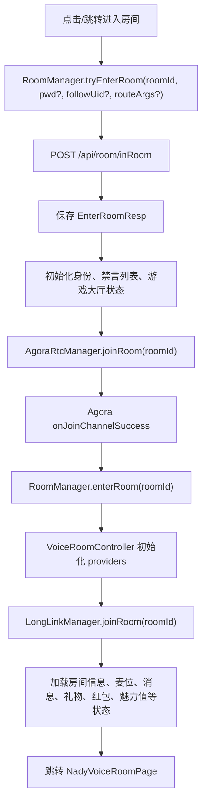
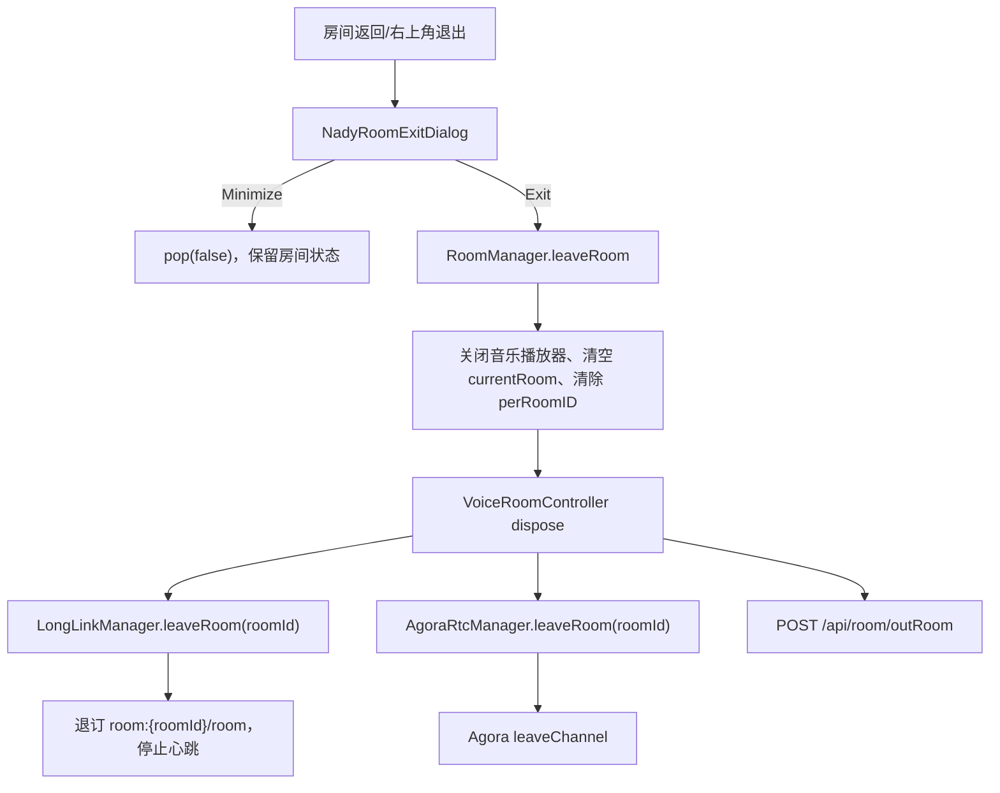
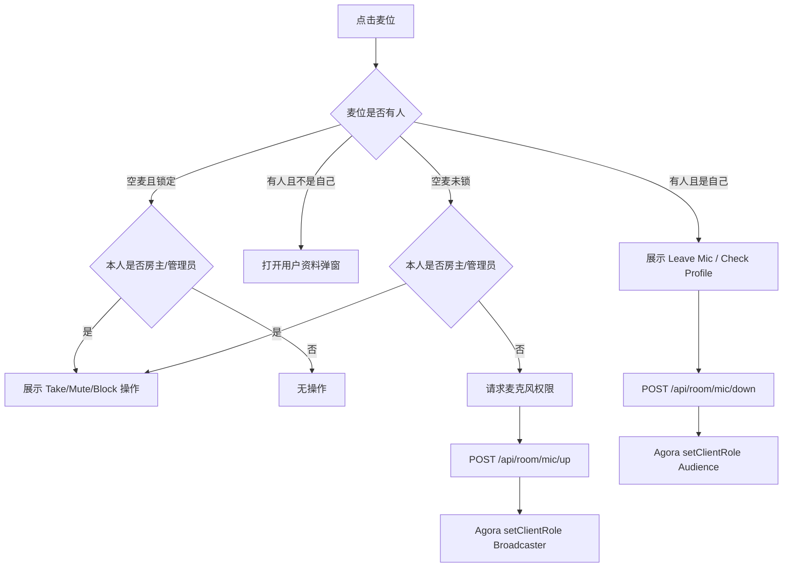
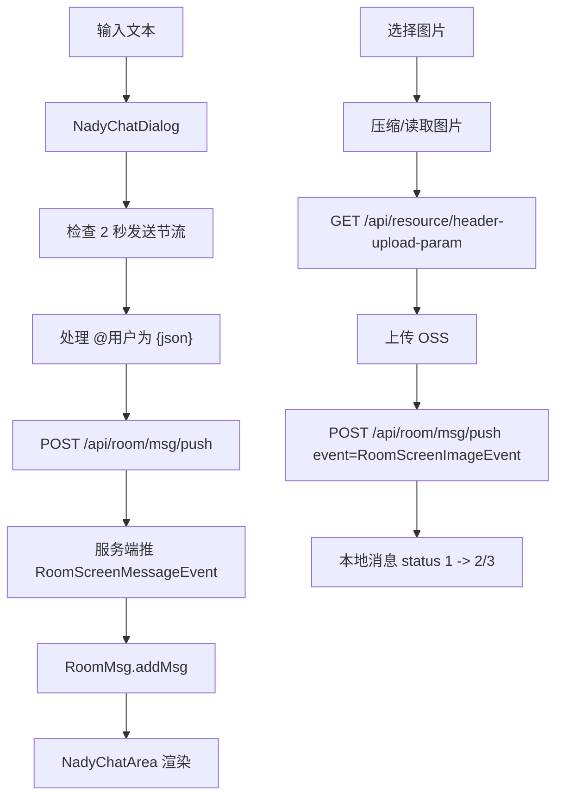
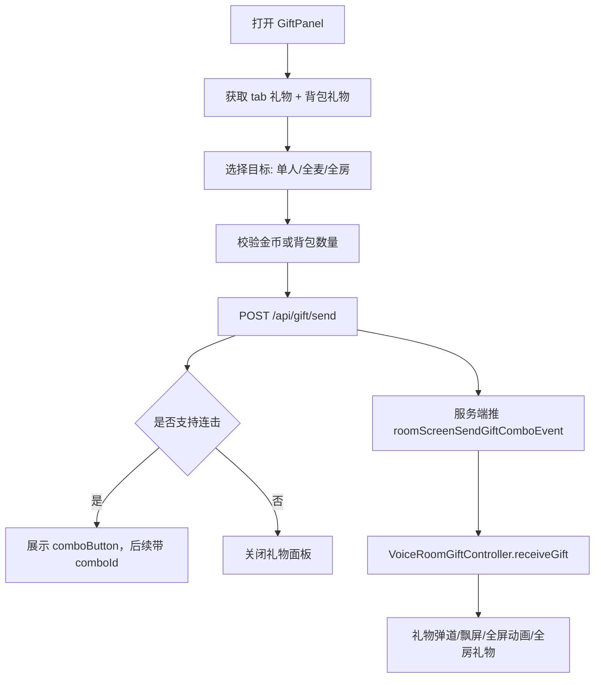

# nady 房间功能迁移清单

静态分析时间：2026-08-21  
来源项目：`/Users/huili/nady`  
目标项目：`/Users/huili/project/iSnow`  
分析范围：`lib/pages/room`、`lib/services/room_manager`、`lib/services/api/room_api.dart`、`lib/model/room`、相关礼物/IM/RTC/游戏依赖。

## 功能清单

| 功能 | 当前类文件名 | 关键方法/状态 | 是否建议首版迁移 |
| --- | --- | --- | --- |
| 进房/退房 | `room_manager.dart`、`voice_room_controller.dart` | `tryEnterRoom`、`enterRoom`、`leaveRoom` | 是 |
| 房间页面 | `nady_voice_room_page.dart`、`nady_normal_chat_room_layout.dart`、`nady_voice_room_ui_layer.dart` | 页面层级、返回拦截、最小化/退出 | 是 |
| 房间信息 | `room_info_data_provider.dart` | `getRoomInfo`、`updateRoomInfo`、`updateRoomGiftWeekVal` | 是 |
| 麦位列表 | `room_mic_data_list_provider.dart` | `getRoomMicList`、`refresh`、`ownerAutoUpMic`、`micAdjust` | 是 |
| 上麦/下麦/锁麦/禁麦 | `room_mic_seat_controller.dart` | `_doUpMic`、`_doDownMic`、`doMuteSeat`、`_doBlockSeat` | 是 |
| 声网 RTC | `agora_rtc_manager.dart` | `joinRoom`、`publish`、`stopPublish`、`leaveRoom`、`muteMicrophone`、`muteSpeaker` | 是 |
| 公屏文本/图片/表情 | `room_msg_provider.dart`、`nady_chat_dialog.dart`、`room_chat_controller.dart` | `sendRoomChatMsg`、`sendImageMsg`、`addMsg` | 是 |
| 礼物面板和送礼 | `gift_send_button.dart`、`nady_bottom_bar.dart` | `SendRoomGiftRequest`、`sendGift`、连击按钮 | 是 |
| 礼物动效 | `voice_room_gift_controller.dart`、`room_gift_controller.dart`、`all_room_gift_controller.dart` | `receiveGift`、`receiveLuckGift` | 可第二阶段 |
| 横幅/全局动效 | `gift_barrage_layer.dart`、`long_link_global_handler.dart` | 礼物横幅、游戏横幅、贵族横幅、世界红包 | 可第二阶段 |
| 观众/在线数/前三 | `room_user_list_provider.dart`、`room_online_user_count_provider.dart` | `getRoomAudienceList`、`roomAudienceTop3ListApi` | 是 |
| 管理员/身份 | `room_admin_list_provider.dart`、`room_identity_provider.dart`、`voice_room_management_dialog_vm.dart` | `addManager`、`removeManager`、`roomIdentityUpdateEvent` | 是 |
| 公屏禁言/黑名单/踢出 | `room_screen_silent.dart`、`room_scrren_slience_list.dart`、`voice_room_management_dialog_vm.dart` | `roomSilence`、`kickOutRoom`、`roomScreenSilenceUpdate` | 是 |
| 房间收藏 | `room_info_data_provider.dart`、title/detail 相关 UI | `followRoom`、`unFollowRoom` | 是 |
| 创建房间 | `nady_create_room_controller.dart`、`nady_create_room_page.dart` | `createRoom`、封面上传 | 是 |
| 红包 | `lucky_bag_controller.dart`、`nady_lucky_bag_*` | `luckyBagSend`、`luckyBagGrab`、`luckyBagList` | 可第二阶段 |
| 幸运转盘 | `room_lucky_wheel_provider.dart`、`nady_room_lucky_wheel_*` | `luckyWheelCreate`、`luckyWheelJoin`、socket 状态 | 可第二阶段 |
| PK | `widgets/pk/*` | `pkBegin`、`pkEnd`、`getRoomPkInfo`、`RoomPkInfoUpdate` | 可第二阶段 |
| 游戏大厅 | `widgets/function_game/*` | `doLobbyAction`、`getFunctionLobbyList`、`RoomLobbyStatusEvent` | 可第二阶段 |
| 音乐播放器 | `widgets/music/*`、`agora_rtc_manager.dart` | `openPlayerAction`、`closePlayerAction`、Agora audio mixing | 可第二阶段 |
| 座驾进房动画 | `room_vehicle_controller.dart` | `RoomUserPropInfoEvent`、`inRoomSendPropInfo` | 可第二阶段 |
| 房内私聊入口 | `nady_bottom_bar.dart`、`nady_conversation_list_in_room_widget.dart` | `nadyIMConnectStatuProvider`、`NadyConversationListInRoom.show()` | 若 iSnow 已迁 IM，则接入 |

## 房间主流程



## 退出流程



## HTTP 接口总表

来源：`RoomApi` wrapper + `ApiClient` + `ApiUrls`。

| 功能 | 方法 | 路径 | 请求字段 | 返回 model | 使用位置 |
| --- | --- | --- | --- | --- | --- |
| 创建房间 | `POST` | `/api/room/openRoom` | `avatar`、`title`、`roomDesc`、`language` | `String roomId` | `NadyCreateRoomController.createRoom` |
| 进入房间 | `POST` | `/api/room/inRoom` | `roomId`、`roomPasswd`、`followUid`、`appVersion` | `EnterRoomResp` | `RoomManager.tryEnterRoom` |
| 退出房间 | `POST` | `/api/room/outRoom` | `roomId` | `dynamic` | `VoiceRoomController.onDispose`、`AgoraRtcManager.outRoom` |
| 检查是否在房 | `GET` | `/api/room/exist_in_room` | query `roomId` | `bool?` | 网络恢复时校验 |
| 房间详情 | `GET` | `/api/room/get/info` | query `roomId` | `RoomInfo` | `RoomInfoData.build` |
| 更新房间信息 | `POST` | `/api/room/update/info` | `roomId`、`title?`、`avatar?`、`roomDesc?`、`roomLock`、`roomPasswd?` | `BaseServerResponse` | 房间管理 |
| 房间用户信息 | `GET` | `/api/room/user/get` | query `roomId`、`targetUid` | `RoomUserInfo` | 用户资料弹窗 |
| 观众列表 | `GET` | `/api/room/list/audience` | query `roomId` | `List<RoomUserInfo>` | 观众列表/打招呼 |
| 观众前三 | `GET` | `/api/room/audienceTop3` | query `roomId` | `RoomUserTopInfo` | 顶部在线人数/前三 |
| 麦位列表 | `GET` | `/api/room/mic/list/info` | query `roomId` | `List<RoomMicModel>` | 麦位 UI |
| 麦位布局调整 | `POST` | `/api/room/mic/adjust` | `roomId`、`micType` | `dynamic/bool` | 麦位布局 |
| 上麦 | `POST` | `/api/room/mic/up` | `roomId`、`position` | `RoomMicOperateResp` | 点击空麦/接受邀请/房主自动上麦 |
| 下麦 | `POST` | `/api/room/mic/down` | `roomId`、`position` | `RoomMicOperateResp` | 自己麦位操作 |
| 踢下麦 | `POST` | `/api/room/mic/kick/down` | `roomId`、`position`、`targetUid` | `RoomMicOperateResp` | 管理操作 |
| 邀请上麦 | `POST` | `/api/room/mic/invite/up` | `roomId`、`targetUid` | `dynamic/bool` | 用户资料/管理操作 |
| 禁麦 | `POST` | `/api/room/mic/mute` | `roomId`、`position` | `dynamic` | 麦位操作 |
| 解除禁麦 | `POST` | `/api/room/mic/unmute` | `roomId`、`position` | `dynamic` | 麦位操作 |
| 锁麦位 | `POST` | `/api/room/mic/lock` | `roomId`、`position`、`isLock` | `RoomMicOperateResp` | 麦位操作 |
| 管理员列表 | `GET` | `/api/room/manager/get/info` | query `roomId` | `List<RoomUserInfo>` | 管理员列表 |
| 添加管理员 | `POST` | `/api/room/manager/add` | `roomId`、`targetUid` | `RoomMicOperateResp` | 房主操作 |
| 移除管理员 | `POST` | `/api/room/manager/cancel` | `roomId`、`targetUid` | `RoomMicOperateResp` | 房主操作 |
| 禁言选项 | `GET` | `/api/room/manager/silenceOption` | 无 | `List<RoomSreenSilcenRes>` | 禁言时长选择 |
| 禁言/取消禁言 | `POST` | `/api/room/manager/silence` | `roomId`、`type`、`targetUid`、`timeType?` | `dynamic/bool` | 管理操作 |
| 禁言列表 | `GET` | `/api/room/manager/silenceList` | query `roomId` | `List<RoomUserInfo>` | 管理页 |
| 黑名单列表 | `GET` | `/api/room/manager/blacklist` | query `roomId` | `List<RoomUserInfo>` | 管理页 |
| 移除黑名单 | `POST` | `/api/room/manager/removeBlacklist` | `roomId`、`targetUid` | `dynamic/bool` | 管理页 |
| 踢出房间 | `POST` | `/api/room/kick/out` | `roomId`、`targetUid`、`type` | `dynamic/bool` | 管理操作 |
| 收藏房间 | `POST` | `/api/follow/room/saveFollow` | `roomId` | `dynamic` | 房间详情/标题栏 |
| 取消收藏 | `POST` | `/api/follow/room/unfollow` | `roomId` | `dynamic` | 房间详情/标题栏 |
| 发送公屏消息 | `POST` | `/api/room/msg/push` | `SendRoomMsgRequest` | `int?` | 文本、图片、表情、公屏消息 |
| 发送欢迎消息 | `POST` | `/api/room/msg/pushWelcomeContent` | `roomId`、`language` | `dynamic` | 欢迎语 |
| 清理公屏 | `POST` | `/api/room/clean` | `roomId` | `dynamic/bool` | 管理操作 |
| 送礼 | `POST` | `/api/gift/send` | `SendRoomGiftRequest` | `dynamic`，连击时 data 为 `comboId` | 礼物面板/快捷幸运礼物 |
| 礼物面板 | `GET` | `/api/gift/info/tabGiftList` | 无 | `TabGiftWrapper` | 礼物面板 |
| 背包礼物 | `GET` | `/api/gift/info/getBackpack` | 无 | `GiftRequest` | 礼物面板背包 tab |
| 幸运礼物列表 | `GET` | `/api/gift/info/lucky/list` | 无 | `List<GiftModel>?` | 底部快捷幸运礼物 |
| 长连接频道 token | `GET` | `/api/room/genGlobalToken` | query `channel` | `String` | socket 订阅 |
| 房间重连上报 | `POST` | `/api/room/reconnect/report` | `roomId` | `dynamic/bool` | socket reconnect |
| 进房座驾触发 | `GET` | `/api/room/inRoom/sendPropInfo` | query `roomId` | `dynamic` | `RoomVehicleController` |
| 进房公屏触发 | `GET` | `/api/room/inRoom/sendScreen` | query `roomId` | `dynamic` | `room:{roomId}` 订阅成功后 |
| PK 开始 | `POST` | `/api/room/pk/begin` | `roomId`、`duration`、`pkUserList` | `dynamic/bool` | PK 设置 |
| PK 结束 | `POST` | `/api/room/pk/over` | `roomId` | `dynamic/bool` | PK 结束 |
| PK 信息 | `GET` | `/api/room/pk/info` | query `roomId`、`pkId?` | `PkModel` | PK 状态 |
| 房间热度 | `GET` | `/api/room/getHotScore` | query `roomId` | `int` | 热度 |
| 红包发送 | `POST` | `/api/redPacket/push` | `roomId`、`type`、`gold`、`numberOfRecipients`、`countdown` | `LuckyBagModel` | 红包 |
| 抢红包 | `POST` | `/api/redPacket/grab` | `luckyBagId` | `LuckyBagResult` | 红包 |
| 红包列表 | `GET` | `/api/redPacket/list` | query `roomId` | `List<LuckyBagModel>` | 红包列表 |
| 红包配置 | `GET` | `/api/redPacket/config` | query `roomId` | `LuckyBagConfig` | 红包配置 |
| 房间是否有红包 | `GET` | `/api/redPacket/haveBox` | query `roomIds: List<String>` | `List<LuckyBagHave>` | 房间列表提示 |
| 幸运转盘开始 | `POST` | `/api/wheel/startLuckyWheel` | `wheelId` | `dynamic/bool` | 幸运转盘 |
| 幸运转盘参加 | `POST` | `/api/wheel/joinLuckyWheel` | `wheelId` | `dynamic/bool` | 幸运转盘 |
| 幸运转盘详情 | `POST` | `/api/wheel/getLuckyWheelDetail` | `roomId` | `LuckyWheelResult` | 幸运转盘 |
| 幸运转盘创建 | `POST` | `/api/wheel/createLuckyWheel` | `entryFee`、`join`、`roomId` | `dynamic/bool` | 幸运转盘 |
| 幸运转盘取消 | `POST` | `/api/wheel/cancelLuckyWheel` | `wheelId` | `dynamic/bool` | 幸运转盘 |
| 魅力值排行 | `GET` | `/api/room/mic/charm/rank` | query `roomId`、`targetUid` | `CharmInfo` | 麦位魅力值弹窗 |
| 魅力值开关查询 | `GET` | `/api/room/mic/charm/isEnable` | query `roomId` | `bool` | 房间魅力值状态 |
| 魅力值开关更新 | `GET` | `/api/room/mic/charm/updateStatus` | query `roomId`、`enable` | `bool` | 房主/管理操作 |
| 房间游戏列表 | `GET` | `/api/room/game/list` | 无 | `List<RoomGameModel>` | 房间更多工具 |
| 房间模式切换 | `POST` | `/api/room/mode/switch` | `roomId`、`mode` | `bool` | 旧游戏模式 |
| 房间模式查询 | `POST` | `/api/room/mode/get` | `roomId` | `int` | 旧游戏模式 |
| 大厅记录 | `GET` | `/api/lobby/lists` | query `roomId` | `List<FunctionGameRecordListModel>` | 游戏大厅记录 |
| 挖矿大厅记录 | `GET` | `/api/lobby/playTo/lists` | query `roomId` | `MiningGameRecordModel` | 挖矿记录 |
| 大厅开关 | `POST` | `/api/lobby/open` | `status`、`roomId`、`lobbyType` | `dynamic/bool` | 房主操作大厅 |
| 打开音乐播放器 | `POST` | `/api/room/openPlayer` | `roomId`、`opType` | `dynamic` | 房间音乐 |
| 关闭音乐播放器 | `POST` | `/api/room/closePlayer` | `roomId` | `dynamic/bool` | 房间音乐 |
| 游戏大奖展示 | `GET` | `/gameBigWin/getGameBigWinShow` | 无 | `GameBigWinShowModel` | 大奖入口 |
| 游戏大奖榜单 | `POST` | `/gameBigWin/getGameBigWinRank` | `gameBigWinId`、`round` | `GameBigWinResultModel` | 大奖榜单 |
| OSS 上传参数 | `GET` | `/api/resource/header-upload-param` | 无 | `UploadParam` | 房间封面/公屏图片上传 |
| 声网 token | `GET` | `/api/agora/token` | query `roomId` | `String` | `AgoraRtcManager.joinRoom` token 兜底 |

## 关键请求字段

### 创建房间 `/api/room/openRoom`

| 字段名 | Dart 类型 | 含义 | 来源 | 是否必填 | 使用位置 |
| --- | --- | --- | --- | --- | --- |
| `avatar` | `String?` | 房间封面 URL | 封面上传成功后的 OSS URL | 是，代码校验非空 |
| `title` | `String?` | 房间名称 | 输入框 | 是，代码校验非空，长度 20 |
| `roomDesc` | `String?` | 房间描述/公告 | 输入框 | 是，代码校验非空，长度 200 |
| `language` | `String?` | 当前语言 | `languageSettingProvider.notifier.language` | 是 |

### 进入房间 `/api/room/inRoom`

| 字段名 | Dart 类型 | 含义 | 来源 | 是否必填 | 使用位置 |
| --- | --- | --- | --- | --- | --- |
| `roomId` | `String` | 房间 ID | 外部跳转/列表/搜索/邀请 | 是 | `RoomManager.tryEnterRoom` |
| `roomPasswd` | `String` | 加密后的房间密码，无密码为空字符串 | 密码弹窗 + `CryptUtil.encrypt` | 锁房必填 |
| `followUid` | `int` | 来源/跟随用户 ID | `followUid` 参数，空为 `0` | 否 |
| `appVersion` | `String?` | App 版本 | `deviceDataProvider.future.appVersion` | 否，但当前会传 |

错误码行为：

| 错误码常量 | 行为 |
| --- | --- |
| `ServiceStatusCode.enterRoomPassword` | 展示密码弹窗，输入后加密重试 |
| `ServiceStatusCode.enterRoomPasswordError` | 标记密码错误状态 |
| `ServiceStatusCode.enterRoomCant` | 停止心跳，展示“被踢不能进入”弹窗 |

### 麦位操作

| 接口 | 字段名 | Dart 类型 | 含义 | 是否必填 |
| --- | --- | --- | --- | --- |
| `/api/room/mic/up` | `roomId` | `String` | 当前房间 ID | 是 |
| `/api/room/mic/up` | `position` | `int` | 麦位下标，nady 从 0 开始 | 是 |
| `/api/room/mic/down` | `roomId` | `String` | 当前房间 ID | 是 |
| `/api/room/mic/down` | `position` | `int` | 麦位下标 | 是 |
| `/api/room/mic/kick/down` | `roomId` | `String` | 当前房间 ID | 是 |
| `/api/room/mic/kick/down` | `position` | `int` | 麦位下标 | 是 |
| `/api/room/mic/kick/down` | `targetUid` | `int` | 被踢下麦用户 ID | 是 |
| `/api/room/mic/invite/up` | `roomId` | `String` | 当前房间 ID | 是 |
| `/api/room/mic/invite/up` | `targetUid` | `int` | 被邀请用户 ID | 是 |
| `/api/room/mic/mute` | `roomId` | `String` | 当前房间 ID | 是 |
| `/api/room/mic/mute` | `position` | `int` | 麦位下标 | 是 |
| `/api/room/mic/unmute` | `roomId` | `String` | 当前房间 ID | 是 |
| `/api/room/mic/unmute` | `position` | `int` | 麦位下标 | 是 |
| `/api/room/mic/lock` | `roomId` | `String` | 当前房间 ID | 是 |
| `/api/room/mic/lock` | `position` | `int` | 麦位下标 | 是 |
| `/api/room/mic/lock` | `isLock` | `bool` | 是否锁麦 | 是 |
| `/api/room/mic/adjust` | `roomId` | `String` | 当前房间 ID | 是 |
| `/api/room/mic/adjust` | `micType` | `int` | 麦位布局类型 | 是 |

### 公屏消息 `/api/room/msg/push`

| 字段名 | Dart 类型 | 含义 | 来源 | 是否必填 | 说明 |
| --- | --- | --- | --- | --- | --- |
| `event` | `String` | socket 事件名 | `LongLinkEvent.*` | 是 | 文本用 `RoomScreenMessageEvent`，图片用 `RoomScreenImageEvent` |
| `roomId` | `String` | 当前房间 ID | `RoomManager.currentRoomID` | 是 | 不能为空 |
| `data` | `String` | 消息内容 | 输入框/OSS path/表情 JSON | 是 | @用户写成 `</user_nike>{json}</user_nike>` |

### 送礼 `/api/gift/send`

| 字段名 | Dart 类型 | 含义 | 来源 | 是否必填 | 说明 |
| --- | --- | --- | --- | --- | --- |
| `targetUids` | `List<int>?` | 收礼用户 ID 列表 | 礼物目标选择/麦上用户 | 单人/麦上必填；全房为 null |
| `sendType` | `SendType` | 发送目标类型 | 目标选择 | 是 | `single=1`、`onMic=2`、`onRoom=3`、`room=4` |
| `roomId` | `String` | 当前房间 ID | 礼物面板传入 | 是 |
| `giftId` | `int` | 礼物 ID | `GiftModel.id` | 是 |
| `giftCount` | `int` | 礼物数量 | `giftSendCountProvider` | 是 |
| `giftSource` | `int` | 礼物来源 | tab ID | 是 | `1` 普通礼物，`2` 背包 |
| `comboId` | `String` | 连击 ID | 首次为空；后续连击由返回 data 填入 | 是 |
| `comboCount` | `int` | 连击次数 | 默认 `1` | 是 |
| `price` | `int` | 单价 | `GiftModel.price` | 是 |
| `userBackpackId` | `int?` | 背包礼物记录 ID | `GiftModel.userBackpackId` | 背包礼物需要 |

### 管理接口字段

| 接口 | 字段名 | Dart 类型 | 含义 | 是否必填 |
| --- | --- | --- | --- | --- |
| `/api/room/manager/silence` | `roomId` | `String` | 当前房间 ID | 是 |
| `/api/room/manager/silence` | `type` | `int` | `1` 禁言，`2` 取消禁言 | 是 |
| `/api/room/manager/silence` | `targetUid` | `int` | 目标用户 ID | 是 |
| `/api/room/manager/silence` | `timeType` | `int?` | `1` 10 分钟，`2` 1 小时，`3` 1 天，`4` 7 天 | 禁言时需要 |
| `/api/room/kick/out` | `roomId` | `String` | 当前房间 ID | 是 |
| `/api/room/kick/out` | `targetUid` | `int` | 目标用户 ID | 是 |
| `/api/room/kick/out` | `type` | `int` | `1` 一天，`2` 永久 | 是 |
| `/api/room/manager/add` | `roomId` | `String` | 当前房间 ID | 是 |
| `/api/room/manager/add` | `targetUid` | `int` | 目标用户 ID | 是 |
| `/api/room/manager/cancel` | `roomId` | `String` | 当前房间 ID | 是 |
| `/api/room/manager/cancel` | `targetUid` | `int` | 目标用户 ID | 是 |
| `/api/room/manager/removeBlacklist` | `roomId` | `String` | 当前房间 ID | 是 |
| `/api/room/manager/removeBlacklist` | `targetUid` | `int` | 目标用户 ID | 是 |

### 红包与幸运转盘字段

| 接口 | 字段名 | Dart 类型 | 含义 | 是否必填 |
| --- | --- | --- | --- | --- |
| `/api/redPacket/push` | `roomId` | `String` | 当前房间 ID | 是 |
| `/api/redPacket/push` | `type` | `int` | 红包类型 | 是 |
| `/api/redPacket/push` | `gold` | `int` | 红包金币总额/档位 | 是 |
| `/api/redPacket/push` | `numberOfRecipients` | `int` | 可抢人数 | 是 |
| `/api/redPacket/push` | `countdown` | `int` | 倒计时秒数 | 是 |
| `/api/redPacket/grab` | `luckyBagId` | `String` | 红包 ID | 是 |
| `/api/wheel/createLuckyWheel` | `entryFee` | `int` | 入场费用 | 是 |
| `/api/wheel/createLuckyWheel` | `join` | `bool` | 创建后是否自动参与 | 是 |
| `/api/wheel/createLuckyWheel` | `roomId` | `String` | 当前房间 ID | 是 |
| `/api/wheel/startLuckyWheel` | `wheelId` | `int` | 转盘 ID | 是 |
| `/api/wheel/joinLuckyWheel` | `wheelId` | `int` | 转盘 ID | 是 |
| `/api/wheel/cancelLuckyWheel` | `wheelId` | `int` | 转盘 ID | 是 |

## 返回 model 层级

### `EnterRoomResp`

| 字段名 | Dart 类型 | 含义 | 是否必填 | UI/流程映射 |
| --- | --- | --- | --- | --- |
| `roomId` | `String` | 房间 ID | 是 | 当前房间 ID |
| `identity` | `UserRoomIdentity` | 本人在房身份 | 是 | 决定房主管理按钮、管理员权限 |
| `agoraToken` | `String?` | 声网 token | 否 | `AgoraRtcManager.joinRoom` 优先使用，空则调用 `/api/agora/token` |
| `longLinkToken` | `String` | 长连接 token | 是 | 当前代码保存但订阅 token 实际用 `/api/room/genGlobalToken` |
| `silenceEndTime` | `int?` | 本人禁言结束时间 | 否 | 底部输入框禁言状态 |
| `status` | `int?` | 游戏大厅/房间状态 | 否 | `roomMicAreaStateControllerProvider.set` |
| `lobbyType` | `int?` | 大厅类型 | 否 | 游戏麦位区域模式 |

### `RoomInfo -> RoomDetailInfo`

| 层级 | 字段名 | Dart 类型 | 含义 | 是否必填 | UI/状态 |
| --- | --- | --- | --- | --- | --- |
| `RoomInfo` | `detailInfo` | `RoomDetailInfo` | JSON key `roomInfoDTO` | 是 | 房间详情整体 |
| `RoomDetailInfo` | `roomId` | `String` | 房间 ID | 是 | 当前房间 |
| `RoomDetailInfo` | `roomUid` | `int` | 房主 UID | 是 | 房主资料、房主自动上麦 |
| `RoomDetailInfo` | `roomNo` | `int` | 房间号 | 是 | 标题栏展示 |
| `RoomDetailInfo` | `avatar` | `String?` | 房间封面 | 是但可空 | 背景/详情 |
| `RoomDetailInfo` | `title` | `String` | 房间标题 | 是 | 标题栏 |
| `RoomDetailInfo` | `roomTypeValue` | `int` | 房间类型 | 是 | 房间类型 |
| `RoomDetailInfo` | `roomDesc` | `String` | 房间描述/公告 | 是 | 公告层 |
| `RoomDetailInfo` | `roomLock` | `bool` | 是否锁房 | 是 | 进房密码 |
| `RoomDetailInfo` | `roomPasswd` | `String` | 房间密码 | 是 | 管理页 |
| `RoomDetailInfo` | `quickWelcomeStr` | `String` | 快捷欢迎语 | 是 | 欢迎消息 |
| `RoomDetailInfo` | `isFollow` | `bool` | 是否收藏/关注房间 | 是 | 收藏按钮 |
| `RoomDetailInfo` | `country` | `String` | 国家/地区 | 是 | 房间信息 |
| `RoomDetailInfo` | `roomGiftWeekVal` | `int` | 房间周礼物流水 | 是 | 房间热度/礼物流水 |
| `RoomDetailInfo` | `roomGiftIncomeVal` | `int?` | 礼物收益 | 否 | 房主收益展示 |
| `RoomDetailInfo` | `hasPrettyNo` | `bool?` | 是否靓号 | 否 | 房号展示 |
| `RoomDetailInfo` | `backgroundUrl` | `String?` | 房间背景图 | 否 | 背景层 |

### `RoomMicModel -> RoomUserInfo -> BaseUserInfo`

| 层级 | 字段名 | Dart 类型 | 含义 | 是否必填 | UI/状态 |
| --- | --- | --- | --- | --- | --- |
| `RoomMicModel` | `position` | `int` | 麦位下标 | 是 | 麦位位置 |
| `RoomMicModel` | `roomUserBaseDto` | `RoomUserInfo?` | 麦上用户 | 否 | 头像、昵称、身份 |
| `RoomMicModel` | `timestamp` | `int?` | 上麦时间/排序时间 | 否 | 当前代码未显著使用 |
| `RoomMicModel` | `isLock` | `bool` | 是否锁麦 | 是 | 空麦锁定 UI |
| `RoomMicModel` | `isMute` | `bool` | 麦位是否禁麦 | 是 | 麦位静音图标 |
| `RoomMicModel` | `isNeedShowWelcome` | `bool?` | 本地欢迎动画标记 | 否 | 麦位欢迎 |
| `RoomMicModel` | `charmValue` | `int?` | 魅力值 | 否 | 魅力值显示 |
| `RoomUserInfo` | `userBase` | `BaseUserInfo` | 用户基础信息 | 是 | 用户资料 |
| `RoomUserInfo` | `roomIdentity` | `UserRoomIdentity` | 房间身份 | 是 | 权限/身份标识 |
| `RoomUserInfo` | `silenceEndTime` | `int?` | 禁言结束时间 | 否 | 禁言状态 |
| `RoomUserInfo` | `operateUserBase` | `BaseUserInfo?` | 操作者信息 | 否 | 管理记录 |
| `RoomUserInfo` | `operateRoomIdentity` | `UserRoomIdentity?` | 操作者身份 | 否 | 管理记录 |
| `RoomUserInfo` | `operateUid` | `int?` | 操作者 UID | 否 | 管理记录 |
| `BaseUserInfo` | `uid` | `int` | 用户 ID | 是 | 所有用户映射 |
| `BaseUserInfo` | `userNo` | `int?` | 用户号 | 否 | 资料页 |
| `BaseUserInfo` | `nick` | `String` | 昵称 | 是 | 公屏/麦位/资料 |
| `BaseUserInfo` | `avatar` | `String?` | 头像 | 否 | 头像 |
| `BaseUserInfo` | `gender` | `int` | 性别 | 是 | 用户展示 |
| `BaseUserInfo` | `userLevel` | `UserLevel?` | 用户等级 | 否 | 等级/贵族/VIP |
| `BaseUserInfo` | `vehicle` | `UserPropInfoDTOUserPropInfoDTO?` | 座驾 | 否 | 进房座驾 |
| `BaseUserInfo` | `specialEffects` | `UserPropInfoDTOUserPropInfoDTO?` | 特效装扮 | 否 | 进房特效 |

### 房间身份 `UserRoomIdentity`

| JSON 值 | Dart enum | 含义 | 权限 |
| --- | --- | --- | --- |
| `ROOM_AUDIENCE` | `UserRoomIdentity.audience` | 普通观众 | 可聊天、上麦、送礼 |
| `ROOM_MANAGER` | `UserRoomIdentity.manager` | 管理员 | 可管理麦位、禁言等 |
| `ROOM_OWNER` | `UserRoomIdentity.owner` | 房主 | 最高房间权限 |

### `SendType`

| JSON 值 | Dart enum | 含义 |
| --- | --- | --- |
| `1` | `SendType.single` | 送给单个用户 |
| `2` | `SendType.onMic` | 送给麦上用户 |
| `3` | `SendType.onRoom` | 送给房间内所有用户 |
| `4` | `SendType.room` | 房间送礼类型，当前主要保留 |

### 礼物 model

| model | 字段名 | Dart 类型 | 含义 |
| --- | --- | --- | --- |
| `TabGiftWrapper` | `gold` | `int` | 当前金币 |
| `TabGiftWrapper` | `tabGiftInfos` | `List<TabGiftModel>?` | 礼物 tab |
| `TabGiftModel` | `tabId` | `int` | tab ID，背包本地追加为 `-99999` |
| `TabGiftModel` | `tab` | `String` | tab 名称 |
| `TabGiftModel` | `giftInfoDTOS` | `List<GiftModel>?` | 礼物列表 |
| `GiftModel` | `id` | `int` | 礼物 ID |
| `GiftModel` | `cornerMark` | `String` | 角标 |
| `GiftModel` | `icon` | `String` | 礼物图标 |
| `GiftModel` | `animationUrl` | `String?` | 礼物动画 URL |
| `GiftModel` | `animationType` | `int?` | 动画类型 |
| `GiftModel` | `jumpLink` | `String?` | 跳转链接 |
| `GiftModel` | `banner` | `String?` | 横幅资源 |
| `GiftModel` | `remark` | `String?` | 备注 |
| `GiftModel` | `levelType` | `int` | 等级类型 |
| `GiftModel` | `giftPreLoad` | `int?` | 是否预加载 |
| `GiftModel` | `name` | `String` | 礼物名称 |
| `GiftModel` | `price` | `int` | 单价 |
| `GiftModel` | `amount` | `int?` | 背包数量 |
| `GiftModel` | `isCombo` | `int` | 是否支持连击，`1` 支持 |
| `GiftModel` | `tabId` | `int?` | 所属 tab |
| `GiftModel` | `giftType` | `int?` | 礼物类型，`2` 魔法礼物 |
| `GiftModel` | `userBackpackId` | `int?` | 背包记录 ID |
| `GiftModel` | `defaultGiftNum` | `int?` | 默认数量 |
| `GiftModel` | `direction` | `int?` | 动效方向 |
| `GiftModel` | `defaultGiftNumConfig` | `String?` | 数量快捷配置，如逗号分隔 |

## 房间状态映射

| 状态 | 当前 provider/类 | 数据类型 | 来源 | UI 映射 |
| --- | --- | --- | --- | --- |
| 当前房间 controller | `roomManagerProvider` | `RoomControllerInterface?` | `RoomManager.enterRoom` | 判断是否在房、当前 roomId |
| 进房返回 | `RoomManager.roomResp` | `EnterRoomResp?` | `/api/room/inRoom` | 身份、Agora token、禁言、游戏状态 |
| 房间详情 | `roomInfoDataProvider(roomId)` | `AsyncValue<RoomInfo>` | `/api/room/get/info` + socket 更新 | 标题、封面、公告、锁房、流水 |
| 房间身份 | `roomIdentifyProvider(roomId)` | `AsyncValue<UserRoomIdentity>` | 进房响应 + `RoomIdentityUpdateEvent` | 管理权限 |
| 麦位列表 | `roomMicDataListProvider(roomId)` | `AsyncValue<List<RoomMicModel>>` | `/api/room/mic/list/info` + `RoomMicUpdateEvent` | 麦位 UI |
| 麦上用户 | `voiceRoomOnMicUserListProvider(roomId)` | `List<BaseUserInfo>` | 麦位列表同步 | 礼物目标、麦上列表 |
| 本人是否上麦 | `selfOnMicStatusProvider(roomId)` | `AsyncValue<bool>` | 监听麦位列表 | 底部输入框/麦克风按钮 |
| 本人麦克风静音 | `selfSettingRoomMicMuteStatusProvider(roomId)` | `AsyncValue<bool>` | 本地存储 + Agora | 麦克风按钮 |
| 本人扬声器静音 | `selfSettingRoomSpeakerMuteStatusProvider(roomId)` | `AsyncValue<bool>` | 本地存储 + Agora | 扬声器按钮，当前 UI 注释 |
| 房间在线数 | `roomOnlineUserCountProvider(roomId)` | `int` | `/api/room/audienceTop3` + socket | 在线人数 |
| 观众列表 | `roomUserListProvider(roomId)` | `AsyncValue<List<RoomUserInfo>>` | `/api/room/list/audience` | 观众弹窗 |
| 观众前三 | `roomUserRankListProvider(roomId)` | `AsyncValue<RoomUserTopInfo?>` | `/api/room/audienceTop3` + socket | 标题区域头像 |
| 管理员列表 | `roomAdminListProvider(roomId)` | `AsyncValue<List<RoomUserInfo>>` | `/api/room/manager/get/info` + 身份事件刷新 | 管理页/用户身份判断 |
| 公屏消息 | `roomMsgProvider(roomId)` | `List<RoomScreenMsg>` | socket + 本地图片消息 | `NadyChatArea` |
| 公屏禁言 | `roomScreenSilentProvider` | `RoomScreenSilentInfo` | `RoomUserPublicScreenSilenceUpdate` | 输入框禁用 |
| 游戏大厅状态 | `roomMicAreaStateControllerProvider` | `RoomMicAreaStateModel` | 进房响应 + `RoomLobbyStatusEvent` | 麦位区域模式 |
| 礼物列表 | `giftListProvider` / `tabGiftListProvider` | `List<TabGiftModel>` | `/api/gift/info/tabGiftList` + 背包 | 礼物面板 |
| 礼物动效 | `voiceRoomGiftControllerProvider(roomId)` | controller | `roomScreenSendGiftComboEvent` | 礼物弹道/动效 |
| 红包列表 | `luckyBagListProvider(roomId)` | `AsyncValue<List<LuckyBagModel>>` | `/api/redPacket/list` + socket | 红包入口 |
| 魅力值开关 | `charmStatusProvider(roomId)` | `bool` | `/api/room/mic/charm/isEnable` + socket | 麦位魅力值 |
| 房间音乐 | `nadyRoomMusicStateControllerProvider` | controller | 音乐 API + Agora mixing | 音乐播放器 |

## 上麦/下麦流程



## 公屏消息流程



## 送礼流程



## RTC 语音流程

当前使用 Agora：

| 步骤 | 当前方法 | 参数 |
| --- | --- | --- |
| 初始化 engine | `AgoraRtcManager.build` | `envProvider.agoraAppID` |
| 设置频道模式 | `RtcEngineContext.channelProfile` | `ChannelProfileType.channelProfileLiveBroadcasting` |
| 设置角色 | `engine.setClientRole` | 初始 `clientRoleBroadcaster`，join 时以 audience 进入 |
| 启用音频 | `engine.enableAudio` | 无 |
| 音频配置 | `engine.setAudioProfile` | `audioProfileDefault`、`audioScenarioGameStreaming` |
| 音量回调 | `engine.enableAudioVolumeIndication` | `interval=1000`、`smooth=3`、`reportVad=true` |
| 加入频道 | `engine.joinChannel` | `token`、`channelId=roomID`、`uid=currentUid`、`clientRoleType=Audience` |
| 上麦发布 | `publish(pos)` | `setClientRole(Broadcaster)` |
| 下麦停止发布 | `stopPublish(pos)` | `setClientRole(Audience)` |
| 离房 | `leaveRoom(roomID)` | `setClientRole(Audience)` + `leaveChannel()` |
| 麦克风静音 | `muteMicrophone(mute)` | `engine.muteLocalAudioStream(mute)` |
| 扬声器静音 | `muteSpeaker(mute)` | `engine.muteAllRemoteAudioStreams(mute)` |
| 音乐混流 | `startPlayMusic(filePath)` | `engine.startAudioMixing(filePath, loopback:false, cycle:-1)` |

## `RoomManager` 目标骨架

```dart
enum RoomLoadStatus {
  idle,
  entering,
  ready,
  minimizing,
  leaving,
  error,
}

class RoomState {
  const RoomState({
    required this.status,
    this.roomId,
    this.enterResp,
    this.roomInfo,
    this.micList = const [],
    this.messages = const [],
    this.identity,
    this.onlineCount = 0,
    this.topUsers,
    this.adminList = const [],
    this.isSelfOnMic = false,
    this.isMicMuted = false,
    this.isSpeakerMuted = false,
    this.screenSilent,
    this.lobbyStatus = 0,
    this.lobbyType,
    this.pk,
  });

  final RoomLoadStatus status;
  final String? roomId;
  final EnterRoomResp? enterResp;
  final RoomInfo? roomInfo;
  final List<RoomMicModel> micList;
  final List<RoomScreenMsg> messages;
  final UserRoomIdentity? identity;
  final int onlineCount;
  final RoomUserTopInfo? topUsers;
  final List<RoomUserInfo> adminList;
  final bool isSelfOnMic;
  final bool isMicMuted;
  final bool isSpeakerMuted;
  final RoomScreenSilentInfo? screenSilent;
  final int lobbyStatus;
  final int? lobbyType;
  final PkModel? pk;

  RoomState copyWith({
    RoomLoadStatus? status,
    String? roomId,
    EnterRoomResp? enterResp,
    RoomInfo? roomInfo,
    List<RoomMicModel>? micList,
    List<RoomScreenMsg>? messages,
    UserRoomIdentity? identity,
    int? onlineCount,
    RoomUserTopInfo? topUsers,
    List<RoomUserInfo>? adminList,
    bool? isSelfOnMic,
    bool? isMicMuted,
    bool? isSpeakerMuted,
    RoomScreenSilentInfo? screenSilent,
    int? lobbyStatus,
    int? lobbyType,
    PkModel? pk,
  }) {
    return RoomState(
      status: status ?? this.status,
      roomId: roomId ?? this.roomId,
      enterResp: enterResp ?? this.enterResp,
      roomInfo: roomInfo ?? this.roomInfo,
      micList: micList ?? this.micList,
      messages: messages ?? this.messages,
      identity: identity ?? this.identity,
      onlineCount: onlineCount ?? this.onlineCount,
      topUsers: topUsers ?? this.topUsers,
      adminList: adminList ?? this.adminList,
      isSelfOnMic: isSelfOnMic ?? this.isSelfOnMic,
      isMicMuted: isMicMuted ?? this.isMicMuted,
      isSpeakerMuted: isSpeakerMuted ?? this.isSpeakerMuted,
      screenSilent: screenSilent ?? this.screenSilent,
      lobbyStatus: lobbyStatus ?? this.lobbyStatus,
      lobbyType: lobbyType ?? this.lobbyType,
      pk: pk ?? this.pk,
    );
  }
}

class RoomManager {
  RoomManager({
    required this.repository,
    required this.socketManager,
    required this.rtcManager,
    required this.currentUidProvider,
  });

  final RoomRepository repository;
  final AppSocketManager socketManager;
  final RoomRtcManager rtcManager;
  final int? Function() currentUidProvider;

  RoomState state = const RoomState(status: RoomLoadStatus.idle);
  RoomSocketEventAdapter? _socketAdapter;

  String get currentRoomId => state.roomId ?? '';
  int? get currentUid => currentUidProvider();

  Future<void> enterRoom(
    String roomId, {
    String? encryptedPassword,
    int? followUid,
    String? appVersion,
    RoomRouteArgs? routeArgs,
  }) async {
    if (state.roomId == roomId && state.status == RoomLoadStatus.ready) {
      return;
    }

    if (state.roomId != null && state.roomId != roomId) {
      await leaveRoom();
    }

    state = RoomState(status: RoomLoadStatus.entering, roomId: roomId);

    final enterResp = await repository.enterRoom(
      roomId: roomId,
      roomPasswd: encryptedPassword ?? '',
      followUid: followUid ?? 0,
      appVersion: appVersion,
    );

    state = RoomState(
      status: RoomLoadStatus.entering,
      roomId: roomId,
      enterResp: enterResp,
      identity: enterResp.identity,
      lobbyStatus: enterResp.status ?? 0,
      lobbyType: enterResp.lobbyType,
    );

    await rtcManager.joinRoom(
      roomId: roomId,
      token: enterResp.agoraToken,
      uid: currentUidProvider(),
      onJoinSuccess: () async {
        await _afterRtcJoined(roomId);
      },
    );
  }

  Future<void> _afterRtcJoined(String roomId) async {
    _socketAdapter = RoomSocketEventAdapter(
      eventBus: socketManager.eventBus,
      roomManager: this,
    )..bind();

    await socketManager.joinRoom(roomId);

    final results = await Future.wait<Object?>([
      repository.getRoomInfo(roomId),
      repository.getRoomMicList(roomId),
      repository.getRoomTopUsers(roomId),
      repository.getAdminList(roomId),
    ]);

    final roomInfo = results[0] as RoomInfo;
    final micList = results[1] as List<RoomMicModel>;
    final topUsers = results[2] as RoomUserTopInfo?;
    final adminList = results[3] as List<RoomUserInfo>;

    state = RoomState(
      status: RoomLoadStatus.ready,
      roomId: roomId,
      enterResp: state.enterResp,
      roomInfo: roomInfo,
      micList: micList,
      topUsers: topUsers,
      onlineCount: topUsers?.audienceCount ?? 0,
      adminList: adminList,
      identity: state.identity,
      lobbyStatus: state.lobbyStatus,
      lobbyType: state.lobbyType,
      isSelfOnMic: _isSelfOnMic(micList),
    );
  }

  Future<void> leaveRoom() async {
    final roomId = state.roomId;
    if (roomId == null || roomId.isEmpty) return;

    state = RoomState(status: RoomLoadStatus.leaving, roomId: roomId);
    _socketAdapter?.unbind();
    _socketAdapter = null;

    await Future.wait([
      socketManager.leaveRoom(roomId),
      rtcManager.leaveRoom(roomId),
      repository.exitRoom(roomId),
    ]);

    state = const RoomState(status: RoomLoadStatus.idle);
  }

  Future<void> upMic(int position) async {
    final resp = await repository.upMic(currentRoomId, position);
    if (resp?.roomId != null && resp?.uid != null) {
      await rtcManager.publish(position);
    }
  }

  Future<void> downMic(int position) async {
    final resp = await repository.downMic(currentRoomId, position);
    if (resp?.roomId != null && resp?.uid != null) {
      await rtcManager.stopPublish(position);
    }
  }

  Future<void> muteMicSeat(int position, bool mute) async {
    if (mute) {
      await repository.muteMic(currentRoomId, position);
    } else {
      await repository.unMuteMic(currentRoomId, position);
    }
  }

  Future<void> sendText(String text) async {
    await repository.sendRoomMessage(SendRoomMsgRequest(
      event: RoomSocketEvents.roomScreenMessageEvent,
      roomId: currentRoomId,
      data: text,
    ));
  }

  Future<void> sendImage(String ossPath) async {
    await repository.sendRoomMessage(SendRoomMsgRequest(
      event: RoomSocketEvents.roomScreenImageEvent,
      roomId: currentRoomId,
      data: ossPath,
    ));
  }

  Future<void> sendGift(SendRoomGiftRequest request) async {
    await repository.sendGift(request);
  }

  void updateMicList(List<RoomMicModel> micList) {
    state = state.copyWith(
      micList: micList,
      isSelfOnMic: _isSelfOnMic(micList),
    );
  }

  void addScreenMessage(RoomScreenMsg message) {
    state = state.copyWith(messages: [message, ...state.messages]);
  }

  bool _isSelfOnMic(List<RoomMicModel> micList) {
    final uid = currentUidProvider();
    if (uid == null) return false;
    return micList.any((mic) => mic.roomUserBaseDto?.userBase.uid == uid);
  }
}
```

## `RoomRepository` 骨架

```dart
class RoomRepository {
  RoomRepository(this.http);

  final HttpClient http;

  Future<String?> createRoom({
    required String avatar,
    required String title,
    required String roomDesc,
    required String language,
  }) async {
    return http.postData<String>('/api/room/openRoom', body: {
      'avatar': avatar,
      'title': title,
      'roomDesc': roomDesc,
      'language': language,
    });
  }

  Future<EnterRoomResp> enterRoom({
    required String roomId,
    required String roomPasswd,
    required int followUid,
    String? appVersion,
  }) async {
    return http.postModel('/api/room/inRoom', body: {
      'roomId': roomId,
      'roomPasswd': roomPasswd,
      'followUid': followUid,
      'appVersion': appVersion,
    }, fromJson: EnterRoomResp.fromJson);
  }

  Future<void> exitRoom(String roomId) {
    return http.post('/api/room/outRoom', body: {'roomId': roomId});
  }

  Future<bool?> checkInRoom(String roomId) {
    return http.getData('/api/room/exist_in_room', query: {'roomId': roomId});
  }

  Future<RoomInfo> getRoomInfo(String roomId) {
    return http.getModel('/api/room/get/info', query: {'roomId': roomId}, fromJson: RoomInfo.fromJson);
  }

  Future<List<RoomMicModel>> getRoomMicList(String roomId) {
    return http.getList('/api/room/mic/list/info', query: {'roomId': roomId}, fromJson: RoomMicModel.fromJson);
  }

  Future<RoomMicOperateResp?> upMic(String roomId, int position) {
    return http.postModel('/api/room/mic/up', body: {
      'roomId': roomId,
      'position': position,
    }, fromJson: RoomMicOperateResp.fromJson);
  }

  Future<RoomMicOperateResp?> downMic(String roomId, int position) {
    return http.postModel('/api/room/mic/down', body: {
      'roomId': roomId,
      'position': position,
    }, fromJson: RoomMicOperateResp.fromJson);
  }

  Future<void> muteMic(String roomId, int position) {
    return http.post('/api/room/mic/mute', body: {
      'roomId': roomId,
      'position': position,
    });
  }

  Future<void> unMuteMic(String roomId, int position) {
    return http.post('/api/room/mic/unmute', body: {
      'roomId': roomId,
      'position': position,
    });
  }

  Future<void> sendRoomMessage(SendRoomMsgRequest request) {
    return http.post('/api/room/msg/push', body: request.toJson());
  }

  Future<dynamic> sendGift(SendRoomGiftRequest request) {
    return http.postData('/api/gift/send', body: request.toJson());
  }

  Future<RoomUserTopInfo?> getRoomTopUsers(String roomId) {
    return http.getModel('/api/room/audienceTop3', query: {'roomId': roomId}, fromJson: RoomUserTopInfo.fromJson);
  }

  Future<List<RoomUserInfo>> getAdminList(String roomId) {
    return http.getList('/api/room/manager/get/info', query: {'roomId': roomId}, fromJson: RoomUserInfo.fromJson);
  }
}
```

## `RoomRtcManager` 骨架

```dart
class RoomRtcManager {
  RoomRtcManager({
    required this.agoraAppId,
    required this.tokenProvider,
  });

  final String agoraAppId;
  final Future<String> Function(String roomId) tokenProvider;

  Object? _engine;
  String? _roomId;

  Future<void> initialize() async {
    // TODO(iSnow): create Agora RtcEngine.
    // TODO(iSnow): initialize with agoraAppId.
    // TODO(iSnow): enable audio and volume indication.
  }

  Future<void> joinRoom({
    required String roomId,
    required String? token,
    required int? uid,
    required Future<void> Function() onJoinSuccess,
  }) async {
    _roomId = roomId;
    final rtcToken = (token == null || token.isEmpty)
        ? await tokenProvider(roomId)
        : token;

    // TODO(iSnow): join Agora channel:
    // channelId: roomId
    // uid: uid
    // token: rtcToken
    // role: audience
    await onJoinSuccess();
  }

  Future<void> publish(int position) async {
    // TODO(iSnow): set Agora client role to broadcaster.
  }

  Future<void> stopPublish(int position) async {
    // TODO(iSnow): set Agora client role to audience.
  }

  Future<void> muteMicrophone(bool mute) async {
    // TODO(iSnow): mute local audio stream.
  }

  Future<void> muteSpeaker(bool mute) async {
    // TODO(iSnow): mute all remote audio streams.
  }

  Future<void> leaveRoom(String roomId) async {
    // TODO(iSnow): set role audience and leave channel.
    if (_roomId == roomId) {
      _roomId = null;
    }
  }
}
```

## iSnow 首版落地建议

1. 先实现最小闭环：`enterRoom`、`join Agora`、`join room socket`、拉取 `RoomInfo` 和 `RoomMicModel`、渲染标题/麦位/公屏/底部栏。
2. 公屏先支持文本、图片、系统通知、送礼公屏、清屏；表情和游戏表情动画可以保留数据结构后置。
3. 麦位先支持上麦、下麦、禁麦/解禁、锁麦/解锁、踢下麦；`RoomMicUpdateEvent` 是 UI 更新的最终来源。
4. 礼物先完成 API 和送礼事件，再接动效；否则会出现扣费成功但 UI 没反馈的问题。
5. 管理功能先接身份、管理员列表、禁言、踢出房间；房主/管理员权限统一由 `UserRoomIdentity` 判断。
6. 红包、PK、游戏大厅、音乐播放器、座驾属于增强功能，建议保留事件常量和 model，UI 可分阶段上线。

## 验收清单

| 验收项 | 预期 |
| --- | --- |
| 进房 | HTTP 成功、Agora 成功、房间 socket 成功后 UI ready |
| 退房 | `/api/room/outRoom`、Agora leave、socket 退订、心跳停止 |
| 麦位 | 上麦/下麦后收到 `RoomMicUpdateEvent` 并刷新麦位 |
| 公屏 | 文本/图片发送后能通过 socket 回推渲染 |
| 禁言 | 收到 `RoomUserPublicScreenSilenceUpdate` 后输入框不可用 |
| 送礼 | `/api/gift/send` 成功后收到送礼事件并展示至少一种反馈 |
| 身份 | 收到 `RoomIdentityUpdateEvent` 后本人权限和管理入口刷新 |
| 重连 | socket 重连后调用 `/api/room/reconnect/report` |
