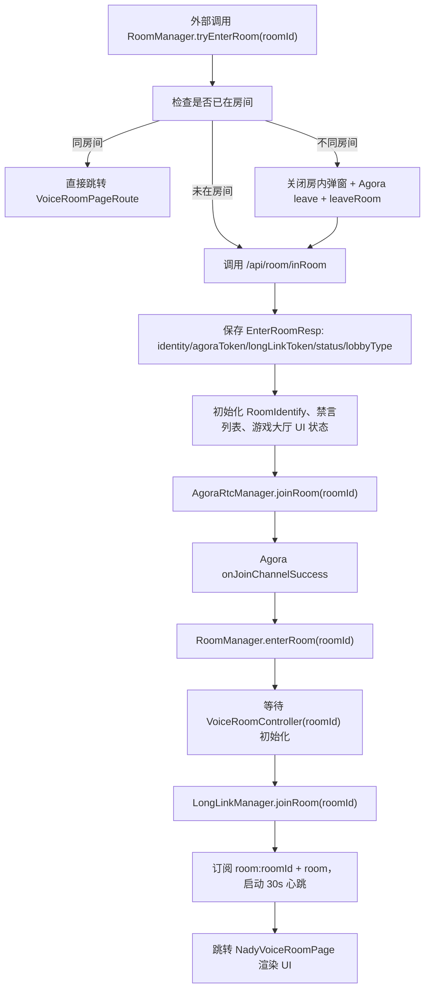
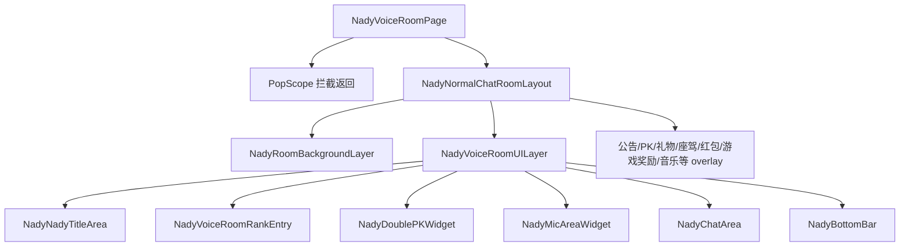
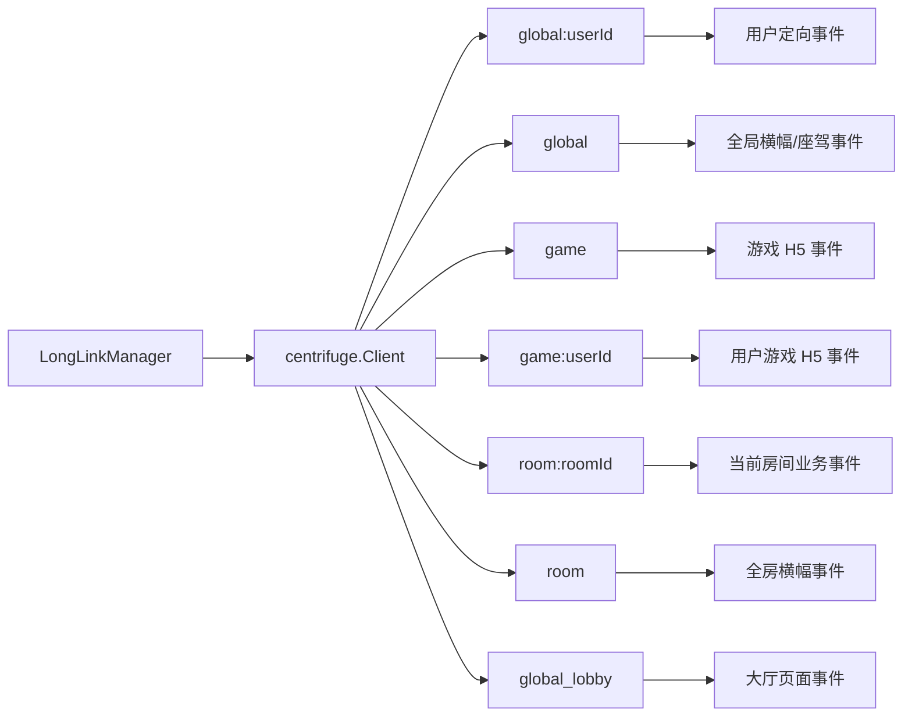
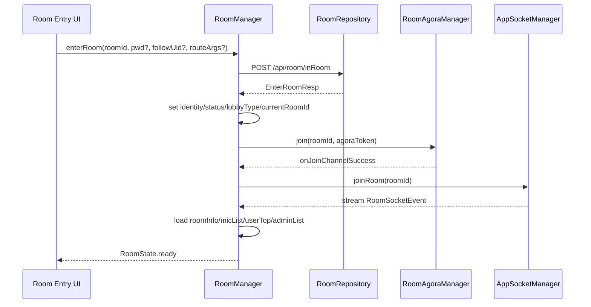

# nady 房间与 Socket 架构总览

静态分析时间：2026-08-21  
来源项目：`/Users/liqihui/nady`  
目标用途：给 `/Users/liqihui/iSnow` 迁移房间能力时作为数据清单和实现说明。  
分析范围：以 nady 代码为准，重点目录为 `lib/pages/room`，并追踪到 `lib/services/room_manager`、`lib/services/long_link`、`lib/services/api`、`lib/model/room`、`lib/model/long_link`。

## 结论

nady 的房间功能建议在 iSnow 中拆成四个独立单例：

| 单例 | 目标职责 | 当前 nady 对应 |
| --- | --- | --- |
| `AppSocketManager` / `SocketService` | 全 App 共享长连接；负责连接、鉴权、重连、心跳、频道订阅、事件分发、退订 | `LongLinkManager`、`LongLinkHandler`、`LongLink*Handler` |
| `RoomManager` / `RoomService` | 当前一个房间的业务状态；负责进房、退房、房间 UI 状态、麦位、消息、礼物、RTC、管理操作 | `RoomManager`、`VoiceRoomController`、room providers |
| `RoomAgoraManager` | 声网 Agora 引擎；负责初始化、join/leave channel、audience/broadcaster 角色切换、静音、声浪、音频混流、token 续期 | `AgoraRtcManager` |
| `RoomMusicManager` | 房间音乐播放器；负责曲库、当前曲目、播放模式、播放器面板状态，调用 `RoomAgoraManager` 执行 audio mixing | `NadyMyMusic`、`NadyPlayingMusic`、`NadyRoomPlayStatus`、`NadyRoomPlayMode`、`NadyRoomMusicStateController` |

socket、room、Agora、music 必须分开提取。socket 是全局基础设施，进入房间只是追加订阅 `room:{roomId}` 和 `room`；room 是业务状态聚合，只维护“当前一个房间”的状态；Agora 是 RTC 音频能力；music 是曲库和播放策略，最终通过 Agora audio mixing 输出。

## 核心源码地图

| 类型 | 文件 |
| --- | --- |
| 房间页面入口 | `/Users/liqihui/nady/lib/pages/room/voice_room/nady_voice_room_page.dart` |
| 房间主布局 | `/Users/liqihui/nady/lib/pages/room/voice_room/nady_normal_chat_room_layout.dart` |
| 房间主 UI 层 | `/Users/liqihui/nady/lib/pages/room/voice_room/nady_voice_room_ui_layer.dart` |
| 进房/退房业务单例 | `/Users/liqihui/nady/lib/services/room_manager/room_manager.dart` |
| 房间生命周期聚合 | `/Users/liqihui/nady/lib/services/room_manager/voice_room_controller.dart` |
| socket 总入口 | `/Users/liqihui/nady/lib/services/long_link/long_link_manager.dart` |
| socket 通用订阅器 | `/Users/liqihui/nady/lib/services/long_link/handler/nady_long_link_handler.dart` |
| 房间频道事件 | `/Users/liqihui/nady/lib/services/long_link/handler/long_link_room_id_handler.dart` |
| 全房频道事件 | `/Users/liqihui/nady/lib/services/long_link/handler/long_link_room_handler.dart` |
| 全局频道事件 | `/Users/liqihui/nady/lib/services/long_link/handler/long_link_global_handler.dart` |
| 全局用户频道事件 | `/Users/liqihui/nady/lib/services/long_link/handler/long_link_global_user_handler.dart` |
| 游戏频道事件 | `/Users/liqihui/nady/lib/services/long_link/handler/long_link_game_handler.dart` |
| 游戏用户频道事件 | `/Users/liqihui/nady/lib/services/long_link/handler/long_link_game_user_handler.dart` |
| 游戏大厅频道事件 | `/Users/liqihui/nady/lib/services/long_link/handler/long_link_global_lobby_handler.dart` |
| 长连接事件常量 | `/Users/liqihui/nady/lib/services/long_link/nady_long_link_event.dart` |
| 房间 API wrapper | `/Users/liqihui/nady/lib/services/api/room_api.dart` |
| Retrofit API 声明 | `/Users/liqihui/nady/lib/services/http/api_client.dart` |
| API 路径常量 | `/Users/liqihui/nady/lib/services/api/api_urls.dart` |
| 房间 model | `/Users/liqihui/nady/lib/model/room/*.dart` |
| socket model | `/Users/liqihui/nady/lib/model/long_link/long_link_msg.dart` |
| RTC 管理 | `/Users/liqihui/nady/lib/services/room_manager/rtc/agora_rtc_manager.dart` |
| 麦位控制 | `/Users/liqihui/nady/lib/pages/room/voice_room/widgets/mic_area/room_mic_seat_controller.dart` |
| 公屏消息 | `/Users/liqihui/nady/lib/services/room_manager/room_msg_provider.dart`、`/Users/liqihui/nady/lib/pages/room/widgets/chat` |
| 礼物发送 | `/Users/liqihui/nady/lib/widgets/gift_panel/gift_send_button.dart` |
| 礼物接收动画 | `/Users/liqihui/nady/lib/services/room_manager/voice_room_gift_controller.dart` |
| 礼物/游戏/红包横幅 | `/Users/liqihui/nady/lib/pages/room/voice_room/widgets/gift_barrage/gift_barrage_layer.dart` |

## 当前房间入口流程



关键点：

| 步骤 | 当前实现 | 迁移要求 |
| --- | --- | --- |
| HTTP 进房 | `RoomApi.of.enterRoom(roomID, pwd, followUid, appVersion)` | 先拿到 `EnterRoomResp`，否则不进入 RTC 和房间 UI |
| RTC 加入 | `AgoraRtcManager.joinRoom(roomID)` | `onJoinChannelSuccess` 后再正式进入房间页面 |
| socket 订阅 | `VoiceRoomController.build` 调用 `LongLinkManager.joinRoom(roomID)` | 进入房间后订阅房间频道，退出时退订 |
| UI 渲染 | `NadyVoiceRoomPage` -> `NadyNormalChatRoomLayout` -> `NadyVoiceRoomUILayer` | RoomManager 需要提前准备房间信息、麦位、身份、消息等状态 |
| 退房 | `RoomManager.leaveRoom` + `VoiceRoomController.onDispose` | 必须同时处理 HTTP 退房、RTC leave、socket 退订、心跳停止、状态清理 |

## 当前页面层级



`NadyNormalChatRoomLayout` 还会在首帧后触发：

| 动作 | 当前实现 |
| --- | --- |
| 首次进房教程 | `NadyTutorialMarkUtils.of.showTutorial` |
| 引导上麦 | `roomMicDataListProvider(roomID).notifier.startGuideUpMicCountDown()` |
| 收藏房间提示 | `showCollectionRoom()` |
| 策略推送 | `triggerInvitePlayGameWithAudience`、`triggerOpenGameHallWithOwner` |
| 房主自动上麦 | `ownerAutoUpMic()` |
| 打开指定游戏 URL | `openGameWithURL(gameUrl, roomId)` |
| 打开大奖入口 | `functionGameControllerProvider.notifier.openBigWin()` |

## 当前 socket 拆分



频道说明：

| 频道 | 订阅时机 | token 来源 | 主要用途 |
| --- | --- | --- | --- |
| `global:{uid}` | App 长连接初始化后 | `/api/room/genGlobalToken?channel=global:{uid}` | 用户定向：封禁、勋章、日志、音乐关闭、幸运礼物大倍率、大奖中奖 |
| `global` | App 长连接初始化后 | `/api/room/genGlobalToken?channel=global` | 全局贵族上线、座驾入口事件 |
| `game` | App 长连接初始化后 | `/api/room/genGlobalToken?channel=game` | H5 游戏事件 |
| `game:{uid}` | App 长连接初始化后 | `/api/room/genGlobalToken?channel=game:{uid}` | 用户维度 H5 游戏事件 |
| `room:{roomId}` | 进入房间后 | `/api/room/genGlobalToken?channel=room:{roomId}` | 当前房间公屏、麦位、身份、PK、红包、游戏等事件 |
| `room` | 进入房间后 | `/api/room/genGlobalToken?channel=room` | 全房礼物/游戏/贵族/世界红包横幅 |
| `global_lobby` | 进入游戏广场/需要大厅事件时 | `/api/room/genGlobalToken?channel=global_lobby` | 大厅中奖和大奖状态 |

## RoomManager 当前职责

| 职责 | 当前实现 |
| --- | --- |
| 保存当前房间 | `RoomManager.state: RoomControllerInterface?`，`currentRoomID` 由 `state?.roomID` 得出 |
| 保存进房响应 | `roomResp: EnterRoomResp?` |
| 保存临时路由参数 | `tempFromUid`、`tempGameURL`、`tempIsNeedOpenBigWin`、`tempIsShowInviteTips` |
| 进房 | `tryEnterRoom` |
| 确认进房并跳转 | `enterRoom` |
| 退房清理 | `leaveRoom` |
| 不同房间切换 | 先 leave Agora + 清理旧房，再进新房 |
| 房间密码 | 进房错误码触发密码弹窗，密码使用 `CryptUtil.encrypt` 后重试 |
| 断线恢复 | socket 重连成功后调用 `/api/room/reconnect/report` |
| 防息屏 | 进房 `WakelockPlus.enable`，退房 `WakelockPlus.disable` |

## 目标项目建议结构

建议在 iSnow 中按下面结构创建，先保证核心闭环，再按功能增加 overlay 和特效：

```text
lib/features/room/
  data/
    room_api.dart
    room_models.dart
    room_repository.dart
    room_socket_events.dart
  socket/
    app_socket_manager.dart
    socket_channel.dart
    socket_event_bus.dart
    socket_message.dart
  domain/
    room_manager.dart
    room_state.dart
    room_agora_manager.dart
    room_agora_state.dart
    room_music_manager.dart
    room_music_state.dart
  presentation/
    room_page.dart
    room_layout.dart
    widgets/
      room_title_bar.dart
      room_mic_area.dart
      room_chat_area.dart
      room_bottom_bar.dart
      overlays/
        gift_overlay.dart
        banner_overlay.dart
        vehicle_overlay.dart
        pk_overlay.dart
        lucky_bag_overlay.dart
```

职责边界：

| 模块 | 必须做 | 不应该做 |
| --- | --- | --- |
| `AppSocketManager` | 连接 Centrifugo、订阅频道、解析 `LongLinkMsg`、发布事件流、重连上报 | 不保存房间 UI 状态，不直接弹业务弹窗 |
| `RoomManager` | 保存当前房间状态、调用 room API、协调 RTC/socket、处理房间事件落状态 | 不持有 socket client 实例细节 |
| `RoomAgoraManager` | 声网初始化、join/leave、角色切换、麦克风/扬声器、声浪、音频混流、token 续期 | 不处理 HTTP 进房和公屏消息，不保存曲库 |
| `RoomMusicManager` | 曲库、当前曲目、播放模式、播放器展开/收起，调用 Agora audio mixing | 不持有 socket client 或 Agora engine |
| `RoomRepository` | HTTP API 请求和 model 转换 | 不关心 Widget 和弹窗 |
| `Room UI` | watch 状态并渲染 | 不直接订阅原始 socket 频道 |

## 目标进房流程建议



## 迁移优先级

1. 先迁移 `AppSocketManager`，只支持连接、token、频道订阅、事件分发、心跳和重连上报。
2. 再迁移 `RoomRepository` 和核心 model：`EnterRoomRequest`、`EnterRoomResp`、`RoomInfo`、`RoomMicModel`、`RoomUserInfo`、`LongLinkMsg`。
3. 再迁移 `RoomManager` 核心状态：进房、退房、房间信息、麦位列表、公屏消息、身份、观众数。
4. 再迁移 `RoomAgoraManager`：Agora join/leave、上麦/下麦、角色切换、静音、声浪、token 续期。
5. 再迁移 `RoomMusicManager`：本地曲库、当前曲目、播放模式、播放器开关、Agora audio mixing。
6. 最后迁移增强功能：礼物动效、横幅、红包、幸运转盘、PK、游戏大厅、座驾、管理弹窗。

## 环境变量和依赖

不要把 nady 里的密钥值直接复制到文档或新项目仓库。迁移时只保留变量名和用途，实际值由 iSnow 的环境配置注入。

| 变量/依赖 | 类型 | 来源 | 用途 |
| --- | --- | --- | --- |
| `agoraAppID` | `String` | `envProvider` | 声网 `RtcEngineContext.appId` |
| `centrifugeBaseUrl` | `String` | `envProvider` | 心跳 POST 地址前缀 |
| `centrifugeXApiKey` | `String` | `envProvider` | 心跳请求头 `X-API-Key` |
| `h5WalletUrl` | `String` | `envProvider` | 金币不足时跳转钱包 |
| `centrifuge` | package | `pubspec.yaml` | socket 长连接 |
| `agora_rtc_engine` | package | `pubspec.yaml` | 房间语音 |
| `hooks_riverpod`、`riverpod_annotation` | package | `pubspec.yaml` | 当前状态管理 |
| `flutter_smart_dialog` | package | `pubspec.yaml` | 弹窗、loading、toast |
| `wakelock_plus` | package | `pubspec.yaml` | 房间内防息屏 |
| `fext_aliyun_oss` | package | `pubspec.yaml` | 房间图片/封面上传 |
| `wechat_assets_picker`、`wechat_camera_picker` | package | `pubspec.yaml` | 图片选择、拍照 |
| `image_editor`、`flutter_image_compress` | package | `pubspec.yaml` | 图片编辑、压缩 |
| `pag`、`flame` | package | `pubspec.yaml` | 动效、礼物动画 |
| `dart_ping` | package | `pubspec.yaml` | socket 连接异常时网络探测 |

## 当前实现中需要注意的迁移风险

| 风险 | 说明 | 建议 |
| --- | --- | --- |
| 进房流程跨 HTTP、RTC、socket | 当前是 HTTP 进房后 join Agora，Agora 成功回调再初始化房间 controller 和 socket | iSnow 中要明确状态机，避免页面先渲染但 socket/RTC 未准备好 |
| `longLinkToken` 未直接用于订阅 | `EnterRoomResp.longLinkToken` 保存了但实际 channel token 由 `/api/room/genGlobalToken` 获取 | 迁移时以代码实际逻辑为准 |
| 事件 payload 类型不统一 | 有些 payload 是 `Map`，有些是 JSON 字符串，如 `RoomSendGiftPublicScreenEvent`、`RoomPartyEvent`、`LuckyWheelInfo` | 事件解析层要按 event 做 adapter |
| 事件存在声明但未主动订阅 | 如 `RoomLuckyBagSettleEvent`、`RoomModeSwitch` | 文档里保留事件名，但标记未发现处理器 |
| 硬编码安全配置 | 房间密码加密密钥在 `RoomConstants` 中 | 新项目应放安全配置或服务端处理，不要继续硬编码 |
| provider 生命周期复杂 | `VoiceRoomController` 通过 `_listen` 保活多个 provider，dispose 时统一关闭 | iSnow 可用显式 `RoomState` 聚合，减少隐式保活 |
| 本地设置写入疑似问题 | 静音 provider 中调用的是 `SpUtil.of.getBool(key, mute)`，看起来像读取而非写入 | 迁移时确认 iSnow 的本地存储 API，避免照搬潜在 bug |

## 四份文档关系

| 文档 | 内容 |
| --- | --- |
| `room_socket_architecture.md` | 当前总览、架构拆分、职责边界、迁移顺序 |
| `socket_migration.md` | socket 连接、频道、鉴权、事件全量清单、payload、Dart 骨架 |
| `room_migration.md` | 房间功能流程、API 请求参数、返回 model、状态结构、RoomManager 骨架 |
| `agora_rtc_migration.md` | Agora RTC、上下麦推流、声浪、token 续期、音乐 audio mixing、Android 必需配置、Dart 骨架 |
