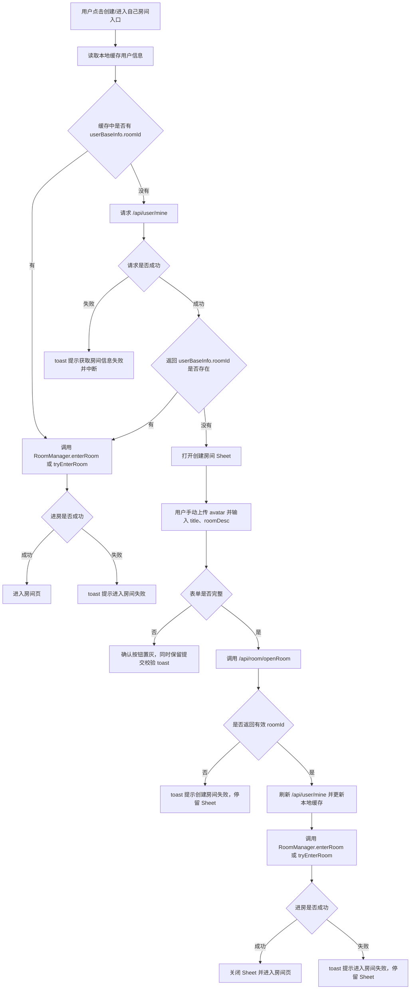

# 创建/进入自己房间逻辑问题单

版本：v1.0  
日期：2026-08-24  
适用项目：iSnow  
参考来源：Nady `nady_create_room_page.dart`、`nady_create_room_controller.dart`、`room_api.dart`

## 1. 问题背景

iSnow 当前已有创建房间弹窗和 `/api/room/openRoom` 接口调用，但入口逻辑与 Nady 不完全一致：当前创建入口会直接弹出创建房间 Sheet，没有先判断当前用户是否已经拥有房间。

Nady 的业务规则是：

- 用户已有房间时，不需要再次输入 `title`、`roomDesc`、`avatar`，直接进入自己的房间。
- 用户没有房间时，才弹出创建房间弹窗，要求填写房间标题、房间描述并上传房间头像。
- 创建成功后，必须拿到服务端返回的 `roomId`，再进入房间。

本问题单用于指导 iSnow 将“创建房间”入口统一改造成“进入自己的房间”能力。

## 2. 目标结果

所有“创建/进入自己房间”的入口统一走同一套逻辑：

1. 点击入口后，优先读取本地缓存用户信息。
2. 如果缓存用户信息中存在 `userBaseInfo.roomId`，直接走 `RoomManager.enterRoom/tryEnterRoom(roomId)`。
3. 如果缓存没有 `roomId`，请求 `/api/user/mine` 获取最新用户信息。
4. 如果接口返回 `userBaseInfo.roomId`，直接进入该房间。
5. 如果仍然没有 `roomId`，弹出创建房间 Sheet。
6. 创建房间时必须手动上传房间头像，标题初始为空且必填，房间描述必填。
7. `/api/room/openRoom` 成功返回 `roomId` 后，刷新 `/api/user/mine` 缓存，再进入房间。
8. 进房成功后才关闭创建弹窗并进入房间页；进房失败时停留在弹窗并 toast 提示。

## 3. Nady 参考逻辑

### 3.1 入口判断

Nady 首页创建房间图标读取：

- `myUserInfoProvider.valueOrNull?.userBaseInfo.roomId`

点击入口后统一调用 `LinkHandle.enterOwnRoom(ref)`。

核心逻辑：

- 有 `roomId`：调用 `roomManagerProvider.notifier.tryEnterRoom(myRoomId)`。
- 无 `roomId`：弹出 `NadyCreateRoomPage` 创建房间。

### 3.2 创建房间表单

Nady 创建房间弹窗包含：

| 字段 | 说明 | 校验 |
|---|---|---|
| `avatar` | 房间封面/头像 | 必填，不上传提示 `You need to upload the room cover` |
| `title` | 房间标题 | 必填，最大 20 字符 |
| `roomDesc` | 房间描述 | 必填，最大 200 字符 |
| `language` | 当前语言 | 创建接口参数 |

### 3.3 创建成功后动作

Nady 创建成功后：

1. `/api/room/openRoom` 返回 `roomId`。
2. 调用 `syncMyUserInfo()` 同步当前用户资料。
3. 调用 `tryEnterRoom(roomId)` 进入房间。
4. 创建弹窗关闭。

iSnow 需要调整为：进房成功后再关闭弹窗；如果进房失败，弹窗保持打开并 toast。

## 4. iSnow 当前差异

当前 iSnow 已具备以下基础能力：

| 模块 | 当前状态 |
|---|---|
| 创建入口 | `party_page.dart` 中 `_openCreateRoom` 直接 `showCreateRoomSheet(context)` |
| 创建 Sheet | 已有 `CreateRoomSheet` |
| 创建 ViewModel | 已有 `CreateRoomViewModel.submit()` |
| 创建接口 | 已有 `CreateRoomRepository.openRoom()` |
| 接口地址 | `HttpApi.roomOpen = '/api/room/openRoom'` |
| 用户缓存 | `AuthSession.user()` 可读取本地用户 |
| 用户资料接口 | `HttpApi.myUserInfo = '/api/user/mine'` |
| 进房能力 | `RoomManager.enterRoom(...)`、Room 页面已有进房初始化逻辑 |

需要补齐的问题：

1. `UserData` 当前需要增加 `roomId` 字段，用于承接 `/api/user/mine` 返回的 `userBaseInfo.roomId`。
2. 创建入口需要从“直接弹创建 Sheet”改为“统一进入自己的房间逻辑”。
3. 创建 Sheet 的 `title` 初始值需要从默认值改为空字符串。
4. 创建 Sheet 的 `avatar` 不允许默认取用户头像，必须由用户手动上传房间头像。
5. 头像上传返回值必须改为完整 URL，不能只返回 OSS object path。
6. 创建成功后需要刷新用户缓存，再进房，进房成功才关闭 Sheet。

## 5. 目标业务流程



## 6. 接口与参数

### 6.1 获取当前用户信息

接口：

```http
GET /api/user/mine
```

关键响应字段：

```json
{
  "data": {
    "userBaseInfo": {
      "roomId": "1986323783696117761"
    }
  }
}
```

处理规则：

- 优先读本地缓存。
- 缓存没有 `roomId` 时才请求该接口。
- 请求成功后需要保存最新 `userBaseInfo` 到本地缓存。
- 请求失败时 toast：`获取房间信息失败`，并中断后续动作。

### 6.2 获取头像上传参数

接口：

```http
GET /api/resource/header-upload-param
```

Nady 使用该接口获取 OSS 临时上传参数。

关键响应字段：

```json
{
  "data": {
    "accessKeyId": "...",
    "accessKeySecret": "...",
    "expiration": "...",
    "securityToken": "...",
    "endpoint": "...",
    "bucket": "...",
    "region": "...",
    "path": "dev/xxx",
    "domain": "https://example-cdn.com"
  }
}
```

处理规则：

- iSnow 创建房间头像上传链路必须对齐 Nady。
- 交互可以保留当前相册选择，不强制实现 Nady 的相机、裁剪、GIF 拦截、10MB 限制等完整交互。
- 上传 OSS 的 object key 为：`${path}.${extension}`。
- `openRoom.avatar` 必须传完整图片 URL：`${domain}/${path}.${extension}`。
- 不能只传 `path` 或 `${path}.${extension}`。

### 6.3 创建房间

接口：

```http
POST /api/room/openRoom
```

请求 Body：

```json
{
  "avatar": "https://example-cdn.com/dev/xxx.jpg",
  "title": "Room title",
  "roomDesc": "Room description",
  "language": "en"
}
```

参数说明：

| 参数 | 类型 | 必填 | 来源 | 说明 |
|---|---|---|---|---|
| `avatar` | `String` | 是 | 头像上传完整 URL | 房间头像/封面 |
| `title` | `String` | 是 | 用户输入 | 房间标题，最大 20 字符 |
| `roomDesc` | `String` | 是 | 用户输入 | 房间描述，最大 200 字符 |
| `language` | `String` | 是 | 当前语言 | 例如 `en`、`zh` |

成功响应：

```json
{
  "data": "1986323783696117761"
}
```

处理规则：

- `data` 为创建成功后的 `roomId`。
- `roomId` 为空时视为创建失败。
- 创建成功后必须先刷新 `/api/user/mine` 缓存，再调用进房。

## 7. 表单规则

### 7.1 初始状态

| 字段 | 初始值 |
|---|---|
| `avatar` | 空，不默认使用用户头像 |
| `title` | 空 |
| `roomDesc` | 空 |

### 7.2 输入限制

| 字段 | 限制 |
|---|---|
| `title` | 最大 20 字符 |
| `roomDesc` | 最大 200 字符 |
| `avatar` | 必须通过上传流程获得完整 URL |

### 7.3 按钮状态

- `avatar`、`title`、`roomDesc` 任一为空时，确认按钮置灰不可点。
- 提交方法中仍保留二次校验，防止异常调用。
- 校验失败时 toast 对应文案。

建议文案：

| 场景 | 文案 |
|---|---|
| 未上传头像 | `请上传房间头像` |
| 未填写标题 | `请输入房间名称` |
| 未填写描述 | `请输入房间描述` |
| 获取用户房间失败 | `获取房间信息失败` |
| 创建失败 | `创建房间失败` |
| 进房失败 | `进入房间失败` |

## 8. 建议改造点

### 8.1 新增统一入口方法

建议新增类似能力：

```dart
Future<void> enterOwnRoom(BuildContext context, WidgetRef ref)
```

职责：

1. 读取本地缓存用户信息。
2. 判断 `roomId`。
3. 缓存无 `roomId` 时请求 `/api/user/mine`。
4. 有房间时进房。
5. 无房间时打开创建 Sheet。
6. 统一处理 toast 和 loading 状态。

所有“创建/进入自己房间”的入口都调用该方法，避免多个入口逻辑分叉。

### 8.2 用户模型补字段

`UserData` 需要增加：

```dart
final String? roomId;
```

并补齐：

- 构造函数
- `fromJson`
- `copyWith`
- `toJson`

保证 `/api/user/mine` 返回的 `userBaseInfo.roomId` 能进入本地缓存。

### 8.3 创建房间状态调整

`CreateRoomState` 建议调整：

- `title` 默认值从 `"Let's go Party!"` 改为 `''`。
- 初始 `avatarUrl` 不再从用户头像填充。
- `canSubmit` 需要同时判断 `avatarUrl`、`title`、`description` 是否非空。

### 8.4 头像上传返回完整 URL

当前上传方法需要确保返回：

```dart
'${uploadParam.domain}/${uploadParam.path}.$safeExtension'
```

而不是：

```dart
'${uploadParam.path}.$safeExtension'
```

否则 `/api/room/openRoom` 的 `avatar` 参数不是 Nady 期望的完整图片 URL。

### 8.5 创建成功后的进房时机

创建 Sheet 的提交流程建议改成：

1. `CreateRoomViewModel.submit()` 调用 `openRoom`。
2. 拿到 `roomId`。
3. 刷新 `/api/user/mine` 并更新缓存。
4. 调用统一进房能力进入 `roomId`。
5. 进房成功后 `Navigator.pop(roomId)`。
6. 进房失败时不 pop，toast `进入房间失败`。

## 9. 异常与边界

| 场景 | 处理 |
|---|---|
| 本地缓存读取不到用户 | 请求 `/api/user/mine` |
| `/api/user/mine` 请求失败 | toast `获取房间信息失败`，中断 |
| 已有 `roomId` 但进房失败 | toast `进入房间失败` |
| 无 `roomId` | 打开创建房间 Sheet |
| 头像上传参数获取失败 | toast 上传失败，不允许提交 |
| OSS 上传失败 | toast 上传失败，不允许提交 |
| `openRoom` 返回空 `roomId` | toast `创建房间失败`，停留 Sheet |
| `openRoom` 成功但刷新用户缓存失败 | 建议仍可尝试进房，但需要记录日志；若产品严格要求可 toast 并停留 Sheet |
| `openRoom` 成功但进房失败 | toast `进入房间失败`，停留 Sheet |
| 用户重复点击确认 | 提交中按钮 loading/禁用，防止重复创建 |

## 10. 验收标准

- 所有“创建/进入自己房间”的入口都调用统一入口方法。
- 用户已有 `userBaseInfo.roomId` 时，不弹创建 Sheet，直接进入自己的房间。
- 缓存没有 `roomId` 时，会请求 `/api/user/mine`。
- `/api/user/mine` 失败时，toast `获取房间信息失败`，不会弹创建 Sheet。
- 用户没有房间时，弹出创建 Sheet。
- 创建 Sheet 初始 `title` 为空。
- 创建 Sheet 不默认使用用户头像作为房间头像。
- 未上传头像、未填标题、未填描述时，确认按钮置灰不可点。
- 提交层保留必填校验和 toast。
- 头像上传使用 `/api/resource/header-upload-param` 获取 OSS 参数。
- `openRoom.avatar` 传完整 URL，格式为 `domain/path.ext`。
- `/api/room/openRoom` Body 包含 `avatar`、`title`、`roomDesc`、`language`。
- 创建成功后刷新 `/api/user/mine` 缓存。
- 创建成功后先调用 `RoomManager.enterRoom/tryEnterRoom(roomId)`，进房成功才关闭 Sheet。
- 创建成功但进房失败时，Sheet 保持打开并 toast `进入房间失败`。
- 已有房间但进房失败时，只 toast `进入房间失败`。

## 11. 建议测试用例

| 用例 | 前置条件 | 操作 | 期望 |
|---|---|---|---|
| 已有房间直接进 | 缓存用户有 `roomId` | 点击入口 | 不弹 Sheet，直接进房 |
| 缓存无房间但接口有房间 | 缓存无 `roomId`，`/api/user/mine` 返回 `roomId` | 点击入口 | 请求用户信息后直接进房 |
| 无房间创建 | 缓存和接口均无 `roomId` | 点击入口 | 弹创建 Sheet |
| 用户信息请求失败 | 缓存无 `roomId`，`/api/user/mine` 失败 | 点击入口 | toast `获取房间信息失败` |
| 表单不完整 | 未上传头像或未填标题/描述 | 查看按钮 | 确认按钮置灰 |
| 头像 URL | 上传头像成功 | 查看 `openRoom` 请求 | `avatar` 为完整 URL |
| 创建成功进房成功 | `openRoom` 返回有效 `roomId`，进房成功 | 点击确认 | 刷新用户缓存，关闭 Sheet，进入房间 |
| 创建成功进房失败 | `openRoom` 返回有效 `roomId`，进房失败 | 点击确认 | Sheet 不关闭，toast `进入房间失败` |
| 已有房间进房失败 | 用户已有 `roomId`，进房失败 | 点击入口 | toast `进入房间失败` |
| 防重复提交 | 提交中连续点击 | 连点确认 | 只发起一次创建请求 |

## 12. 参考文件

Nady：

- `/Users/huili/nady/lib/pages/main/sub_pages/home/nady_create_room_icon_widget.dart`
- `/Users/huili/nady/lib/utils/link_handle.dart`
- `/Users/huili/nady/lib/pages/room/voice_room/nady_create_room_page.dart`
- `/Users/huili/nady/lib/pages/room/voice_room/nady_create_room_controller.dart`
- `/Users/huili/nady/lib/services/api/room_api.dart`
- `/Users/huili/nady/lib/services/api/common_api.dart`

iSnow：

- `/Users/huili/project/iSnow/lib/classes/party/party_page.dart`
- `/Users/huili/project/iSnow/lib/classes/create_room/create_room_sheet.dart`
- `/Users/huili/project/iSnow/lib/classes/create_room/create_room_state.dart`
- `/Users/huili/project/iSnow/lib/classes/create_room/create_room_view_model.dart`
- `/Users/huili/project/iSnow/lib/classes/create_room/create_room_repository.dart`
- `/Users/huili/project/iSnow/lib/classes/create_room/create_room_models.dart`
- `/Users/huili/project/iSnow/lib/classes/oauth/provider/login_provider.dart`
- `/Users/huili/project/iSnow/lib/model/user_profile.dart`
- `/Users/huili/project/iSnow/lib/manager/auth_session.dart`
- `/Users/huili/project/iSnow/lib/manager/room_manager.dart`
