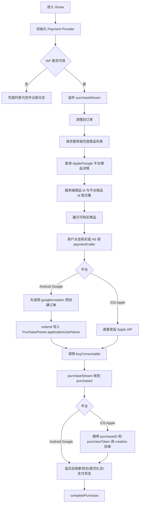

# iSnow 内购能力迁移问题单

## 1. 背景与目标

将 Nady 的内购能力迁移到 iSnow，要求 iSnow 的接口链路、请求参数、平台购买分支、H5 支付桥接和支付成功后的状态刷新与 Nady 保持一致。

本问题单只覆盖 Apple IAP 与 Google Play IAP。Nady 中 Huawei IAP 代码当前为注释状态，iSnow 暂不迁移 Huawei 支付。

### Nady 参考代码

| 模块 | Nady 文件 |
| --- | --- |
| 支付 Provider 主逻辑 | `/Users/huili/nady/lib/services/payment/payment_provider.dart` |
| 充值 API 封装 | `/Users/huili/nady/lib/services/api/user_api.dart` |
| Retrofit 接口声明 | `/Users/huili/nady/lib/services/http/api_client.dart` |
| API path 常量 | `/Users/huili/nady/lib/services/api/api_urls.dart` |
| H5 支付 bridge | `/Users/huili/nady/lib/widgets/nady_browser_page.dart` |
| 商品模型 | `/Users/huili/nady/lib/model/product_info.dart` |
| 充值请求模型 | `/Users/huili/nady/lib/model/recharge_model.dart` |

### iSnow 当前缺口

经现有代码检查，iSnow 需要补齐以下能力：

- `pubspec.yaml` 增加 `in_app_purchase`、`in_app_purchase_android` 依赖。
- 增加充值商品模型、充值请求模型、支付 Provider/Controller。
- 在 `HttpApi`/接口层增加 Nady 同款充值接口。
- WebView 增加 `paymentCaller`、`paymentList` JS bridge。
- Profile 的 `wallet`/`recharge` 入口接入同一套支付流程，不再停留在 coming soon。
- 支付成功后刷新钱包、首充礼包和支付状态。

## 2. 业务流程总览



## 3. 接口与参数

### 3.1 查询充值商品列表

| 项目 | 说明 |
| --- | --- |
| Method | `POST` |
| Path | `/api/recharge/package/queryByChannel` |
| Query | `channel={apple|google}` |
| Query | `merchant={apple|google}` |
| Body | 无 |
| 返回 | `List<ProductInfoModel>` |

Nady 逻辑：

- Android：`channel=google`，`merchant=google`
- iOS：`channel=apple`，`merchant=apple`
- 普通充值列表过滤 `useType == 1`
- 代理充值列表过滤 `useType == 4`
- 服务端返回的 `id` 必须与 Apple/Google 后台商品 id 一致；客户端用该 id 调 `queryProductDetails`，最终只展示服务端和平台都存在的商品。

### 3.2 iOS 支付成功后创建充值记录

| 项目 | 说明 |
| --- | --- |
| Method | `POST` |
| Path | `/api/recharge/record/creation` |
| Body | `{ "rechargeReqJson": encrypted(RechargeModel.toJson()) }` |
| 触发时机 | iOS `purchaseStream` 收到 `PurchaseStatus.purchased` 后 |

`RechargeModel` 参数：

| 字段 | 类型 | iOS 值 | 必填 |
| --- | --- | --- | --- |
| `productId` | `String` | `PurchaseDetails.productID` | 是 |
| `channel` | `String` | `apple` | 是 |
| `merchant` | `int` | `2` | 是 |
| `orderId` | `String?` | `PurchaseDetails.purchaseID` | 是，iOS 必须有 |
| `purchaseToken` | `String?` | `verificationData.serverVerificationData` | 是 |
| `countryRechargeChannelConfigId` | `String?` | 购买入口传入并按 `productId` 缓存；无则空字符串 | 否 |

处理要求：

- iOS 购买成功后必须先检查 `purchaseID`。
- `purchaseID == null` 时中断验单，toast `Payment failed`，记录日志。
- `/api/recharge/record/creation` 成功后刷新钱包、首充礼包、支付状态。

### 3.3 Android Google 预创建充值订单

| 项目 | 说明 |
| --- | --- |
| Method | `POST` |
| Path | `/api/recharge/record/google/creation` |
| Body | `{ "rechargeReqJson": encrypted(RechargeModel.toJson()) }` |
| 返回 | `orderId` 字符串 |
| 触发时机 | Android 调 Google Play `buyConsumable` 前 |

`RechargeModel` 参数：

| 字段 | 类型 | Android 值 | 必填 |
| --- | --- | --- | --- |
| `productId` | `String` | 购买入口传入的商品 id | 是 |
| `channel` | `String` | `google` | 是 |
| `merchant` | `int` | `1` | 是 |
| `countryRechargeChannelConfigId` | `String?` | 购买入口传入；无则空字符串 | 否 |
| `orderId` | `String?` | 不传 | 否 |
| `purchaseToken` | `String?` | 不传 | 否 |

处理要求：

- Android 必须先调用 `/api/recharge/record/google/creation`。
- 接口返回的 `orderId` 必须写入 `PurchaseParam.applicationUserName`。
- `google/creation` 失败时不允许继续拉起 Google Play 支付，停留当前页面并 toast。
- Android 收到 `PurchaseStatus.purchased` 后不再调用 `/api/recharge/record/creation`，只刷新钱包、首充礼包、支付状态，并 `completePurchase`。

### 3.4 首充礼包接口

| 项目 | 说明 |
| --- | --- |
| Method | `POST` |
| Path | `/api/recharge/package/giftBag` |
| 用途 | 支付成功后刷新首充礼包状态；首充入口购买完成后也要刷新 |

首充购买逻辑与 Nady 对齐：

- `buyFirstble(productId, coinAmount)` 单独查询该 `productId` 的平台商品详情。
- Android 首充购买前同样调用 `createRechargeGoogle(productId)`，但 Nady 未传 `countryRechargeChannelConfigId`。
- iOS 首充购买走统一的 `purchaseStream` 成功回调，再调用 `/api/recharge/record/creation`。

## 4. 客户端核心逻辑

### 4.1 初始化 Payment Provider

实现要求：

- 启动或进入主页面时初始化支付 Provider。
- 调用 `InAppPurchase.instance.isAvailable()`；不可用时返回空列表。
- 订阅 `InAppPurchase.instance.purchaseStream`。
- 初始化后执行旧订单清理。
- 调用 `refreshList()` 拉取普通充值商品。
- Provider dispose 时取消 purchaseStream listener。

旧订单清理：

- Android：通过 `InAppPurchaseAndroidPlatformAddition.queryPastPurchases()` 查询历史订单；对 `PurchaseStatus.purchased` 的历史订单执行 `completePurchase` 和 `consumePurchase`。
- iOS：调用 `InAppPurchase.instance.restorePurchases()`。

### 4.2 刷新普通充值列表

实现顺序：

1. 检查 IAP 是否可用。
2. 调 `/api/recharge/package/queryByChannel` 获取服务端商品列表。
3. 过滤 `useType == 1`。
4. 取服务端商品 `id` 集合调用 `InAppPurchase.instance.queryProductDetails(ids)`。
5. 将服务端商品 id 与平台商品 id 取交集。
6. 缓存可购买商品的 `ProductDetails`。
7. UI 只展示交集范围内的服务端商品。

`ProductInfoModel` 字段需与 Nady 保持一致：

| 字段 | 类型 |
| --- | --- |
| `id` | `String` |
| `name` | `String` |
| `channel` | `String` |
| `currency` | `String` |
| `currencyAmount` | `int` |
| `coinAmount` | `int` |
| `sortNo` | `int?` |
| `remark` | `String?` |
| `merchant` | `String` |
| `dollarAmount` | `int` |
| `useType` | `int` |

### 4.3 发起普通购买

入口参数：

| 参数 | 类型 | 说明 |
| --- | --- | --- |
| `productId` | `String` | 服务端商品 id，也是平台商品 id |
| `coinAmount` | `int` | 金币数量；Nady 当前主要用于入口传参保留 |
| `countryRechargeChannelConfigId` | `String?` | 代理/国家充值渠道配置 id，可为空 |

实现要求：

- 每次购买前将 `countryRechargeChannelConfigId` 按 `productId` 缓存，用于 iOS 成功回调后验单。
- iOS：显示 loading 后直接调用 `buyConsumable`。
- Android：显示 loading，先创建 Google 订单，成功后关闭 loading，再调用 `buyConsumable`。
- 调用平台购买时使用：
  - `autoConsume: true`
  - `productDetails: cached ProductDetails`
  - `applicationUserName: Android orderId；iOS 为空字符串`

### 4.4 purchaseStream 状态处理

| 状态 | iOS | Android |
| --- | --- | --- |
| `pending` | 无特殊处理 | toast `In payment` |
| `error` | dismiss loading，toast `Fail payment`，记录日志 | toast `Fail payment`，记录日志 |
| `purchased` | dismiss loading，toast `Successful payment`，调用 iOS 验单接口，成功后刷新状态 | toast `Successful payment`，延迟刷新状态 |
| `canceled` | dismiss loading，尝试 `completePurchase`，toast `Cancel payment` | 尝试 `completePurchase`，toast `Cancel payment` |
| `restored` | 暂不处理 | 暂不处理 |

所有 `purchased` 分支最终都需要：

- 如果 `pendingCompletePurchase == true`，调用 `InAppPurchase.instance.completePurchase(purchaseDetails)`。
- 刷新钱包 Provider。
- 刷新首充礼包 Provider。
- 支付状态 Provider 自增或发出刷新通知。

## 5. H5 Bridge 规范

iSnow WebView 需要新增与 Nady 一致的 JS bridge 能力。

### 5.1 `paymentCaller`

H5 入参：

| 参数 | 类型 | 说明 |
| --- | --- | --- |
| `skuID` | `String` | 商品 id |
| `coinAmount` | `int` | 金币数量 |
| `type` | `String?` | `first` 表示首充购买；其他值走普通购买 |
| `countryRechargeChannelConfigId` | `String?` | 代理/国家渠道配置 id |

处理逻辑：

- `type == first`：调用 `buyFirstble(skuID, coinAmount)`。
- 其他：调用 `buyConsumable(skuID, coinAmount, countryRechargeChannelConfigId: value ?? '')`。

### 5.2 `paymentList`

H5 入参：

| 参数 | 类型 | 说明 |
| --- | --- | --- |
| `type` | `String?` | `agent` 表示代理充值列表；其他值返回普通充值列表 |

处理逻辑：

- `type == agent`：调用 `getAgentList()`，过滤 `useType == 4`。
- 其他：返回 Payment Provider 当前普通充值列表，过滤 `useType == 1`。

回调 H5 数据结构：

```json
{
  "list": [],
  "type": "agent"
}
```

其中 `list` 内元素使用 `ProductInfoModel` 的 JSON 结构。

## 6. iSnow 实施任务拆分

- 新增依赖：`in_app_purchase`、`in_app_purchase_android`。
- 新增接口常量：
  - `/api/recharge/package/queryByChannel`
  - `/api/recharge/package/giftBag`
  - `/api/recharge/record/creation`
  - `/api/recharge/record/google/creation`
- 新增 API 方法：
  - `queryRechargeByChannel(channel, merchant)`
  - `createRecharge(RechargeModel)`
  - `createRechargeGoogle(RechargeModel)`
  - `getFirstGiftBag()`
- 新增模型：
  - `ProductInfoModel`
  - `RechargeModel`
  - 首充礼包模型按 `/api/recharge/package/giftBag` 响应补齐。
- 新增 Payment Provider/Controller：
  - 负责商品列表、商品详情缓存、购买发起、purchaseStream 处理、旧订单清理。
  - 对外提供 `refreshList()`、`buyConsumable()`、`buyFirstble()`、`getAgentList()`。
- 新增状态刷新依赖：
  - 钱包 Provider 刷新。
  - 首充礼包 Provider 刷新。
  - 支付状态 Provider 自增或通知刷新。
- 接入 UI：
  - Profile 的 `wallet`/`recharge` 入口进入 iSnow 原生充值页。
  - 原生充值页使用 Payment Provider 展示普通充值商品。
  - WebView 接入 `paymentCaller`、`paymentList`。

## 7. 异常处理要求

- IAP 不可用：充值列表返回空，不允许发起购买。
- 服务端商品列表为空：充值页展示空态。
- `queryProductDetails` 返回错误：充值列表返回空，记录日志。
- 点击购买时本地没有对应 `ProductDetails`：不拉起支付，toast 支付失败。
- Android `google/creation` 失败：停留当前页面，toast 支付失败，不拉起 Google Play。
- iOS `purchaseID == null`：toast `Payment failed`，中断 `/api/recharge/record/creation`。
- iOS `/api/recharge/record/creation` 失败：停留当前页面，toast 支付失败，保留 purchase complete 的安全处理。
- `PurchaseStatus.error`：toast `Fail payment`。
- `PurchaseStatus.canceled`：toast `Cancel payment`。
- 支付成功后刷新钱包/首充礼包失败：不回滚支付结果，记录日志并允许用户手动刷新。

## 8. 验收用例

### 商品列表

- iOS 请求 `/api/recharge/package/queryByChannel?channel=apple&merchant=apple`。
- Android 请求 `/api/recharge/package/queryByChannel?channel=google&merchant=google`。
- 普通充值列表只展示 `useType == 1` 且平台商品查询成功的商品。
- 代理充值列表只返回 `useType == 4` 且平台商品查询成功的商品。

### iOS 支付

- 点击普通商品后直接拉起 Apple IAP。
- Apple 支付成功后调用 `/api/recharge/record/creation`。
- `RechargeModel` 包含 `productId=productID`、`channel=apple`、`merchant=2`、`orderId=purchaseID`、`purchaseToken=serverVerificationData`、`countryRechargeChannelConfigId`。
- 验单成功后刷新钱包、首充礼包、支付状态。

### Android 支付

- 点击普通商品后先调用 `/api/recharge/record/google/creation`。
- `RechargeModel` 包含 `productId`、`channel=google`、`merchant=1`、`countryRechargeChannelConfigId`。
- 接口返回 `orderId` 后拉起 Google Play 支付。
- `PurchaseParam.applicationUserName == orderId`。
- Google 支付成功后刷新钱包、首充礼包、支付状态。

### H5 Bridge

- H5 调 `paymentList` 且 `type=agent` 时返回代理充值商品。
- H5 调 `paymentList` 且非 `agent` 时返回普通充值商品。
- H5 调 `paymentCaller` 且 `type=first` 时走首充购买。
- H5 调 `paymentCaller` 且非 `first` 时走普通购买，并透传 `countryRechargeChannelConfigId`。

### 失败场景

- 商店不可用、商品缺失、购买失败、取消购买、验单失败时不崩溃。
- 失败场景停留当前页面，并按 Nady 同款 toast 提示。
- 支付成功后即使刷新钱包失败，也不能重复拉起购买或重复创建订单。

## 9. 注意事项

- 服务端商品 `id` 必须与 Apple App Store Connect / Google Play Console 的商品 id 完全一致。
- `queryRechargeByChannel` 的 `merchant` query 参数是字符串 `apple/google`；`RechargeModel.merchant` 是整数，Google 为 `1`，Apple 为 `2`。
- `rechargeReqJson` 加密方式复用 iSnow 已有 `CryptUtil`，保持与 Nady 的 `CryptUtil.encrypt(jsonEncode(model.toJson()))` 一致。
- Android 必须保留 `autoConsume: true`，并对历史 purchased 订单做 `completePurchase` 与 `consumePurchase` 清理。
- iOS 必须保留 restore 逻辑，避免旧交易卡住后续购买。
- Huawei IAP 暂不纳入 iSnow 本次迁移。
