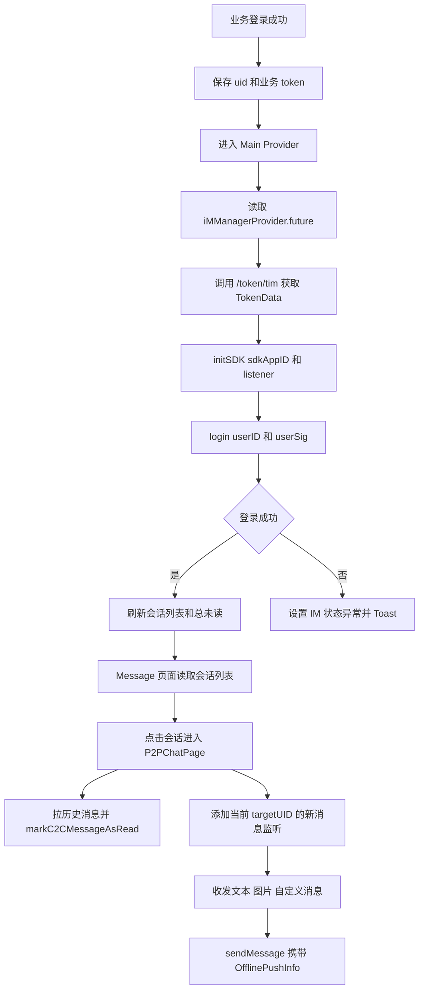

# nady 腾讯云 IM 私聊功能迁移文档

生成时间：2026-08-09  
分析方式：静态代码分析  
目标项目类型：Flutter / Dart  
事实来源：仅以 `/Users/liqihui/nady` 当前代码为准，未登录 Apifox，未运行 App。

## 1. 迁移结论

nady 的私聊 IM 能力基于 `tencent_cloud_chat_sdk`，业务代码没有直接使用腾讯云 UIKit，而是自行封装 Riverpod Provider、会话列表、聊天页和自定义消息渲染。

需要迁移时，优先迁移以下能力：

1. SDK 初始化与登录：`IMManager` 从业务接口 `/token/tim` 获取 `sdkAppID` 和 `userSig`，使用当前业务登录 UID 作为 IM `userID`。
2. 全局 SDK 监听：连接状态、被踢下线、UserSig 过期、全局新消息、已读回执、消息修改。
3. 会话列表与未读数：使用 SDK 会话管理器获取会话、监听会话变化、监听总未读数。
4. 私聊页：使用 `targetUID` 建立 C2C 聊天上下文，进入页面后拉历史消息并标记已读。
5. 消息发送：nady 实际实现了文本、图片、自定义消息发送；语音、视频、表情在会话预览分支中有类型识别，但未看到发送实现。
6. 自定义消息：nady 用 `ImCustomMessageModel(type, payload, timestamp)` 包装业务 payload，`payload` 是二次 JSON 字符串。
7. 离线推送：发送消息时设置 `OfflinePushInfo`；独立 `PushManager` 存在，但初始化和注册调用在当前代码中被注释或未启用。

## 2. 关键代码索引

| 模块 | 文件 | 关键类/方法 | 说明 |
|---|---|---|---|
| IM 初始化与登录 | `/Users/liqihui/nady/lib/services/im/im_manager.dart:45` | `IMManager.build` | 初始化 SDK、登录、全局监听、退出登录 |
| IM token 接口 | `/Users/liqihui/nady/lib/services/api/token_api.dart:15` | `TokenApi.getTimToken` | 获取腾讯云 IM 登录参数 |
| IM token model | `/Users/liqihui/nady/lib/model/common/token_data.dart:6` | `TokenData` | `appID/token/expiresIn/expires` |
| 主页面启动触发 | `/Users/liqihui/nady/lib/pages/main/main_provider.dart:29` | `Main.build` | 进入主页面后触发 `iMManagerProvider.future` |
| 会话列表 | `/Users/liqihui/nady/lib/widgets/chat/conversation_list_provider.dart:21` | `ConversationList` | 获取会话、监听会话变化、排序、搜索 |
| 总未读数 | `/Users/liqihui/nady/lib/widgets/chat/conversation_list_provider.dart:248` | `ConversationUnreadCount` | 获取总未读、监听总未读变化、清空未读 |
| 会话 item | `/Users/liqihui/nady/lib/widgets/chat/nady_conversation_element.dart:25` | `NadyConversationElement` | 普通私聊会话展示、删除、进入私聊 |
| 系统会话 item | `/Users/liqihui/nady/lib/pages/main/sub_pages/message/widget/nady_system_conversation_widget.dart:24` | `NadySystemConversationWidget` | 系统会话展示、进入系统消息页 |
| 私聊页 | `/Users/liqihui/nady/lib/pages/p2p_chat/p2p_chat_page.dart:36` | `P2PChatPage` | 页面参数、历史消息分页、资料刷新、底部输入 |
| 私聊消息 Provider | `/Users/liqihui/nady/lib/pages/p2p_chat/p2p_chat_provider.dart:33` | `P2PChatNewMsgList` | 新消息监听、文本/图片/自定义消息发送、重发 |
| 历史消息 Provider | `/Users/liqihui/nady/lib/pages/p2p_chat/p2p_chat_provider.dart:288` | `P2PChatHistoryMsgList` | 拉历史、分页、已读、已读回执 |
| 私聊消息渲染 | `/Users/liqihui/nady/lib/pages/p2p_chat/p2p_chat_element.dart:57` | `P2PChatElement` | 文本、图片、自定义消息 UI |
| 私聊底部输入 | `/Users/liqihui/nady/lib/pages/p2p_chat/p2p_chat_bottom_sheet.dart:337` | `P2PChatBottomSheet` | 文本输入、更多功能面板 |
| 图片选择/拍照 | `/Users/liqihui/nady/lib/pages/p2p_chat/media_message_mixin.dart:10` | `MediaMessageMixin` | 相册/相机权限和 picker |
| 聊天设置 | `/Users/liqihui/nady/lib/pages/p2p_chat/p2p_chat_setting_page.dart:24` | `P2PChatSettingPage` | 置顶、消息免打扰 |
| 免打扰状态 | `/Users/liqihui/nady/lib/services/im/im_notification_mute_state_provider.dart:10` | `ImNotificationMuteState` | 本地缓存 + SDK C2C 接收选项 |
| 自定义消息基础模型 | `/Users/liqihui/nady/lib/model/common/im_custom_message_model.dart:6` | `ImCustomMessageType` / `ImCustomMessageModel` | 私聊自定义消息外层结构 |
| 系统自定义消息模型 | `/Users/liqihui/nady/lib/pages/main/sub_pages/message/data/nady_custom_msg_model.dart:20` | `NadySystemMsgModel` | 系统会话自定义消息解析 |
| 系统消息类型 | `/Users/liqihui/nady/lib/pages/main/sub_pages/message/data/nady_custom_msg_type.dart:1` | `NadySystemMsgType` | 系统消息 type 枚举 |
| Android Application | `/Users/liqihui/nady/android/app/src/main/kotlin/com/nady/NadyApplication.kt:5` | `TencentCloudChatPushApplication` | 腾讯云推送 Android Application 基类 |
| Android Activity | `/Users/liqihui/nady/android/app/src/main/kotlin/com/nady/MainActivity.kt:22` | `TencentCloudChatPushActivity` | 腾讯云推送 Activity 基类 |
| Android Manifest | `/Users/liqihui/nady/android/app/src/main/AndroidManifest.xml:1` | manifest | 权限、deep link、Application/Activity |
| iOS AppDelegate | `/Users/liqihui/nady/ios/Runner/AppDelegate.swift:7` | `AppDelegate` | 当前未看到腾讯云推送显式注册代码 |
| iOS Info.plist | `/Users/liqihui/nady/ios/Runner/Info.plist:25` | URL schemes / 权限 | `nady://` scheme、相册/相机/麦克风权限 |
| iOS entitlements | `/Users/liqihui/nady/ios/Runner/Runner.entitlements:1` | Associated Domains | 当前未看到 `aps-environment` |

## 3. 依赖与版本

以 `pubspec.yaml` 和 `pubspec.lock` 为准：

| 依赖 | pubspec 约束 | lock 实际版本 | 用途 |
|---|---:|---:|---|
| `tencent_cloud_chat_sdk` | `8.5.6864+2` | `8.5.6864+2` | IM SDK，登录、会话、消息 |
| `tencent_cloud_chat_push` | `^8.1.6906` | `8.5.6864` | 离线推送 |
| `permission_handler` | `^11.3.1` | `11.4.0` | 相册/相机等权限 |
| `wechat_assets_picker` | `^10.1.3` | `10.1.3` | 相册选择图片 |
| `wechat_camera_picker` | `^4.3.1` | `4.4.0` | 拍照 |
| `fext_aliyun_oss` | 本地 path | `0.0.1` | 图片发送前上传 OSS 做审核 |
| `firebase_core` | `3.13.1` | `3.13.1` | Firebase 初始化 |
| `firebase_analytics` | `11.4.6` | `11.4.6` | 路由埋点 |
| `firebase_crashlytics` | `^4.1.0` | `4.3.6` | 崩溃上报 |
| `firebase_auth` | `^5.4.0` | `5.5.4` | Firebase Auth 初始化 |
| `flutter_local_notifications` | `^19.4.1` | `19.5.0` | 本地通知/前台服务相关，非 IM 私聊核心 |
| `infinite_scroll_pagination` | `^4.0.0` | 以 lock 为准 | 历史消息分页 |
| `hooks_riverpod` / `riverpod_annotation` | 见 pubspec | 以 lock 为准 | 状态管理 |

平台侧：

| 平台 | 文件 | 当前状态 |
|---|---|---|
| Android Firebase | `/Users/liqihui/nady/android/app/google-services.json` | 存在；迁移时复制对应项目自己的 Firebase 配置，不建议复用 nady 密钥 |
| iOS Firebase | `/Users/liqihui/nady/ios/Runner/GoogleService-Info.plist` | 存在；迁移时替换为目标项目自己的配置 |
| Android 推送配置 | `timpush-configs.json` / `timpush-configs-prod.json` | 代码引用，但仓库未检出 |
| iOS APNs 证书 ID | `PushManager.initBefore` | 代码中硬编码证书 ID，详见推送章节 |

## 4. SDK 原生能力 vs nady 业务封装

### 4.1 SDK 原生能力

| 能力 | SDK API | nady 使用位置 |
|---|---|---|
| 初始化 SDK | `TencentImSDKPlugin.v2TIMManager.initSDK` | `/Users/liqihui/nady/lib/services/im/im_manager.dart:114` |
| 登录 | `v2TIMManager.login` | `/Users/liqihui/nady/lib/services/im/im_manager.dart:126` |
| 退出登录 | `v2TIMManager.logout` | `/Users/liqihui/nady/lib/services/im/im_manager.dart:217` |
| 登录状态 | `v2TIMManager.getLoginStatus` | `/Users/liqihui/nady/lib/services/im/im_manager.dart:414` |
| 添加高级消息监听 | `getMessageManager().addAdvancedMsgListener` | `/Users/liqihui/nady/lib/services/im/im_manager.dart:210`、`/Users/liqihui/nady/lib/pages/p2p_chat/p2p_chat_provider.dart:103` |
| 获取会话列表 | `getConversationList(nextSeq, count)` | `/Users/liqihui/nady/lib/widgets/chat/conversation_list_provider.dart:33` |
| 添加会话监听 | `addConversationListener` | `/Users/liqihui/nady/lib/widgets/chat/conversation_list_provider.dart:63` |
| 获取总未读 | `getTotalUnreadMessageCount` | `/Users/liqihui/nady/lib/widgets/chat/conversation_list_provider.dart:252` |
| 清理会话未读 | `cleanConversationUnreadMessageCount` | `/Users/liqihui/nady/lib/widgets/chat/conversation_list_provider.dart:286` |
| 拉 C2C 历史 | `getC2CHistoryMessageList` | `/Users/liqihui/nady/lib/pages/p2p_chat/p2p_chat_provider.dart:295`、`:315` |
| 标记 C2C 已读 | `markC2CMessageAsRead` | `/Users/liqihui/nady/lib/pages/p2p_chat/p2p_chat_provider.dart:345` |
| 发送已读回执 | `sendMessageReadReceipts` | `/Users/liqihui/nady/lib/pages/p2p_chat/p2p_chat_provider.dart:351` |
| 创建文本消息 | `createTextMessage` | `/Users/liqihui/nady/lib/pages/p2p_chat/p2p_chat_provider.dart:118` |
| 创建自定义消息 | `createCustomMessage` | `/Users/liqihui/nady/lib/pages/p2p_chat/p2p_chat_provider.dart:149` |
| 创建图片消息 | `createImageMessage` | `/Users/liqihui/nady/lib/pages/p2p_chat/p2p_chat_provider.dart:201` |
| 发送消息 | `sendMessage` | `/Users/liqihui/nady/lib/pages/p2p_chat/p2p_chat_provider.dart:124`、`:156`、`:221` |
| 重发消息 | `reSendMessage` | `/Users/liqihui/nady/lib/pages/p2p_chat/p2p_chat_provider.dart:252` |
| 置顶会话 | `pinConversation` | `/Users/liqihui/nady/lib/services/im/im_manager.dart:231` |
| 设置 C2C 接收选项 | `setC2CReceiveMessageOpt` | `/Users/liqihui/nady/lib/services/im/im_notification_mute_state_provider.dart:42` |

### 4.2 nady 业务封装

| 封装 | 责任 | 迁移建议 |
|---|---|---|
| `IMManager` | SDK 初始化、登录、全局监听、连接状态、退出清理 | 必迁移，改造为目标项目自己的全局服务 |
| `NadyIMConnectStatu` | IM 连接状态：`0` 正常、`1` 连接失败、`2` 连接中/失败重连 | 可迁移为 UI 连接状态 Provider |
| `PushManager` | 推送证书、Android 推送配置、注册/反注册 | 需要按目标项目证书和厂商配置重写 |
| `ConversationList` | 会话列表、监听、系统会话过滤、置顶排序、搜索 | 必迁移 |
| `ConversationUnreadCount` | 总未读数、监听、全部已读 | 必迁移 |
| `P2PChatNewMsgList` | 当前私聊对象的新消息、发送消息、重发、进度更新 | 必迁移 |
| `P2PChatHistoryMsgList` | 历史消息分页、已读、已读回执 | 必迁移 |
| `ImCustomMessageModel` | 私聊自定义消息外层协议 | 必迁移 |
| `NadySystemMsgModel` | 系统会话自定义消息解析 | 如果目标项目需要系统消息，迁移 |
| `MediaMessageMixin` | 相册/相机选择 | 图片消息需要迁移 |

## 5. 总体流程



## 6. IM 初始化与登录

### 6.1 触发时机

`main.dart` 本身不直接初始化 IM。IM 初始化发生在主页面聚合 Provider：

- `/Users/liqihui/nady/lib/pages/main/main_provider.dart:34`：监听 `iMManagerProvider`。
- `/Users/liqihui/nady/lib/pages/main/main_provider.dart:54`：`Future.wait` 中读取 `ref.read(iMManagerProvider.future)`。

业务前置条件：

- `authenticationUIDProvider` 已有 UID。
- `authenticationTokenProvider` 已有业务 token。
- `myUserInfoProvider` 可以正常获取当前用户资料。

### 6.2 登录参数来源

| 参数 | Dart 类型 | 来源 | 是否必填 | 用途 |
|---|---|---|---|---|
| `TokenData.appID` | `int` | `TokenApi.of.getTimToken()` -> `/token/tim` | 是 | `initSDK.sdkAppID` |
| `TokenData.token` | `String` | `TokenApi.of.getTimToken()` -> `/token/tim` | 是 | `login.userSig` |
| `TokenData.expiresIn` | `double?` | `/token/tim` 响应 | 否 | 代码未使用 |
| `TokenData.expires` | `double?` | `/token/tim` 响应 | 否 | 代码未使用 |
| `authenticationUIDProvider.value` | `int` | 业务登录保存到 `SpKeys.lastLoginUid` | 是 | `login.userID`，转为字符串 |
| `kReleaseMode` | `bool` | Flutter 编译环境 | 是 | 决定 SDK loglevel |
| `V2TimSDKListener` | `V2TimSDKListener` | `TimSDKListenerManager.imListener` | 是 | SDK 全局监听 |

相关代码：

- `TokenData` 定义：`/Users/liqihui/nady/lib/model/common/token_data.dart:6`
- `TokenApi.getTimToken`：`/Users/liqihui/nady/lib/services/api/token_api.dart:15`
- API path：`/Users/liqihui/nady/lib/services/api/api_urls.dart:114`，`/token/tim`
- Retrofit 方法：`/Users/liqihui/nady/lib/services/http/api_client.dart:328`
- IM 初始化和登录：`/Users/liqihui/nady/lib/services/im/im_manager.dart:112`

### 6.3 初始化流程

`IMManager.build` 流程：

1. 设置全局 SDK listener：`TimSDKListenerManager.setIMListener(V2TimSDKListener(...))`。
2. 调用 `TokenApi.of.getTimToken()` 获取 `TokenData`。
3. 调用 `TencentImSDKPlugin.v2TIMManager.initSDK`：
   - `sdkAppID: tokenData.appID`
   - `loglevel: release -> V2TIM_LOG_WARN，否则 V2TIM_LOG_ALL`
   - `listener: imListener`
4. 调用 `login`：
   - `userID: authenticationUIDProvider.value!.toString()`
   - `userSig: tokenData.token`
5. `code == 0` 时：
   - `_login = true`
   - `_imLoginSussess(tokenData)`
   - 刷新会话列表和未读数
6. 失败时：
   - `_login = false`
   - `nadyIMConnectStatuProvider.changeStatu(2)`
   - Toast 展示错误码

### 6.4 SDK 监听处理

| 监听回调 | nady 行为 | 代码位置 |
|---|---|---|
| `onUserStatusChanged` | 打日志 | `/Users/liqihui/nady/lib/services/im/im_manager.dart:56` |
| `onLog` | 打印 SDK 日志 | `/Users/liqihui/nady/lib/services/im/im_manager.dart:60` |
| `onKickedOffline` | 如果业务仍登录，先离开房间，再业务 logout，弹出“账号在其他设备登录”对话框 | `/Users/liqihui/nady/lib/services/im/im_manager.dart:64` |
| `onUserSigExpired` | 仅打日志，未看到自动刷新 userSig | `/Users/liqihui/nady/lib/services/im/im_manager.dart:85` |
| `onConnectFailed` | 状态设为 `1`，触发 ping/NDS | `/Users/liqihui/nady/lib/services/im/im_manager.dart:88` |
| `onConnectSuccess` | 关闭连接异常弹窗，状态设为 `0` | `/Users/liqihui/nady/lib/services/im/im_manager.dart:93` |
| `onConnecting` | 状态设为 `2`，触发 ping/NDS | `/Users/liqihui/nady/lib/services/im/im_manager.dart:100` |

全局高级消息监听：

| 回调 | nady 行为 |
|---|---|
| `onRecvC2CReadReceipt` | 仅打日志 |
| `onRecvMessageModified` | 仅打日志 |
| `onRecvMessageReadReceipts` | 仅打日志 |
| `onRecvMessageRevoked` | 仅打日志 |
| `onRecvNewMessage` | 用 `SpKeys.lastTimMessageId` 去重；如果是 sender `10000` 的自定义复杂系统消息，且消息在 1 小时内，可进入后续业务处理；当前任务相关逻辑多为注释 |
| `onSendMessageProgress` | 空实现 |

### 6.5 重连

`NadyIMConnectStatu.reConnect`：

1. 延迟 5 秒，如果状态仍非 `0`，弹出网络异常。
2. 调用 `getLoginStatus()`。
3. 如果 `statu.code != 1`，重新获取 `/token/tim` 并再次 `login`。
4. 登录成功后调用 `_imLoginSussess`；失败时状态设为 `2`。

代码位置：`/Users/liqihui/nady/lib/services/im/im_manager.dart:399`

注意：`getLoginStatus` 的返回判断写的是 `statu.code != 1`，这里按代码记录；迁移时建议确认腾讯云 SDK 当前版本返回值含义。

### 6.6 退出

`IMManager` dispose 时：

- 如果 `_login == true`：调用 `v2TIMManager.logout()`。
- 调用 `PushManager.instance.unRegister()`。
- 离开当前房间。
- 移除高级消息监听。

代码位置：`/Users/liqihui/nady/lib/services/im/im_manager.dart:214`

## 7. 推送与离线通知

### 7.1 发送消息时的离线推送参数

文本、自定义、图片消息都在 `sendMessage` 时传入 `OfflinePushInfo`。

| 字段 | Dart 类型 | 来源 | 是否必填 | 说明 |
|---|---|---|---|---|
| `title` | `String?` | `myUserInfoProvider.value?.userBaseInfo.nick ?? "Message"` | 是 | 通知标题，使用发送者昵称 |
| `desc` | `String?` | 文本内容 / `[Image]` / `pushContent ?? "Message"` | 是 | 通知摘要 |
| `ignoreIOSBadge` | `bool?` | 固定 `true` | 否 | 忽略 iOS badge |
| `ext` | `String?` | JSON 字符串 | 是 | 点击推送后的跳转信息 |

`ext` 当前结构：

```json
{
  "jumpUrl": "nady:///main/p2p-chat?target-u-i-d=<senderUid>&is-on-room=false"
}
```

来源：

- 文本消息：`/Users/liqihui/nady/lib/pages/p2p_chat/p2p_chat_provider.dart:128`
- 自定义消息：`/Users/liqihui/nady/lib/pages/p2p_chat/p2p_chat_provider.dart:160`
- 图片消息：`/Users/liqihui/nady/lib/pages/p2p_chat/p2p_chat_provider.dart:226`

迁移注意：这里的 `target-u-i-d` 使用的是发送者自己的 UID，目的是接收方点击后进入与发送者的私聊。

### 7.2 PushManager

`PushManager` 位于 `/Users/liqihui/nady/lib/services/im/im_manager.dart:329`。

| 方法 | 作用 | 当前代码状态 |
|---|---|---|
| `initBefore` | 设置 APNs 证书 ID、Android 推送配置文件、Android 推送品牌 | 存在，但 `main.dart` 调用被注释 |
| `register` | 调用 `TencentCloudChatPush().registerPush` 并传入点击回调 | 存在，但 `_imLoginSussess` 里调用被注释 |
| `unRegister` | 调用 `TencentCloudChatPush().unRegisterPush` | `IMManager` dispose 时调用 |

### 7.3 iOS 推送配置

`PushManager.initBefore` 中的 APNs 证书 ID：

| 环境 | 条件 | `apnsCertificateID` |
|---|---|---:|
| prod | `ENV == prod` | `15262` |
| 非 prod release | `ENV != prod && kReleaseMode == true` | `15242` |
| 非 prod debug | `ENV != prod && kReleaseMode == false` | `15239` |

代码位置：`/Users/liqihui/nady/lib/services/im/im_manager.dart:334`

iOS 文件状态：

- `/Users/liqihui/nady/ios/Runner/AppDelegate.swift:7`：继承 `FlutterAppDelegate`，未看到腾讯云推送显式注册逻辑。
- `/Users/liqihui/nady/ios/Runner/Runner.entitlements:1`：未看到 `aps-environment`；迁移到目标项目时如需 APNs，需确认 Xcode capability。
- `/Users/liqihui/nady/ios/Podfile.lock` 中存在 `tencent_cloud_chat_push 8.5.6864` 与 `TIMPush 8.5.6864`。

### 7.4 Android 推送配置

Android 原生接入点：

- `/Users/liqihui/nady/android/app/src/main/kotlin/com/nady/NadyApplication.kt:5`：`NadyApplication : TencentCloudChatPushApplication()`
- `/Users/liqihui/nady/android/app/src/main/kotlin/com/nady/MainActivity.kt:22`：`MainActivity : TencentCloudChatPushActivity()`
- `/Users/liqihui/nady/android/app/src/main/AndroidManifest.xml:9`：`android:name=".NadyApplication"`
- `/Users/liqihui/nady/android/app/src/main/AndroidManifest.xml:14`：`android:name=".MainActivity"`

`PushManager.initBefore` Android 分支：

| 字段 | 值 | 说明 |
|---|---|---|
| `ENV != prod` | `timpush-configs.json` | 开发/测试推送配置文件 |
| `ENV == prod` | `timpush-configs-prod.json` | 生产推送配置文件 |
| push brand | `TencentCloudChatPushBrandID.FCM` | 当前 Huawei 逻辑被注释，只设置 FCM |

代码引用但未检出文件：

- `timpush-configs.json`
- `timpush-configs-prod.json`

静态扫描结果：仓库内未找到 `timpush-configs*.json`。迁移时必须从原项目或腾讯云控制台补齐。

Android 权限与 deep link：

- `POST_NOTIFICATIONS`：`/Users/liqihui/nady/android/app/src/main/AndroidManifest.xml:160`
- `INTERNET`：`/Users/liqihui/nady/android/app/src/main/AndroidManifest.xml:122`
- `READ_MEDIA_IMAGES/VIDEO/AUDIO`：`/Users/liqihui/nady/android/app/src/main/AndroidManifest.xml:133`
- `nady://` scheme：`/Users/liqihui/nady/android/app/src/main/AndroidManifest.xml:34`

## 8. 会话列表、系统会话和未读数

### 8.1 会话列表流程

`ConversationList.build`：

1. `_nextSeq = "0"`。
2. 先调用 `removeConversationListener()` 清理旧监听。
3. 调用 `getConversationList(nextSeq: "0", count: 100)`。
4. 保存 `nextSeq`。
5. 审核版本时移除系统会话。
6. 添加 `V2TimConversationListener`：
   - `onConversationChanged`
   - `onNewConversation`
7. 监听回调中更新列表、置顶系统会话、排序。
8. dispose 时移除 listener。

排序规则：

1. 置顶会话排前。
2. 同为置顶或同为非置顶时，按 `lastMessage.timestamp` 倒序。

代码位置：

- 拉取列表：`/Users/liqihui/nady/lib/widgets/chat/conversation_list_provider.dart:33`
- 监听：`/Users/liqihui/nady/lib/widgets/chat/conversation_list_provider.dart:48`
- 更新与排序：`/Users/liqihui/nady/lib/widgets/chat/conversation_list_provider.dart:88`

### 8.2 系统会话 ID

| conversationID | userID | 名称 |
|---|---:|---|
| `c2c_10000` | `10000` | System |
| `c2c_10001` | `10001` | Wallet Assistant |
| `c2c_10002` | `10002` | Friend Assistant |
| `c2c_10003` | `10003` | Interaction Notification |

定义位置：

- `/Users/liqihui/nady/lib/pages/main/sub_pages/message/data/system_conversation_id.dart:3`
- `/Users/liqihui/nady/lib/pages/main/sub_pages/message/data/nady_system_conversation_id.dart:3`

系统会话会被自动置顶：

- `/Users/liqihui/nady/lib/widgets/chat/conversation_list_provider.dart:76`

### 8.3 普通会话点击

`NadyConversationElement`：

- 如果 `conversation.userID == null` 或 `<= 0`，不展示。
- 使用 `userInfoProvider(int.parse(conversation.userID!))` 获取业务用户资料。
- `inRoom == true`：调用 `P2PChatPage.show(conversation.userID!)` 以底部弹层展示。
- `inRoom == false`：路由 push `P2PChatPageRoute(isOnRoom: false, targetUID: conversation.userID!)`。
- 长按会话调用 SDK `deleteConversation` 并从本地列表移除。

代码位置：`/Users/liqihui/nady/lib/widgets/chat/nady_conversation_element.dart:40`

### 8.4 总未读数

`ConversationUnreadCount.build`：

1. 调用 `getTotalUnreadMessageCount()`。
2. 添加 `V2TimConversationListener(onTotalUnreadMessageCountChanged)`。
3. 收到变化后更新状态。
4. dispose 移除 listener。

清空未读：

```dart
cleanConversationUnreadMessageCount(
  conversationID: '',
  cleanTimestamp: 0,
  cleanSequence: 0,
)
```

代码位置：

- 获取总未读：`/Users/liqihui/nady/lib/widgets/chat/conversation_list_provider.dart:252`
- 清空未读：`/Users/liqihui/nady/lib/widgets/chat/conversation_list_provider.dart:285`
- 消息页“全部已读”按钮：`/Users/liqihui/nady/lib/pages/main/sub_pages/message/nady_message_page.dart:76`

### 8.5 会话设置

| 功能 | SDK API | 业务入口 |
|---|---|---|
| 置顶 | `pinConversation(conversationID: 'c2c_$targetId', isPinned: bool)` | `/Users/liqihui/nady/lib/pages/p2p_chat/p2p_chat_setting_page.dart:152` |
| 免打扰 | `setC2CReceiveMessageOpt(userIDList, opt)` | `/Users/liqihui/nady/lib/services/im/im_notification_mute_state_provider.dart:31` |
| 查询接收状态 | `getC2CReceiveMessageOpt` | `/Users/liqihui/nady/lib/services/im/im_manager.dart:246` |

接收选项：

| enum | 含义 |
|---|---|
| `V2TIM_RECEIVE_MESSAGE` | 在线正常接收，离线推送 |
| `V2TIM_NOT_RECEIVE_MESSAGE` | 不接收消息 |
| `V2TIM_RECEIVE_NOT_NOTIFY_MESSAGE` | 在线接收，离线不推送 |

nady 免打扰本地状态存储在 `nadyUserDataManagerProvider(imNotificationMuteStateBoxName)`，同时同步 SDK C2C 接收选项。

## 9. 私聊页流程

### 9.1 路由参数

`P2PChatPageRoute`：

| 参数 | Dart 类型 | 是否必填 | 说明 |
|---|---|---|---|
| `targetUID` | `String` | 是 | 对方用户 ID，即 C2C 目标 userID |
| `isOnRoom` | `bool` | 是 | 是否从房间内弹出私聊半屏 |

定义位置：`/Users/liqihui/nady/lib/router/routes.dart:588`

### 9.2 页面构建

`P2PChatPage` 主要动作：

1. 根据 `targetUID` 获取目标用户资料：
   - `PageHomeViewModelProvider(int.parse(targetUID)).info`
   - `userInfoProvider(int.parse(targetUID)).notifier.refresh()`
2. 获取当前用户资料：
   - `myUserInfoProvider.value!.userBaseInfo`
3. 建立两个 Provider：
   - `p2PChatNewMsgListProvider(targetUID)`
   - `p2PChatHistoryMsgListProvider(targetUID)`
4. 初始化分页控制器。
5. 进入页面后：
   - `markC2CMessageAsRead()`
   - 注册分页拉取 `more`
6. 渲染 `P2PChatBodyWidget` 与 `P2PChatBottomSheet`。

代码位置：`/Users/liqihui/nady/lib/pages/p2p_chat/p2p_chat_page.dart:47`

### 9.3 当前聊天窗口新消息监听

`P2PChatNewMsgList.build(targetUID)`：

1. 保存 `_targetUID`。
2. 获取 SDK message manager 和 conversation manager。
3. 添加 `V2TimAdvancedMsgListener`：
   - `onRecvNewMessage`
   - `onRecvMessageModified`
   - `onRecvC2CReadReceipt`
   - `onSendMessageProgress`
4. 添加 `V2TimConversationListener`：
   - 当前会话 unread > 0 时调用 `markC2CMessageAsRead(userID: targetUID)`。
5. 初始调用一次 `markC2CMessageAsRead(userID: targetUID)`。
6. dispose 时移除监听。

代码位置：`/Users/liqihui/nady/lib/pages/p2p_chat/p2p_chat_provider.dart:39`

新消息筛选逻辑：

```dart
if (_targetUID == newMsg.userID) {
  previousState.insert(0, newMsg);
  sendC2CMessageAsRed([newMsg.msgID!]);
}
```

### 9.4 历史消息分页

`P2PChatHistoryMsgList.build(targetUID)`：

- 初始拉取 `count: 20`。
- SDK API：`getC2CHistoryMessageList(userID: targetUID, count: 20)`。
- 成功且数据非空时，对第一条消息调用 `sendMessageReadReceipts`。

分页 `more(msgID, count)`：

- 调用 `getC2CHistoryMessageList(userID, count, lastMsgID: msgID)`。
- 成功后追加到历史列表。

代码位置：`/Users/liqihui/nady/lib/pages/p2p_chat/p2p_chat_provider.dart:288`

### 9.5 已读处理

| 动作 | API | 位置 |
|---|---|---|
| 进入私聊页标记会话已读 | `markC2CMessageAsRead(userID)` | `/Users/liqihui/nady/lib/pages/p2p_chat/p2p_chat_page.dart:82` |
| 当前会话有未读变化时标记已读 | `markC2CMessageAsRead(userID)` | `/Users/liqihui/nady/lib/pages/p2p_chat/p2p_chat_provider.dart:89` |
| 历史消息拉取后发送已读回执 | `sendMessageReadReceipts(messageIDList)` | `/Users/liqihui/nady/lib/pages/p2p_chat/p2p_chat_provider.dart:351` |
| 收到 C2C 已读回执 | `onRecvC2CReadReceipt` | `/Users/liqihui/nady/lib/pages/p2p_chat/p2p_chat_provider.dart:67` |

## 10. 消息发送与渲染

### 10.1 文本消息

发送入口：

- UI：`/Users/liqihui/nady/lib/pages/p2p_chat/p2p_chat_bottom_sheet.dart:492`
- Provider：`/Users/liqihui/nady/lib/pages/p2p_chat/p2p_chat_provider.dart:118`

流程：

1. 文本输入框限制 `maxLength: 1000`。
2. 发送前检查对方 VIP 勿扰规则。
3. 调用 `_msgManager.createTextMessage(text: message)`。
4. 调用 `_msgManager.sendMessage(id, receiver: targetUID, groupID: "", offlinePushInfo)`。
5. `res.code == 120001` 时 Toast `res.desc`。
6. 否则将 `res.data` 插入新消息列表头部。

字段映射：

| nady 字段 | SDK 字段 | 类型 |
|---|---|---|
| 输入框文本 `content` | `V2TimTextElem.text` | `String?` |
| `targetUID` | `sendMessage.receiver` / `V2TimMessage.userID` | `String` |
| 当前用户昵称 | `OfflinePushInfo.title` | `String?` |
| 文本内容 | `OfflinePushInfo.desc` | `String?` |

### 10.2 图片消息

发送入口：

- 相册：`/Users/liqihui/nady/lib/pages/p2p_chat/p2p_chat_bottom_sheet.dart:178`
- 拍照：`/Users/liqihui/nady/lib/pages/p2p_chat/p2p_chat_bottom_sheet.dart:232`
- Provider：`/Users/liqihui/nady/lib/pages/p2p_chat/p2p_chat_provider.dart:201`

流程：

1. `MediaMessageMixin.showAssetPicker` 先请求相册权限，使用 `AssetPicker.pickAssets`，`RequestType.image`。
2. `MediaMessageMixin.showCameraPicker` 先请求相机权限，使用 `CameraPicker.pickFromCamera`。
3. 对每个图片文件调用 `sendImageMessage(file.path)`。
4. `sendImageMessage` 先把文件上传到 OSS：
   - `CommonApi.of.getUploadParam()`
   - `FextAliyunOss().putBytesObject(...)`
5. 调用 `CommonApi.of.shumeiAudit(targetUID, 'img', imageUrl)` 做图片审核。
6. 审核失败直接返回。
7. 调用 `createImageMessage(imagePath: imagePath)`。
8. 如果 `imageMsg.data.messageInfo` 不为空，先插入本地预览消息。
9. 调用 `sendMessage`，成功后用 SDK 返回消息替换本地预览消息。

图片显示逻辑：

- 自己发送且 `msg.localImage != null`：优先用本地路径。
- 否则使用 `msg.thumbnail.url`。
- 点击图片预览时使用本地图片或原图 `msg.originalImage.url`。

扩展字段：

| Getter | 来源 | 说明 |
|---|---|---|
| `V2TimMessage.localImage` | `imageElem.path` | 发送前本地预览 |
| `V2TimMessage.thumbnail` | `imageElem.imageList` 中 `type == 1` | 缩略图 |
| `V2TimMessage.originalImage` | `imageElem.imageList` 中 `type == 0` | 原图 |
| `V2TimMessage.isViolation` | `cloudCustomData` JSON 中 `type == 0` | nady 自定义审核/违规判断 |

代码位置：`/Users/liqihui/nady/lib/pages/p2p_chat/p2p_chat_provider.dart:359`

### 10.3 自定义消息

发送入口：

- 通用 Provider：`/Users/liqihui/nady/lib/pages/p2p_chat/p2p_chat_provider.dart:149`
- 房间分享 UI：`/Users/liqihui/nady/lib/pages/p2p_chat/p2p_chat_bottom_sheet.dart:128`

流程：

1. 构造 `ImCustomMessageModel`。
2. `jsonEncode(customModel.toJson())` 得到 `data`。
3. 调用 `_msgManager.createCustomMessage(data: data)`。
4. 调用 `_msgManager.sendMessage(id, receiver: targetUID, groupID: "", offlinePushInfo)`。
5. 成功后插入新消息列表。

外层结构：

| 字段 | Dart 类型 | 是否必填 | 说明 | SDK 映射 |
|---|---|---|---|---|
| `type` | `ImCustomMessageType` | 是 | 业务消息类型 | `customElem.data.type` |
| `payload` | `String` | 是 | 二次 JSON 字符串 | `customElem.data.payload` |
| `timestamp` | `int` | 是 | 毫秒时间戳 | `customElem.data.timestamp` |

SDK 映射：

| nady | SDK |
|---|---|
| `jsonEncode(ImCustomMessageModel.toJson())` | `V2TimCustomElem.data` |
| `pushContent` | `OfflinePushInfo.desc` |
| 当前用户昵称 | `OfflinePushInfo.title` |
| `jumpUrl` JSON | `OfflinePushInfo.ext` |

### 10.4 重发

`P2PChatNewMsgList.resend(V2TimMessage message)`：

1. 先把本地消息 `status` 改为 `1`。
2. 调用 `_msgManager.reSendMessage(msgID: message.msgID ?? '')`。
3. 成功后替换新消息列表中的消息；如果消息在历史列表中，则调用历史 Provider 改状态。

代码位置：`/Users/liqihui/nady/lib/pages/p2p_chat/p2p_chat_provider.dart:252`

### 10.5 消息渲染类型

`P2PChatElement.genContent`：

| SDK `elemType` | 类型 | nady 私聊渲染 |
|---:|---|---|
| `1` | 文本 | `genTextContent(textElem.text)` |
| `2` | 自定义 | 解析 `ImCustomMessageModel` 后按 `type` 渲染 |
| `3` | 图片 | `genImageContent` |
| `4` | 语音 | 私聊页未看到渲染实现；会话预览分支有类型注释 |
| `5` | 视频 | 私聊页未看到渲染实现；会话预览分支有类型注释 |
| `8` | 表情 | 私聊页未看到渲染实现；会话预览分支有类型注释 |

会话列表最后一条消息文本：

- 文本：显示 `textElem.text`。
- 自定义：按 `ImCustomMessageType` 转换为本地化文案。
- 图片：显示 `[image]`。
- 语音、视频、文件、位置、表情、群 tips、合并消息：代码返回 `lastMessage.textElem?.text ?? ''`，没有专门渲染。

代码位置：`/Users/liqihui/nady/lib/widgets/chat/conversation_list_provider.dart:161`

## 11. nady 实际涉及的消息类型

### 11.1 私聊中实际发送的类型

| 类型 | 是否发送 | 发送方式 | 说明 |
|---|---|---|---|
| 文本 | 是 | `createTextMessage` | 输入框发送 |
| 图片 | 是 | `createImageMessage` | 相册/相机，发送前 OSS 上传与审核 |
| 自定义消息 | 是 | `createCustomMessage` | 房间分享等业务消息 |
| 语音 | 未看到 | 无 | SDK 字段存在，但 nady 私聊未实现 |
| 视频 | 未看到 | 无 | SDK 字段存在，但 nady 私聊未实现 |
| 表情 | 未看到 | 无 | SDK 字段存在，但 nady 私聊未实现 |
| 礼物 | 间接涉及 | 自定义消息 / 系统消息 | `systemSendGiftStore`、系统会话、房间聊天中有礼物模型 |

### 11.2 `ImCustomMessageType`

定义位置：`/Users/liqihui/nady/lib/model/common/im_custom_message_model.dart:6`

| enum | JSON 值 | 私聊渲染 | 会话预览 | 说明 |
|---|---|---|---|---|
| `shareRoom` | `shareRoom` | 是 | `Share Room` | 分享语音房 |
| `shareParty` | `shareParty` | 是 | `Room Party` | 分享派对/活动 |
| `textIMMsg` | `TextIMMsg` | 是 | payload 中 `text` | 自定义文本消息 |
| `systemTextIMMsg` | `SystemTextIMMsg` | 未见私聊渲染 | 未见 | 系统文本 |
| `titleImageTextLinkIMMsg` | `TitleImageTextLinkIMMsg` | 未见私聊渲染 | 未见 | 图文链接 |
| `rewardPackSendIMMsg` | `RewardPackSendIMMsg` | 未见私聊渲染 | 未见 | 奖励包 |
| `transferAccounts` | `transferAccounts` | 是 | 多语言 title | 转账 |
| `systemComplexIMMsg` | `SystemComplexIMMsg` | 全局监听特殊处理 | 未见私聊渲染 | 复杂系统消息 |
| `systemSendGiftStore` | `SystemSendGiftStore` | 是 | `You sent` / `Sent you` | 商城礼物/赠送 |
| `vip` | `Vip` | 未见私聊渲染 | 未见 | VIP 消息 |
| `invitationWhatUp` | `InvitationIMMsg` | 是 | `What's up` | 动态互动邀请 |

### 11.3 私聊自定义 payload 模型

| type | payload 解析模型 | 字段 |
|---|---|---|
| `shareRoom` | `RoomDetailInfo` | 代码引用模型，字段请跟随房间模块 |
| `shareParty` | `GamePartyModel` | 代码引用模型，字段请跟随派对模块 |
| `textIMMsg` | JSON map | `text: String` |
| `transferAccounts` | `TransferAccountsModel` | `titleAr: String`, `titleEn: String`, `titleTr: String?`, `uid: int`, `digitalCurrency: int`, `num: int`, `remark: String`, `operationTimestamp: int` |
| `systemSendGiftStore` | JSON map | 代码未定义强类型；私聊渲染传给 `P2PChatSendStoreWidget(info: jsonDecode(payload))` |
| `invitationWhatUp` | `ImDynamicWhatUpModel` | `id: int`, `uid: int`, `targets: String`, `status: int`, `type: int`, `context: String`, `material: String`, `longitude: double`, `latitude: double`, `address: String`, `createTime: int` |

### 11.4 系统会话自定义类型

定义位置：`/Users/liqihui/nady/lib/pages/main/sub_pages/message/data/nady_custom_msg_type.dart:1`

| enum | JSON 值 | payload 模型 | 主要字段 |
|---|---|---|---|
| `rewardPackSendIMMsg` | `RewardPackSendIMMsg` | `RewardPackModel` | `enTitle`, `arTitle`, `trTitle`, `text`, `linkUrl`, `list: List<Goods>` |
| `purseTransferAccounts` | `purseTransferAccountsImMsg` | `NadyPurseTransferAccountsModel` | `uid`, `digitalCurrency`, `num`, `sendTime`, `title`, `titleAr`, `titleTr`, `remark`, `linkUrl`, `pic`, `remarkAr` |
| `shareRoom` | `shareRoom` | 未在 `NadySystemMsgModel._jsonTo` 中解析 | 代码未体现 |
| `systemComplexIMMsg` | `SystemComplexIMMsg` | `NadySystemComplexModel` | `titleMap`, `textMap`, `linkUrl`, `picUrl`, `event`, `eventPayload` |
| `inviteActiveMsg` | `InviteActiveMsg` | `NadyInviteFriendModel` | `title`, `text`, `eventId`, `userInfo` |
| `transferAccounts` | `transferAccounts` | `TransferAccountsModel` | 同上 |
| `missionMsg` | `MissionMsg` | 未解析 | 代码未体现 |
| `aristocracyMsg` | `Aristocracy` | `AristocracyMsgModel` | `titleMap`, `textMap`, `type`, `remarkMap`, `linkUrl`, `aristocracyInfo`, `sendUserNo` |
| `vip` | `Vip` | `VipMsgModel` | `titleMap`, `textMap`, `type`, `linkUrl`, `vipInfo`, `sendUserNo`, `propIcon` |
| `privatePhoto` | `PrivatePhoto` | `PrivatePhotoMsgModel` | `titleMap`, `textMap`, `linkUrl` |
| `invitationNoticeMsg` | `InvitationNoticeMsg` | `InvitationNoticeMsgModel` | `userBaseInfoDTO`, `type`, `content`, `material`, `interactionType`, `interactionId` |
| `agentSendsVerificationCodeIMMsg` | `AgentSendsVerificationCodeIMMsg` | `AgentSendsVerificationCodeIMMsgModel` | `code: String?` |
| `agentSendsInviteIMMsg` | `AgentSendsInviteIMMsg` | `AgentSendsInviteIMMsgModel` | `id`, `uid`, `avatar`, `nick`, `type`, `channel` |

## 12. SDK 字段映射

### 12.1 `V2TimMessage`

SDK 定义位置：`/Users/liqihui/.pub-cache/hosted/pub.dev/tencent_cloud_chat_sdk-8.5.6864+2/lib/models/v2_tim_message.dart:20`

| 字段 | 类型 | nady 是否使用 | 含义 / nady 用法 |
|---|---|---|---|
| `msgID` | `String?` | 是 | SDK 消息 ID；去重、回执、重发、分页 lastMsgID |
| `timestamp` | `int?` | 是 | 秒级时间戳；会话排序、时间展示、系统消息过滤 |
| `progress` | `int?` | 间接 | 多媒体发送进度；nady 当前只在 progress 回调里更新 status |
| `sender` | `String?` | 是 | 发送者 ID；判断系统消息 sender `10000`、转账 UI |
| `nickName` | `String?` | 否 | SDK 昵称；nady 更多使用业务用户资料 |
| `faceUrl` | `String?` | 是 | SDK 头像兜底 |
| `groupID` | `String?` | 否 | 群消息字段；私聊不使用 |
| `userID` | `String?` | 是 | C2C 对方 userID；匹配当前 `targetUID` |
| `status` | `int?` | 是 | 发送状态；`1` 发送中、`2` 成功、`3` 失败按 UI 使用 |
| `elemType` | `int` | 是 | 消息类型 |
| `textElem` | `V2TimTextElem?` | 是 | 文本消息内容 |
| `customElem` | `V2TimCustomElem?` | 是 | 自定义消息 JSON |
| `imageElem` | `V2TimImageElem?` | 是 | 图片消息 |
| `soundElem` | `V2TimSoundElem?` | 否 | 语音字段存在，nady 未实现私聊语音 |
| `videoElem` | `V2TimVideoElem?` | 否 | 视频字段存在，nady 未实现私聊视频 |
| `faceElem` | `V2TimFaceElem?` | 否 | 表情字段存在，nady 未实现私聊表情 |
| `cloudCustomData` | `String?` | 是 | nady 用来判断违规：JSON `type == 0` |
| `isSelf` | `bool?` | 是 | 决定左右气泡和头像 |
| `isRead` | `bool?` | 间接 | SDK 已读状态 |
| `isPeerRead` | `bool?` | 是 | VIP 已读图标展示 |
| `offlinePushInfo` | `OfflinePushInfo?` | 发送时设置 | 离线推送标题、内容、跳转 |
| `id` | `String?` | 是 | create message 后的临时 ID；用于发送进度和本地预览替换 |

### 12.2 `MessageElemType`

SDK 定义位置：`/Users/liqihui/.pub-cache/hosted/pub.dev/tencent_cloud_chat_sdk-8.5.6864+2/lib/enum/message_elem_type.dart:7`

| 值 | 常量 | 类型 |
|---:|---|---|
| `0` | `V2TIM_ELEM_TYPE_NONE` | 无元素 |
| `1` | `V2TIM_ELEM_TYPE_TEXT` | 文本 |
| `2` | `V2TIM_ELEM_TYPE_CUSTOM` | 自定义 |
| `3` | `V2TIM_ELEM_TYPE_IMAGE` | 图片 |
| `4` | `V2TIM_ELEM_TYPE_SOUND` | 语音 |
| `5` | `V2TIM_ELEM_TYPE_VIDEO` | 视频 |
| `6` | `V2TIM_ELEM_TYPE_FILE` | 文件 |
| `7` | `V2TIM_ELEM_TYPE_LOCATION` | 位置 |
| `8` | `V2TIM_ELEM_TYPE_FACE` | 表情 |
| `9` | `V2TIM_ELEM_TYPE_GROUP_TIPS` | 群 tips |
| `10` | `V2TIM_ELEM_TYPE_MERGER` | 合并消息 |

### 12.3 Elem 字段

| Elem | 字段 | 类型 | nady 使用 |
|---|---|---|---|
| `V2TimTextElem` | `text` | `String?` | 文本气泡、会话预览 |
| `V2TimCustomElem` | `data` | `String?` | `jsonDecode` 为业务自定义消息 |
| `V2TimCustomElem` | `desc` | `String?` | nady 未使用 |
| `V2TimCustomElem` | `extension` | `String?` | nady 未使用 |
| `V2TimImageElem` | `path` | `String?` | 本地图片预览 |
| `V2TimImageElem` | `imageList` | `List<V2TimImage?>?` | 缩略图/原图 |
| `V2TimImage` | `uuid` | `String?` | nady 未直接使用 |
| `V2TimImage` | `type` | `int?` | `0` 原图，`1` 缩略图 |
| `V2TimImage` | `size` | `int?` | nady 未直接使用 |
| `V2TimImage` | `width` | `int?` | nady 未直接使用 |
| `V2TimImage` | `height` | `int?` | nady 未直接使用 |
| `V2TimImage` | `url` | `String?` | 图片展示/预览 |
| `V2TimSoundElem` | `path`, `UUID`, `dataSize`, `duration`, `url`, `localUrl` | nullable | SDK 支持，nady 私聊未实现 |
| `V2TimVideoElem` | `videoPath`, `UUID`, `videoSize`, `duration`, `snapshotPath`, `snapshotUUID`, `snapshotSize`, `snapshotWidth`, `snapshotHeight`, `videoUrl`, `snapshotUrl`, `localVideoUrl`, `localSnapshotUrl` | nullable | SDK 支持，nady 私聊未实现 |
| `V2TimFaceElem` | `index`, `data` | nullable | SDK 支持，nady 私聊未实现 |

### 12.4 `V2TimConversation`

SDK 定义位置：`/Users/liqihui/.pub-cache/hosted/pub.dev/tencent_cloud_chat_sdk-8.5.6864+2/lib/models/v2_tim_conversation.dart:9`

| 字段 | 类型 | nady 使用 | 含义 |
|---|---|---|---|
| `conversationID` | `String` | 是 | 会话 ID，C2C 格式如 `c2c_10000` |
| `type` | `int?` | 否 | 会话类型 |
| `userID` | `String?` | 是 | C2C 对方 ID |
| `groupID` | `String?` | 否 | 群 ID |
| `showName` | `String?` | 是 | 会话展示名兜底 |
| `faceUrl` | `String?` | 是 | 会话头像兜底 |
| `unreadCount` | `int?` | 是 | 会话未读角标 |
| `lastMessage` | `V2TimMessage?` | 是 | 最后一条消息预览、排序 |
| `isPinned` | `bool?` | 是 | 置顶状态 |
| `recvOpt` | `int?` | 是 | 设置页传入免打扰状态 |
| `c2cReadTimestamp` | `int?` | 否 | C2C 已读时间 |
| `groupReadSequence` | `int?` | 否 | 群已读序列 |

## 13. 用户资料来源

nady 没有看到调用腾讯云 SDK 的 `setSelfInfo` 或用户资料 API。聊天 UI 的用户资料主要来自业务接口。

### 13.1 当前用户资料

`myUserInfoProvider`：

- 来源：`UserApi.of.getMyUserInfo()`
- 前置：`authenticationUIDProvider` 和 `authenticationTokenProvider`
- 本地缓存：`SpKeys.lastLoginUserObject`

代码位置：`/Users/liqihui/nady/lib/services/state_manager/my_user_info_provider.dart:20`

IM 相关用到的当前用户字段：

| 字段路径 | 类型 | 用途 |
|---|---|---|
| `userBaseInfo.uid` | `int` | 推送 jumpUrl、当前用户 ID |
| `userBaseInfo.nick` | `String?` | 推送标题 |
| `userBaseInfo.avatar` | `String?` | 自己消息头像 |
| `userBaseInfo.userLevel.vipLevel` | `int?` | 是否展示已读 VIP 标识、勿扰规则 |
| `userBaseInfo.userLevel.vipColor` | `String?` | 昵称样式 |
| `userBaseInfo.roomId` | `String?` | 分享房间时获取当前房间 |
| `userBaseInfo.roleType` | `int?` | 转账入口白名单判断 |
| `userBaseInfo.isCoinDealer` | `bool?` | 转账入口展示 |
| `userBaseInfo.isCoiner` | `bool?` | 转账入口展示 |

### 13.2 对方用户资料

`userInfoProvider(uid)`：

- 来源：`UserApi.of.getUser(uid)`
- 私聊页进入后会 `refresh()`

代码位置：`/Users/liqihui/nady/lib/services/state_manager/user_info_provider.dart:7`

私聊页还使用：

- `PageHomeViewModelProvider(int.parse(targetUID)).info`
- 位置：`/Users/liqihui/nady/lib/pages/p2p_chat/p2p_chat_page.dart:53`

IM UI 用到的对方资料字段：

| 字段路径 | 类型 | 用途 |
|---|---|---|
| `userBaseInfo.uid` | `int` | 用户主页跳转 |
| `userBaseInfo.nick` | `String?` | 标题、会话昵称 |
| `userBaseInfo.avatar` | `String?` | 对方头像 |
| `userBaseInfo.tagPicInfos[].tagPic` | `List<String>?` | 昵称标签 |
| `userBaseInfo.userLevel.vipColor` | `String?` | 昵称样式 |
| `userBaseInfo.userLevel.vipLevel` | `int?` | VIP 勿扰判断 |
| `userBaseInfo.followRelation` | enum/int | 判断是否互相关注 |
| `userBaseInfo.friendInMic` | `String?` | 私聊页顶部“对方正在房间”入口 |
| `bubble.icon / bubble.animationUrl` | `String?` | 自己文本气泡装扮 |

## 14. 私聊业务规则

| 规则 | 代码位置 | 说明 |
|---|---|---|
| VIP 勿扰拦截文本、图片、分享房间 | `/Users/liqihui/nady/lib/pages/p2p_chat/p2p_chat_bottom_sheet.dart:134`、`:184`、`:238`、`:496` | 对方 VIP level >= 5，非互关，且 `vipSet.noDisturb.open`，则弹窗并阻止发送 |
| 图片发送前审核 | `/Users/liqihui/nady/lib/pages/p2p_chat/p2p_chat_provider.dart:206` | 上传 OSS 后调用 `CommonApi.of.shumeiAudit(targetUID, 'img', imageUrl)` |
| 发送失败码 `120001` | 多处 `sendMessage` 后 | Toast 展示 `res.desc` |
| 图片本地预上屏 | `/Users/liqihui/nady/lib/pages/p2p_chat/p2p_chat_provider.dart:214` | SDK `createImageMessage` 返回 `messageInfo` 后先插入列表 |
| 系统消息去重 | `/Users/liqihui/nady/lib/services/im/im_manager.dart:167` | 保存 `lastTimMessageId`，重复消息跳过 |
| 系统复杂消息 1 小时过期 | `/Users/liqihui/nady/lib/services/im/im_manager.dart:183` | `spaceTime > 60 * 60` 则不处理 |
| 审核版本隐藏系统会话 | `/Users/liqihui/nady/lib/widgets/chat/conversation_list_provider.dart:40` | `deviceDataProvider.notifier.isVersionAuditing` 时移除系统会话 |
| 消息页全部已读 | `/Users/liqihui/nady/lib/pages/main/sub_pages/message/nady_message_page.dart:76` | 点击清理按钮调用 `cleanUnread()` |

## 15. 迁移步骤建议

按下面顺序迁移，失败定位会更清晰。

### 阶段 1：依赖和平台配置

1. 添加 `tencent_cloud_chat_sdk` 和 `tencent_cloud_chat_push`。
2. Android：
   - Application 继承 `TencentCloudChatPushApplication`。
   - Activity 继承 `TencentCloudChatPushActivity`。
   - 配置 `POST_NOTIFICATIONS`、网络、相册、相机权限。
   - 准备 `timpush-configs.json` 与生产配置。
3. iOS：
   - 替换目标项目自己的 Firebase/APNs 配置。
   - 开启 Push Notifications capability。
   - 配置目标项目的腾讯云 APNs certificate ID。
4. 配置 deep link scheme，nady 是 `nady://`，目标项目应替换为自己的 scheme。

### 阶段 2：业务登录和 IM 登录

1. 业务登录成功后保存业务 UID 和 token。
2. 实现目标项目自己的 `/token/tim` 接口调用，响应需要映射到：
   - `appID: int`
   - `token: String`
   - `expiresIn: double?`
   - `expires: double?`
3. 实现 IM 全局服务：
   - 创建 `V2TimSDKListener`
   - `initSDK`
   - `login`
   - 维护连接状态
   - dispose/logout 清理
4. 处理 `onKickedOffline` 和 `onUserSigExpired`。

### 阶段 3：会话列表和未读

1. 实现 `ConversationList`：
   - `getConversationList(nextSeq: "0", count: 100)`
   - `onConversationChanged`
   - `onNewConversation`
   - 分页 `more()`
2. 实现 `ConversationUnreadCount`：
   - `getTotalUnreadMessageCount`
   - `onTotalUnreadMessageCountChanged`
3. 实现系统会话 ID 分流。
4. 实现置顶和免打扰。

### 阶段 4：私聊页

1. 路由传入 `targetUID`。
2. 页面启动时：
   - 拉目标用户业务资料。
   - 创建新消息 Provider。
   - 创建历史消息 Provider。
   - 标记 C2C 已读。
3. UI 列表合并：
   - `newMsgList` 展示新收/新发消息。
   - `historyMsgList` 用分页控件继续上拉加载。

### 阶段 5：消息发送

1. 文本：`createTextMessage` -> `sendMessage`。
2. 图片：
   - 权限
   - picker/camera
   - 上传/审核
   - `createImageMessage`
   - 本地预上屏
   - `sendMessage` 替换本地消息
3. 自定义：
   - 保持 `ImCustomMessageModel` 外层结构。
   - payload 必须是 JSON 字符串，不是嵌套对象。
4. 每次 `sendMessage` 都设置 `OfflinePushInfo`。

### 阶段 6：系统消息和扩展能力

1. 如目标项目需要系统会话，迁移 `NadySystemMsgType` 和 `NadySystemMsgModel`。
2. 如目标项目需要礼物、转账、VIP、代理邀请、互动通知，按 payload 模型迁移。
3. 语音、视频、表情如果目标项目要实现，需要新增：
   - 创建消息 API 调用。
   - 权限/录音/视频选择。
   - UI 渲染。
   - 下载/在线播放逻辑。

## 16. AI 迁移识别清单

给另一个 AI 或开发者迁移时，可以按这个清单识别代码：

```yaml
im_sdk:
  package: tencent_cloud_chat_sdk
  version: 8.5.6864+2
  manager: TencentImSDKPlugin.v2TIMManager
  login:
    token_api: /token/tim
    sdk_app_id: TokenData.appID
    user_sig: TokenData.token
    user_id: authenticationUIDProvider.value.toString()
  listeners:
    sdk_listener: V2TimSDKListener
    message_listener: V2TimAdvancedMsgListener
    conversation_listener: V2TimConversationListener
  c2c:
    target_id_param: targetUID
    conversation_id_format: c2c_<uid>
    history_count: 20
    conversation_count: 100
  messages:
    send_text: createTextMessage -> sendMessage
    send_image: createImageMessage -> sendMessage
    send_custom: createCustomMessage -> sendMessage
    resend: reSendMessage
    mark_read: markC2CMessageAsRead
    read_receipt: sendMessageReadReceipts
  custom_payload:
    outer_model: ImCustomMessageModel
    outer_fields:
      type: ImCustomMessageType
      payload: String JSON
      timestamp: int milliseconds
  push:
    package: tencent_cloud_chat_push
    offline_push_info:
      title: current user nick
      desc: message summary
      ignoreIOSBadge: true
      ext: '{"jumpUrl":"<scheme>:///main/p2p-chat?target-u-i-d=<senderUid>&is-on-room=false"}'
```

## 17. 待补充 / 风险点

1. `PushManager.initBefore()` 在 `/Users/liqihui/nady/lib/main.dart:42` 被注释；`PushManager.register()` 在 `/Users/liqihui/nady/lib/services/im/im_manager.dart:293` 被注释。按当前代码，推送初始化/注册可能依赖插件或其他未检出的入口，迁移时需验证。
2. 仓库未找到 `timpush-configs.json` 和 `timpush-configs-prod.json`，但代码引用了这两个文件。
3. `onUserSigExpired` 只打日志，没有自动刷新 `userSig`；迁移时建议补自动重新获取 `/token/tim` 并登录。
4. 私聊语音、视频、表情没有实际发送和渲染实现；如果新项目需要，需要另行实现。
5. 自定义消息的 `payload` 很多是动态 JSON 或业务模型，部分模型来自房间、派对、钱包、VIP 模块；迁移时需要同时迁移对应业务模型或降级为通用 JSON map。
6. nady 没有看到腾讯云 SDK 用户资料写入逻辑，聊天头像/昵称依赖业务用户接口；目标项目也需要准备等价用户资料服务。
7. 文档未使用 Apifox，接口字段只按代码模型推断；服务端实际返回若与模型不一致，需要从接口文档补齐。

