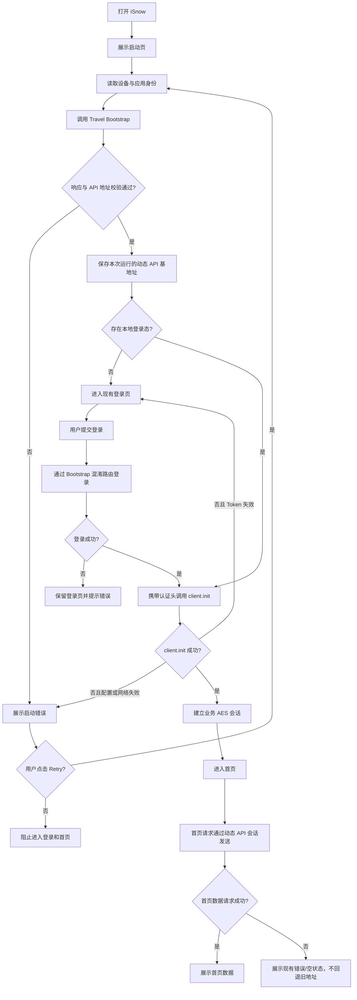

# iSnow × Travel test 启动与公共 API 流程

```mermaid
flowchart TD
    A[打开 iSnow] --> B[展示启动页]
    B --> C[读取设备与应用身份]
    C --> D[调用 Travel Bootstrap]
    D --> E{响应与 API 地址校验通过?}
    E -- 否 --> F[展示启动错误]
    F --> G{用户点击 Retry?}
    G -- 是 --> C
    G -- 否 --> H[阻止进入登录和首页]
    E -- 是 --> I[保存本次运行的动态 API 基地址]
    I --> J{存在本地登录态?}
    J -- 否 --> K[进入现有登录页]
    J -- 是 --> L[携带认证头调用 client.init]
    L --> M{client.init 成功?}
    M -- 否且 Token 失效 --> K
    M -- 否且配置或网络失败 --> F
    M -- 是 --> N[建立业务 AES 会话]
    N --> O[进入首页]
    K --> P[用户提交登录]
    P --> Q[通过 Bootstrap 混淆路由登录]
    Q --> R{登录成功?}
    R -- 否 --> S[保留登录页并提示错误]
    R -- 是 --> L
    O --> T[首页请求通过动态 API 会话发送]
    T --> U{首页数据请求成功?}
    U -- 是 --> V[展示首页数据]
    U -- 否 --> W[展示现有错误/空状态，不回退旧地址]
```
